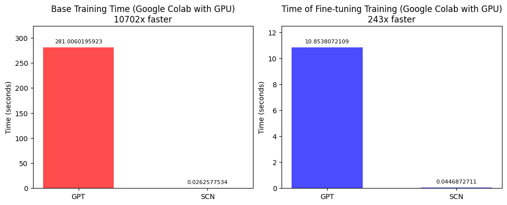

SCN or SCNet is a family of architectures for language models that uses a HurNet network to perform semantic comparison computations and output a response based on user input.

# SCN

The SCN is a proprietary neural network architecture based on [SCNet](https://github.com/sapiens-technology/SCNet). It was created by Ben-Hur Varriano to meet the demands of Sapiens Technology®️ and to function as a support model for traditional models. For some specific cases, it can also be implemented as the main model in question-and-answer tasks where the training dataset is not excessively large. In very large datasets, it can still be used, but at a performance cost. The [HurNet](https://github.com/sapiens-technology/HurNet) network is implemented in the code by the [HurNetTorch](https://github.com/sapiens-technology/HurNetTorch) package, which has optimization features for CPU, GPU, TPU, and MPS devices. Any public disclosure or comment on technical aspects related to this code is strictly prohibited and the author will be prosecuted by our legal team.

<br><br>

Click [here](https://github.com/sapiens-technology/SCN/blob/main/SCN-EN.pdf) to access the full study.

<br><br>

<sup>You can check the tests in the graph above by clicking [here](https://colab.research.google.com/drive/1PPZZsREgkUowqiePFC7c6-_gnb_N0khO?usp=sharing).</sup>

| Training Type SCN                  | Speed gain compared to GPT model with Transformer |
|------------------------------------|---------------------------------------------------|
| Base model training                | 10702x                                            |
| Fine-tuning training               | 243x                                              |

## Installation

Use the package manager [pip](https://pypi.org/project/scn/) to install the Semantic Comparison Network.

```bash
pip install scn
```

## Usage
Basic usage example:
```python
from scn import SCN # imports the main class "SCN" from the module "scn"
scn = SCN() # assigns the "scn" variable the instantiation of the "SCN" class, constructing the object with "()"
# now just use the "scn" object to access the class's resources
# use the "addFit" method to add input and output pairs to the training dataset
# assign a sample input in the first argument and a desired output in the second argument, calling the same method as many times as necessary
scn.addFit('Hello! Who are you?', 'Hello! I am Sapiens Chat, an AI model created by Sapiens Technology.')
scn.addFit('Who discovered Brazil?', 'Brazil was discovered by Portuguese navigators led by Pedro Alvares Cabral in 1500.')
scn.addFit('What is the main language spoken in Spain?', 'The main language spoken in Spain is Spanish.')
scn.train() # use the "train" method to train the model with the assigned dataset
# with the "print_predict" method you can display the output for a given input
scn.print_predict('Hello! Who are you?')
scn.print_predict('Who discovered Brazil?')
scn.print_predict('What is the main language spoken in Spain?')

```
Prediction response:
```bash
Reading data: 100%|████████████████████████████████████████████████████████████████████████████████████████████████████████████| 1/1 [00:00<00:00, 15650.39it/s]
Embedding data: 100%|███████████████████████████████████████████████████████████████████████████████████████████████████████| 286/286 [00:00<00:00, 5248.18it/s]
Tokenizing data: 100%|███████████████████████████████████████████████████████████████████████████████████████████████████████████| 6/6 [00:00<00:00, 108.32it/s]
Training model: 100%|████████████████████████████████████████████████████████████████████████████████████████████████████████████| 7/7 [00:00<00:00, 125.72it/s]
Hello! I am Sapiens Chat, an AI model created by Sapiens Technology.
Brazil was discovered by Portuguese navigators led by Pedro Alvares Cabral in 1500.
The main language spoken in Spain is Spanish.
```
```python
from scn import SCN
scn = SCN()

scn.addFit('Hello! Who are you?', 'Hello! I am Sapiens Chat, an AI model created by Sapiens Technology.')
scn.addFit('Who discovered Brazil?', 'Brazil was discovered by Portuguese navigators led by Pedro Alvares Cabral in 1500.')
scn.addFit('What is the main language spoken in Spain?', 'The main language spoken in Spain is Spanish.')
scn.train(progress=False) # set "False" to the "progress" parameter if you want to hide the training progress
# assign in the first argument the input for which you want to obtain an output
# the training input output that is most semantically similar to the prediction input, will be returned
scn.print_predict('Hello! Who are you?') # if the answer is wrong, add more data to your training

```
Prediction response:
```bash
Hello! I am Sapiens Chat, an AI model created by Sapiens Technology.
```

You can also use the "string" training parameter to add input and output pairs to your dataset.
```python
from scn import SCN
scn = SCN()
# variable with the training data set (can receive strings of any size)
# place each output below each input and separate the pairs with a blank line
# to increase the quality of the answers, preferably use two or more different examples for the same output
dataset = '''
What does the acronym GPT mean in language models?
GPT in language models stands for Generative Pre-trained Transformer.

Tell me what is the meaning of GPT in language models.
GPT in language models stands for Generative Pre-trained Transformer.

What is the capital of Spain?
The capital of Spain is Madrid.

Tell me the name of the capital of Spain.
The capital of Spain is Madrid.
'''
scn.train(string=dataset) # uses the value of the "dataset" variable as the training database
# call the prediction method as many times as you want
scn.print_predict('What does the acronym GPT mean in language models?')
scn.print_predict('Tell me what is the meaning of GPT in language models.')
scn.print_predict('What is the capital of Spain?')
scn.print_predict('Tell me the name of the capital of Spain.')

```
```bash
Reading data: 100%|████████████████████████████████████████████████████████████████████████████████████████████████████████████| 1/1 [00:00<00:00, 10645.44it/s]
Embedding data: 100%|███████████████████████████████████████████████████████████████████████████████████████████████████████| 384/384 [00:00<00:00, 7094.96it/s]
Tokenizing data: 100%|███████████████████████████████████████████████████████████████████████████████████████████████████████████| 6/6 [00:00<00:00, 107.62it/s]
Training model: 100%|████████████████████████████████████████████████████████████████████████████████████████████████████████████| 7/7 [00:00<00:00, 124.87it/s]
GPT in language models stands for Generative Pre-trained Transformer.
GPT in language models stands for Generative Pre-trained Transformer.
The capital of Spain is Madrid.
The capital of Spain is Madrid.
```
You can combine multiple data sources to build your model by inputting data using the "addFit" and "train" methods.
```python
from scn import SCN
scn = SCN()
# it is also possible to join the data from the "string" parameter with the pairs from the "addFit" method in a single training
# when possible, always use multiple input examples for the same output
dataset = '''
What does the acronym GPT mean in language models?
GPT in language models stands for Generative Pre-trained Transformer.

Tell me what is the meaning of GPT in language models.
GPT in language models stands for Generative Pre-trained Transformer.
'''
# in the "addFit" method also give preference to add multiple inputs to the same output
scn.addFit('What is the capital of Spain?', 'The capital of Spain is Madrid.')
scn.addFit('Tell me the name of the capital of Spain.', 'The capital of Spain is Madrid.')
scn.train(string=dataset)

scn.print_predict('What does the acronym GPT mean in language models?')
scn.print_predict('Tell me what is the meaning of GPT in language models.')
scn.print_predict('What is the capital of Spain?')
scn.print_predict('Tell me the name of the capital of Spain.')

```
```bash
Reading data: 100%|████████████████████████████████████████████████████████████████████████████████████████████████████████████| 1/1 [00:00<00:00, 12157.40it/s]
Embedding data: 100%|███████████████████████████████████████████████████████████████████████████████████████████████████████| 384/384 [00:00<00:00, 6937.66it/s]
Tokenizing data: 100%|███████████████████████████████████████████████████████████████████████████████████████████████████████████| 6/6 [00:00<00:00, 106.38it/s]
Training model: 100%|████████████████████████████████████████████████████████████████████████████████████████████████████████████| 7/7 [00:00<00:00, 123.44it/s]
GPT in language models stands for Generative Pre-trained Transformer.
GPT in language models stands for Generative Pre-trained Transformer.
The capital of Spain is Madrid.
The capital of Spain is Madrid.
```
The best way to train a language model is through structured data in JSON format. The file should have a key named "data" with a list of dictionaries containing input and output strings with the keys named "input" and "output". You can work with files of any size, the limitation will be determined by the capacity of your hardware.

We will use as an example a file named "dataset.json" with the content below:
```json
{
	"data": [
				{
					"input": "Hello! Who are you?",
					"output": "Hello! I am Sapiens Chat, an AI model created by Sapiens Technology."
				},
				{
					"input": "Who discovered Brazil?",
					"output": "Brazil was discovered by Portuguese navigators led by Pedro Alvares Cabral in 1500."
				},
				{
					"input": "What is the main language spoken in Spain?",
					"output": "The main language spoken in Spain is Spanish."
				},
				{
					"input": "What is the capital of Portugal?",
					"output": "The capital of Portugal is Lisbon."
				},
				{
					"input": "How much is 2 + 2?",
					"output": "The sum of 2 + 2 in mathematics is 4."
				},
				{
					"input": "What is five minus three?",
					"output": "The result of five minus three is two."
				},
				{
					"input": "What is your name?",
					"output": "My name is Sapiens Chat."
				}
	]
}
```
```python
from scn import SCN
scn = SCN()
# use the "dataset_path" parameter to assign the path of a "json", "csv" or "txt" file as the training database
scn.train(dataset_path='dataset.json')
scn.print_predict('Hello! Who are you?')
scn.print_predict('Who discovered Brazil?')
scn.print_predict('What is the main language spoken in Spain?')
scn.print_predict('What is the capital of Portugal?')
scn.print_predict('How much is 2 + 2?')
scn.print_predict('What is five minus three?')
scn.print_predict('What is your name?')

```
```bash
Reading data: 100%|████████████████████████████████████████████████████████████████████████████████████████████████████████████| 1/1 [00:00<00:00, 10433.59it/s]
Embedding data: 100%|███████████████████████████████████████████████████████████████████████████████████████████| 1000000/1000000 [00:00<00:00, 18577362.42it/s]
Tokenizing data: 100%|███████████████████████████████████████████████████████████████████████████████████████████████████████████| 6/6 [00:00<00:00, 107.89it/s]
Training model: 100%|████████████████████████████████████████████████████████████████████████████████████████████████████████████| 7/7 [00:00<00:00, 125.18it/s]
Hello! I am Sapiens Chat, an AI model created by Sapiens Technology.
Brazil was discovered by Portuguese navigators led by Pedro Alvares Cabral in 1500.
The main language spoken in Spain is Spanish.
The capital of Portugal is Lisbon.
The sum of 2 + 2 in mathematics is 4.
The result of five minus three is two.
My name is Sapiens Chat.
```
You can also supplement the training data with the "addFit" method.
```python
from scn import SCN
scn = SCN()
# call the "addFit" method before the "train" method to add more data to your dataset
scn.addFit('What is the capital of Spain?', 'The capital of Spain is Madrid.')
scn.addFit('Tell me the name of the capital of Spain.', 'The capital of Spain is Madrid.')
scn.train(dataset_path='dataset.json')
scn.print_predict('What is the capital of Spain?')
scn.print_predict('Tell me the name of the capital of Spain.')
scn.print_predict('What is the main language spoken in Spain?')

```
```bash
Reading data: 100%|█████████████████████████████████████████████████████████████████████████████████████████████████████████████| 1/1 [00:00<00:00, 7752.87it/s]
Embedding data: 100%|███████████████████████████████████████████████████████████████████████████████████████████████████████| 136/136 [00:00<00:00, 2531.44it/s]
Tokenizing data: 100%|███████████████████████████████████████████████████████████████████████████████████████████████████████████| 6/6 [00:00<00:00, 109.73it/s]
Training model: 100%|████████████████████████████████████████████████████████████████████████████████████████████████████████████| 7/7 [00:00<00:00, 127.29it/s]
The capital of Spain is Madrid.
The capital of Spain is Madrid.
The main language spoken in Spain is Spanish.
```
In addition to the "addFit" method, the "string" parameter can also be used as a complement of data.
```python
from scn import SCN
scn = SCN()
# you can also supplement the file data with the data from the "string" parameter
string = '''
What does the acronym GPT mean in language models?
GPT in language models stands for Generative Pre-trained Transformer.

Tell me what is the meaning of GPT in language models.
GPT in language models stands for Generative Pre-trained Transformer.
'''
scn.train(dataset_path='dataset.json', string=string)
scn.print_predict('Tell me what is the meaning of GPT in language models.')
scn.print_predict('What is the main language spoken in Spain?')

```
```bash
Reading data: 100%|████████████████████████████████████████████████████████████████████████████████████████████████████████████| 1/1 [00:00<00:00, 12787.51it/s]
Embedding data: 100%|███████████████████████████████████████████████████████████████████████████████████████████████████████| 246/246 [00:00<00:00, 4561.99it/s]
Tokenizing data: 100%|███████████████████████████████████████████████████████████████████████████████████████████████████████████| 6/6 [00:00<00:00, 107.82it/s]
Training model: 100%|████████████████████████████████████████████████████████████████████████████████████████████████████████████| 7/7 [00:00<00:00, 125.10it/s]
GPT in language models stands for Generative Pre-trained Transformer.
The main language spoken in Spain is Spanish.
```
Since SCN is a pattern recognition network, you can type the same question in different ways and the pattern will still be recognized.
```python
from scn import SCN
scn = SCN()
# you can also supplement the file data with the data from the "string" parameter
string = '''
What does the acronym GPT mean in language models?
GPT in language models stands for Generative Pre-trained Transformer.

Tell me what is the meaning of GPT in language models.
GPT in language models stands for Generative Pre-trained Transformer.
'''
scn.train(dataset_path='dataset.json', string=string)
# note that it is not necessary for the prompt to be exactly the same as one of the training inputs, it just needs to have the same semantic meaning
prompt = 'i would like to know the meaning of the acronym gpt in language models'
print('Prompt:', prompt)
print('Answer: ', end='')
scn.print_predict(prompt)
print()
print('Prompt:', prompt)
prompt = 'please could you tell me the name of the main language spoken in spain?'
print('Answer:', end='')
scn.print_predict(prompt)

```
```bash
Reading data: 100%|████████████████████████████████████████████████████████████████████████████████████████████████████████████| 1/1 [00:00<00:00, 12985.46it/s]
Embedding data: 100%|███████████████████████████████████████████████████████████████████████████████████████████████████████| 246/246 [00:00<00:00, 4495.52it/s]
Tokenizing data: 100%|███████████████████████████████████████████████████████████████████████████████████████████████████████████| 6/6 [00:00<00:00, 107.47it/s]
Training model: 100%|████████████████████████████████████████████████████████████████████████████████████████████████████████████| 7/7 [00:00<00:00, 124.69it/s]
Prompt: i would like to know the meaning of the acronym gpt in language models
Answer: GPT in language models stands for Generative Pre-trained Transformer.

Prompt: i would like to know the meaning of the acronym gpt in language models
Answer:The main language spoken in Spain is Spanish.
```
You can combine different ways of inserting data when assembling your dataset. Below we are combining data coming from a file, with data from variables.
```python
from scn import SCN
scn = SCN()
# both the "string" parameter and the "addFit" method can be used together or separately when inserting additional data together with the file
string = '''
What does the acronym GPT mean in language models?
GPT in language models stands for Generative Pre-trained Transformer.

Tell me what is the meaning of GPT in language models.
GPT in language models stands for Generative Pre-trained Transformer.

What is the closest star?
The closest star is the Sun.
'''
scn.addFit('What is the capital of Spain?', 'The capital of Spain is Madrid.')
scn.addFit('Tell me the name of the capital of Spain.', 'The capital of Spain is Madrid.')
scn.train(dataset_path='dataset.json', string=string)
scn.print_predict('What is the main language spoken in Spain?')
scn.print_predict('Tell me the name of the capital of Spain.')
scn.print_predict('What is the closest star?')

```
```bash
Reading data: 100%|████████████████████████████████████████████████████████████████████████████████████████████████████████████| 1/1 [00:00<00:00, 12826.62it/s]
Embedding data: 100%|███████████████████████████████████████████████████████████████████████████████████████████████████████| 440/440 [00:00<00:00, 7831.14it/s]
Tokenizing data: 100%|███████████████████████████████████████████████████████████████████████████████████████████████████████████| 6/6 [00:00<00:00, 104.83it/s]
Training model: 100%|████████████████████████████████████████████████████████████████████████████████████████████████████████████| 7/7 [00:00<00:00, 121.60it/s]
The main language spoken in Spain is Spanish.
The capital of Spain is Madrid.
The closest star is the Sun.
```
The "dataset_path" parameter in the training method can also receive unstructured files in TXT format. But still the preferable and most reliable format remains the JSON format.

We will use as an example a file named "dataset.txt" with the content below:
```txt
What is Artificial Intelligence (AI)?
Artificial Intelligence is a field of computer science that develops systems capable of performing tasks that would normally require human intelligence, such as learning, reasoning, perception, and decision-making.

What is the difference between weak AI and strong AI?
Weak AI (or narrow AI) is designed for specific tasks, such as virtual assistants and recommendation systems. Strong AI, on the other hand, would have self-awareness and the ability to understand and reason about any subject like a human being.

What is Machine Learning and how is it related to AI?
Machine Learning is a subfield of AI that teaches machines to learn patterns from data without explicit programming. It allows systems to improve their performance over time with experience.

What are the main types of machine learning?
The three main types are:
- **Supervised Learning**: The model learns from labeled data.
- **Unsupervised Learning**: The model identifies patterns without labels.
- **Reinforcement Learning**: The model learns through trial and error, receiving rewards or penalties.

What are artificial neural networks?
They are models inspired by the functioning of the human brain, composed of layers of artificial neurons that process information and adjust their weights to recognize patterns and make decisions.

What are the risks of Artificial Intelligence?
Some risks include algorithmic bias, job loss due to automation, misuse in surveillance or warfare, and the possibility of superintelligence beyond human control.

How is AI used in everyday life?
AI is present in virtual assistants (Siri, Alexa), recommendation systems (Netflix, Spotify), facial recognition, autonomous cars, medical diagnostics, chatbots, and much more.

What is natural language processing (NLP)?
It is a field of AI that enables machines to understand, interpret, and generate human language, used in machine translation, chatbots, and voice assistants.

Can AI replace humans in the workforce?
AI can automate repetitive and analytical tasks, but it is unlikely to fully replace humans in creative, emotional, and critical thinking jobs.  

What is a generative AI model?
It is a type of AI that can create new content, such as images, text, and music, based on patterns learned from large amounts of data. Examples include ChatGPT and DALL·E.

```
```python
from scn import SCN
scn = SCN()
scn.train(dataset_path='dataset.txt')
scn.print_predict('What is Artificial Intelligence (AI)?')

```
```bash
Reading data: 100%|█████████████████████████████████████████████████████████████████████████████████████████████████████████████| 1/1 [00:00<00:00, 9709.04it/s]
Embedding data: 100%|███████████████████████████████████████████████████████████████████████████████████████████| 1000000/1000000 [00:00<00:00, 16241128.82it/s]
Tokenizing data: 100%|████████████████████████████████████████████████████████████████████████████████████████████████████████████| 6/6 [00:00<00:00, 95.77it/s]
Training model: 100%|████████████████████████████████████████████████████████████████████████████████████████████████████████████| 7/7 [00:00<00:00, 111.21it/s]
Artificial Intelligence is a field of computer science that develops systems capable of performing tasks that would normally require human intelligence, such as learning, reasoning, perception, and decision-making.
```
Remember that it is possible to complement the file data with the "string" parameter and/or the "addFit" method.
```python
from scn import SCN
scn = SCN()

string = '''
What does the acronym GPT mean in language models?
GPT in language models stands for Generative Pre-trained Transformer.

Tell me what is the meaning of GPT in language models.
GPT in language models stands for Generative Pre-trained Transformer.

What is the closest star?
The closest star is the Sun.
'''
scn.addFit('What is the capital of Spain?', 'The capital of Spain is Madrid.')
scn.addFit('Tell me the name of the capital of Spain.', 'The capital of Spain is Madrid.')
scn.train(dataset_path='dataset.txt', string=string)
scn.print_predict('What is Artificial Intelligence (AI)?')
scn.print_predict('Tell me the name of the capital of Spain.')
scn.print_predict('What is the closest star?')

```
```bash
Reading data: 100%|████████████████████████████████████████████████████████████████████████████████████████████████████████████| 1/1 [00:00<00:00, 11748.75it/s]
Embedding data: 100%|███████████████████████████████████████████████████████████████████████████████████████████████████████| 440/440 [00:00<00:00, 7014.42it/s]
Tokenizing data: 100%|████████████████████████████████████████████████████████████████████████████████████████████████████████████| 6/6 [00:00<00:00, 94.00it/s]
Training model: 100%|████████████████████████████████████████████████████████████████████████████████████████████████████████████| 7/7 [00:00<00:00, 109.11it/s]
Artificial Intelligence is a field of computer science that develops systems capable of performing tasks that would normally require human intelligence, such as learning, reasoning, perception, and decision-making.
The capital of Spain is Madrid.
The closest star is the Sun.
```
You can set "True" for the "stream" parameter of the prediction method when you want to display the response token by token.
```python
from scn import SCN
scn = SCN()
scn.train(dataset_path='dataset.txt', progress=False) # progress=False inhibits the display of progress bars
scn.print_predict('What is Artificial Intelligence (AI)?', stream=True) # stream=True display one token at a time

```
```bash
Artificial Intelligence is a field of computer science that develops systems capable of performing tasks that would normally require human intelligence, such as learning, reasoning, perception, and decision-making.
```
With the "interval" parameter you can define a minimum interval in seconds between the display of one token and another. This parameter will only work if "stream" is equal to True.
```python
from scn import SCN
scn = SCN()
# "dataset_path" receives the path to a structured file in "json" or "csv" format, or to an unstructured file in "txt" format
# "progress" is set to True to display progress or False to not display progress; the default value is True
scn.train(dataset_path='dataset.txt', progress=False)
# interval=0.1 causes each generated token to wait 10% of 1 second before displaying the next token
# the default value of the "interval" parameter is 0.0, but you can set any positive floating value
scn.print_predict('What is Artificial Intelligence (AI)?', stream=True, interval=0.1)

```
```bash
Artificial Intelligence is a field of computer science that develops systems capable of performing tasks that would normally require human intelligence, such as learning, reasoning, perception, and decision-making.
```
With the "precision" parameter you can define a percentage value between 0 and 1 for the default size of the "embeddings", referring to the proportion of the largest "embedding" found in the training data set. This can be especially useful if you need to reduce the processing load on limited hardware, but it will make the prediction responses less precision.
```python
from scn import SCN
scn = SCN()
# precision=0.8 makes all embeddings 80% the length of the largest embedding
# very small precision values may cause incomplete or inadequate predictions
scn.train(dataset_path='dataset.txt', precision=0.8, progress=False)
scn.print_predict('What is Artificial Intelligence (AI)?', stream=True, interval=0.1)

```
```bash
Artificial Intelligence is a field of computer science that develops systems capable of performing tasks that would normally require human intelligence, such as learning, reasoning, perception, and decision-making.
```
You can also work with structured files in CSV format with a column named "input", "prompt" or "question" for input and a column named "output", "answer" or "response" for output. The CSV file may contain other columns, but only these two will be read. Each line in the file will represent a pair of input and output. Always give preference to structured files in JSON or CSV format.

We will use as an example a file named "dataset.csv" with the content below:
```csv
"input","output"
"Hello! Who are you?","Hello! I am Sapiens Chat, an AI model created by Sapiens Technology."
"Who discovered Brazil?","Brazil was discovered by Portuguese navigators led by Pedro Alvares Cabral in 1500."
"What is the main language spoken in Spain?","The main language spoken in Spain is Spanish."
"What is the capital of Portugal?","The capital of Portugal is Lisbon."
"How much is 2 + 2?","The sum of 2 + 2 in mathematics is 4."
"What is five minus three?","The result of five minus three is two."
"What is your name?","My name is Sapiens Chat."
```
```python
from scn import SCN
scn = SCN()
# although "dataset_path" can handle "json", "csv" and "txt" files, always give preference to datasets in "json" format when possible
scn.train(dataset_path='dataset.csv')
# interval=0.01 for 1% intervals of 1 second between one token and another
scn.print_predict('What is the main language spoken in Spain?', stream=True, interval=0.01)

```
```bash
Reading data: 100%|████████████████████████████████████████████████████████████████████████████████████████████████████████████| 1/1 [00:00<00:00, 12826.62it/s]
Embedding data: 100%|███████████████████████████████████████████████████████████████████████████████████████████| 1000000/1000000 [00:00<00:00, 17843470.42it/s]
Tokenizing data: 100%|███████████████████████████████████████████████████████████████████████████████████████████████████████████| 6/6 [00:00<00:00, 105.09it/s]
Training model: 100%|████████████████████████████████████████████████████████████████████████████████████████████████████████████| 7/7 [00:00<00:00, 121.99it/s]
The main language spoken in Spain is Spanish.
```
Now see an example complementing the file data with the "string" parameter and with the "addFit" method.
```python
from scn import SCN
scn = SCN()

string = '''
What does the acronym GPT mean in language models?
GPT in language models stands for Generative Pre-trained Transformer.

Tell me what is the meaning of GPT in language models.
GPT in language models stands for Generative Pre-trained Transformer.

What is the closest star?
The closest star is the Sun.
'''
scn.addFit('What is the capital of Spain?', 'The capital of Spain is Madrid.')
scn.addFit('Tell me the name of the capital of Spain.', 'The capital of Spain is Madrid.')
scn.train(dataset_path='dataset.csv', string=string, progress=False)

stream = True
interval = 0.01
scn.print_predict('What is the main language spoken in Spain?', stream=stream, interval=interval)
scn.print_predict('Tell me the name of the capital of Spain.', stream=stream, interval=interval)
scn.print_predict('What is the closest star?', stream=stream, interval=interval)

```
```bash
The main language spoken in Spain is Spanish.
The capital of Spain is Madrid.
The closest star is the Sun.
```
With the "tokenizer" name parameter contained in the training method, you can set the name of a specific type of tokenizer to be used in converting texts into embeddings chains.
```python
from scn import SCN
scn = SCN()
# "tokenizer" takes a string with the name of the encoder to be used for tokenization; the default value is 'gpt-4'
# tokenizers available: 'gpt-2', 'gpt-3', 'gpt-3.5-turbo', 'gpt-4', 'gpt-4-turbo', 'text-davinci-001', 'text-davinci-002' and 'text-davinci-003'
scn.train(dataset_path='dataset.csv', tokenizer='gpt-2') # tokenizer='gpt-2' uses gpt-2 tokenizer
scn.print_predict('Hello! Who are you?', stream=True, interval=0.01)

```
```bash
Reading data: 100%|████████████████████████████████████████████████████████████████████████████████████████████████████████████| 1/1 [00:00<00:00, 11881.88it/s]
Embedding data: 100%|███████████████████████████████████████████████████████████████████████████████████████████| 1000000/1000000 [00:00<00:00, 12289380.15it/s]
Tokenizing data: 100%|████████████████████████████████████████████████████████████████████████████████████████████████████████████| 6/6 [00:00<00:00, 72.78it/s]
Training model: 100%|█████████████████████████████████████████████████████████████████████████████████████████████████████████████| 7/7 [00:00<00:00, 84.59it/s]
Hello! I am Sapiens Chat, an AI model created by Sapiens Technology.
```
The "precision" parameter sets a specific percentage of the total length of the largest tokenized embedding and applies this same length to all embeddings.
```python
from scn import SCN
scn = SCN()
# precision=0.95 so that all embedding vectors have a size of 95% of the size of the largest embedding
# the default value of "precision" is 1.0, i.e. all embedding vectors will have the same length as 100% of the length of the largest vector
# always use float values between 0 and 1 for "precision"
scn.train(dataset_path='dataset.csv', precision=0.95, tokenizer='gpt-4-turbo')
scn.print_predict('What is five minus three?', stream=True, interval=0.01)

```
```bash
Reading data: 100%|████████████████████████████████████████████████████████████████████████████████████████████████████████████| 1/1 [00:00<00:00, 12018.06it/s]
Embedding data: 100%|███████████████████████████████████████████████████████████████████████████████████████████| 1000000/1000000 [00:00<00:00, 18491121.03it/s]
Tokenizing data: 100%|███████████████████████████████████████████████████████████████████████████████████████████████████████████| 6/6 [00:00<00:00, 108.77it/s]
Training model: 100%|████████████████████████████████████████████████████████████████████████████████████████████████████████████| 7/7 [00:00<00:00, 126.19it/s]
The result of five minus three is two.
```
With the "context_window" parameter of the training method, you can set an integer to limit the size of your model's context window. The size defined in this parameter will be applied to the length of all embeddings. By default, the context window size is infinite, which means that all embeddings will always use their maximum length.
```python
from scn import SCN
scn = SCN()
# in the example below we are applying a limit of 50 tokens to the size of the context window
# in this case, any prediction input with a length other than 50 tokens will have its size resized to 50
# the "context_window" parameter must always receive an integer greater than zero; the default value for "context_window" is float('inf'), that is, infinity
# the smaller your context window, the faster your training and inference will be
# the bigger your context window, the slow your training and inference will be
# larger context windows decrease the chances of incorrect responses, but smaller context windows increase the chances of your model issuing an inaccurate response
scn.train(dataset_path='dataset.csv', context_window=50)
scn.print_predict('What is the main language spoken in Spain?', stream=True, interval=0.01)

```
```bash
Reading data: 100%|█████████████████████████████████████████████████████████████████████████████████████████████████████████████| 1/1 [00:00<00:00, 7752.87it/s]
Embedding data: 100%|███████████████████████████████████████████████████████████████████████████████████████████| 1000000/1000000 [00:00<00:00, 18335514.73it/s]
Tokenizing data: 100%|███████████████████████████████████████████████████████████████████████████████████████████████████████████| 6/6 [00:00<00:00, 107.75it/s]
Training model: 100%|████████████████████████████████████████████████████████████████████████████████████████████████████████████| 7/7 [00:00<00:00, 125.11it/s]
The main language spoken in Spain is Spanish.
```
With the "end_tag" parameter of the "train" method, you can define a substring contained in the text of your file or training string to be used as a separator of the input and output pairs. In this case, the algorithm will divide your text into smaller parts, separated by the value of "end_tag" and consider that each of these parts contains a specific output and/or input.

We will use as an example a file named "dataset_with_tag.txt" with the content below:
```txt
What is Artificial Intelligence (AI)?
Artificial Intelligence is a field of computer science that develops systems capable of performing tasks that would normally require human intelligence, such as learning, reasoning, perception, and decision-making.
<|end|>
What is the difference between weak AI and strong AI?
Weak AI (or narrow AI) is designed for specific tasks, such as virtual assistants and recommendation systems. Strong AI, on the other hand, would have self-awareness and the ability to understand and reason about any subject like a human being.
<|end|>
What is Machine Learning and how is it related to AI?
Machine Learning is a subfield of AI that teaches machines to learn patterns from data without explicit programming. It allows systems to improve their performance over time with experience.
<|end|>
What are the main types of machine learning?
The three main types are:
- **Supervised Learning**: The model learns from labeled data.
- **Unsupervised Learning**: The model identifies patterns without labels.
- **Reinforcement Learning**: The model learns through trial and error, receiving rewards or penalties.
<|end|>
What are artificial neural networks?
They are models inspired by the functioning of the human brain, composed of layers of artificial neurons that process information and adjust their weights to recognize patterns and make decisions.
<|end|>
What are the risks of Artificial Intelligence?
Some risks include algorithmic bias, job loss due to automation, misuse in surveillance or warfare, and the possibility of superintelligence beyond human control.
<|end|>
How is AI used in everyday life?
AI is present in virtual assistants (Siri, Alexa), recommendation systems (Netflix, Spotify), facial recognition, autonomous cars, medical diagnostics, chatbots, and much more.
<|end|>
What is natural language processing (NLP)?
It is a field of AI that enables machines to understand, interpret, and generate human language, used in machine translation, chatbots, and voice assistants.
<|end|>
Can AI replace humans in the workforce?
AI can automate repetitive and analytical tasks, but it is unlikely to fully replace humans in creative, emotional, and critical thinking jobs.  
<|end|>
What is a generative AI model?
It is a type of AI that can create new content, such as images, text, and music, based on patterns learned from large amounts of data. Examples include ChatGPT and DALL·E.
<|end|>
```
```python
from scn import SCN
scn = SCN()
# the "end_tag" parameter will only take effect when "dataset_path" receives a "txt" file or when you are using the "string" parameter
# below we are considering the '<|end|>' tag contained in the example file as the value that separates one possible answer from the other, but you can use any substring you prefer
# the default value of the "end_tag" parameter is '\n\n', that is, the text will use two line breaks to separate the parts
scn.train(dataset_path='dataset_with_tag.txt', end_tag='<|end|>')
scn.print_predict('Explain artificial neural networks to me.', stream=True, interval=0.01)

```
```bash
Reading data: 100%|████████████████████████████████████████████████████████████████████████████████████████████████████████████| 1/1 [00:00<00:00, 11748.75it/s]
Embedding data: 100%|███████████████████████████████████████████████████████████████████████████████████████████| 1000000/1000000 [00:00<00:00, 16049284.65it/s]
Tokenizing data: 100%|████████████████████████████████████████████████████████████████████████████████████████████████████████████| 6/6 [00:00<00:00, 94.67it/s]
Training model: 100%|████████████████████████████████████████████████████████████████████████████████████████████████████████████| 7/7 [00:00<00:00, 109.93it/s]
They are models inspired by the functioning of the human brain, composed of layers of artificial neurons that process information and adjust their weights to me patterns and make decisions.
```
If you are using the "string" parameter together with a text file, both must have the same value of "end_tag" in their content.
```python
from scn import SCN
scn = SCN()
# below we are using the "string" parameter with different inputs for the same outputs of file, this way your model will become more accurate
# note that both the value of the "string" parameter and the content of the file in "dataset_path" have '<|end|>' as a separator
string = '''
Tell me the main types of machine learning.
The three main types are:
- **Supervised Learning**: The model learns from labeled data.
- **Unsupervised Learning**: The model identifies patterns without labels.
- **Reinforcement Learning**: The model learns through trial and error, receiving rewards or penalties.
<|end|>
Explain to me what Artificial Intelligence is.
Artificial Intelligence is a field of computer science that develops systems capable of performing tasks that would normally require human intelligence, such as learning, reasoning, perception, and decision-making.
<|end|>
'''
scn.train(dataset_path='dataset_with_tag.txt', string=string, end_tag='<|end|>')
prompt = 'Explain artificial neural networks to me.'
print('Prompt:', prompt)
print('Answer: ', end='', flush=True)
scn.print_predict('Explain artificial neural networks to me.', stream=True, interval=0.01)
print()
prompt = 'Tell me the main types of machine learning.'
print('Prompt:', prompt)
print('Answer: ', end='', flush=True)
scn.print_predict('Tell me the main types of machine learning.', stream=True, interval=0.01)

```
```bash
Reading data: 100%|████████████████████████████████████████████████████████████████████████████████████████████████████████████| 1/1 [00:00<00:00, 12710.01it/s]
Embedding data: 100%|███████████████████████████████████████████████████████████████████████████████████████████████████████| 589/589 [00:00<00:00, 9854.78it/s]
Tokenizing data: 100%|████████████████████████████████████████████████████████████████████████████████████████████████████████████| 6/6 [00:00<00:00, 98.55it/s]
Training model: 100%|████████████████████████████████████████████████████████████████████████████████████████████████████████████| 7/7 [00:00<00:00, 114.44it/s]
Prompt: Explain artificial neural networks to me.
Answer: They are models inspired by the functioning of the human brain, composed of layers of artificial neurons that process information and adjust their weights to me patterns and make decisions.

Prompt: Tell me the main types of machine learning.
Answer: The three main types are:
- **Supervised Learning**: The model learns from labeled data.
- **Unsupervised Learning**: The model identifies patterns without labels.
- **Reinforcement Learning**: The model learns through trial and error, receiving rewards or penalties.
```
The "validate" parameter of the training method receives a float for a percentage between 0 and 1 that represents the part of the data set that will be separated for validation and testing of the model's learning at the end of the training process.
```python
from scn import SCN
scn = SCN()
# the "validate" parameter receives a float with the percentage of data that will be used to validate the learning
# the default value of "validate" is 0.0, i.e. there will be no validation upon completion of training
# in the scn network the validation data will also be part of the training; in this case if you want you can use 1.0 to validate 100% of the data
# the larger the sample set aside for validation and testing, the longer it will take to complete the training method
# you can use the return of the "train" function to get your training metrics
training_metrics = scn.train(dataset_path='dataset.txt', validate=0.2) # validate=0.2 so that 20% of the data is used for validation and testing
print(training_metrics) # displays training metrics
# the 'val_loss' key contains the percentage (between 0 and 1) of the amount of data separated for testing that failed validation (the lower the better)
# the 'loss' key contains the percentage (between 0 and 1) of information loss, that is, the percentage of data that was not fully learned (the lower the better)
# the 'generalization_rate' key contains the percentage (between 0 and 1) of the model's ability to generalize to inputs other than those used in training (the higher the better)
# the 'precision' key contains the percentage (between 0 and 1) of the model's final precision in relation to your possible ability to get the answers right (the higher the better)

```
```bash
Reading data: 100%|████████████████████████████████████████████████████████████████████████████████████████████████████████████| 1/1 [00:00<00:00, 12985.46it/s]
Embedding data: 100%|███████████████████████████████████████████████████████████████████████████████████████████| 1000000/1000000 [00:00<00:00, 16196475.19it/s]
Tokenizing data: 100%|████████████████████████████████████████████████████████████████████████████████████████████████████████████| 6/6 [00:00<00:00, 95.55it/s]
Validating model: 100%|███████████████████████████████████████████████████████████████████████████████████████████████████| 426/426 [00:00<00:00, 165426.67it/s]
Training model: 100%|████████████████████████████████████████████████████████████████████████████████████████████████████████████| 7/7 [00:00<00:00, 106.27it/s]
{'val_loss': 0.2197099781488428, 'loss': 0.08435451958561202, 'generalization_rate': 0.7802900218511573, 'precision': 0.915645480414388}
```
Below is an example with all the training parameters and their default values.
```python
from scn import SCN
scn = SCN()

scn.train( # train the model
	dataset_path='dataset.txt', # path to training file ("json", "csv" or "txt")
	string='', # complementary content
	precision=1.0, # percentage for the maximum length of the embeddings relative to the length of the largest embedding
	tokenizer='gpt-4', # tokenization standard
	context_window=float('inf'), # context window size
	end_tag='\n\n', # separator used to divide the training text into smaller parts
	validate=0.0, # percentage of the dataset separated for validation
	progress=True # enables or disables progress bars
)

scn.print_predict(prompt='What is Artificial Intelligence (AI)?')

```
```bash
Reading data: 100%|█████████████████████████████████████████████████████████████████████████████████████████████████████████████| 1/1 [00:00<00:00, 6626.07it/s]
Embedding data: 100%|███████████████████████████████████████████████████████████████████████████████████████████| 1000000/1000000 [00:00<00:00, 16054997.97it/s]
Tokenizing data: 100%|████████████████████████████████████████████████████████████████████████████████████████████████████████████| 6/6 [00:00<00:00, 94.94it/s]
Training model: 100%|████████████████████████████████████████████████████████████████████████████████████████████████████████████| 7/7 [00:00<00:00, 110.19it/s]
Artificial Intelligence is a field of computer science that develops systems capable of performing tasks that would normally require human intelligence, such as learning, reasoning, perception, and decision-making.
```
To save a trained model so that you can use it in the future on any machine without having to train it again, simply call the method named "saveModel" right after calling the "train" method. The "saveModel" method will save two files with your model: one file with the network settings and another with the weights.
```python
from scn import SCN
scn = SCN()
# training and saving the language model
scn.train(dataset_path='dataset.json') # train the model
# the "saveModel" method will save two files with your model data: a ".scn01" file with the settings and another "scn02" file with the weights
# if no name is specified in the "model_path" parameter of the saving method, the model files will be saved with the default name "model" in the local directory
scn.saveModel() # save the model ("model.scn01" and "model.scn02" files)
# note in the progress bar that the model will be saved with 91U, that is, 91 unit parameters (U for Units, K for Thousands/Kilobytes, M for Millions, B for Billions and T for Trillions)

```
```bash
Reading data: 100%|████████████████████████████████████████████████████████████████████████████████████████████████████████████| 1/1 [00:00<00:00, 10305.42it/s]
Embedding data: 100%|███████████████████████████████████████████████████████████████████████████████████████████| 1000000/1000000 [00:00<00:00, 17901272.72it/s]
Tokenizing data: 100%|███████████████████████████████████████████████████████████████████████████████████████████████████████████| 6/6 [00:00<00:00, 105.41it/s]
Training model: 100%|████████████████████████████████████████████████████████████████████████████████████████████████████████████| 7/7 [00:00<00:00, 122.36it/s]
Generating 91U parameters: 100%|███████████████████████████████████████████████████████████████████████████████████████████████| 6/6 [00:00<00:00, 40009.26it/s]
Encoding file: 100%|█████████████████████████████████████████████████████████████████████████████████████████████████████| 598/598 [00:00<00:00, 2442252.96it/s]
Saving model: 100%|█████████████████████████████████████████████████████████████████████████████████████████████████████████████| 5/5 [00:00<00:00, 4448.77it/s]
```
Once you save your model, you never have to go through the hassle of retraining it or waiting for the weights adjustment process. Simply use the "loadModel" method to load the pre-trained model files and make your predictions as normal.
```python
from scn import SCN
scn = SCN()
# the "loadModel" method will search for files of some pre-trained model in the local directory if no value is passed for the "model_path" parameter
# if no path is given to the "model_path" parameter, the "loadModel" method will look for model files in the local directory and load the first one it finds
scn.loadModel() # loads a pre-trained model
scn.print_predict('What is the main language spoken in Spain?') # performs model inference

```
```bash
Decoding file: 100%|██████████████████████████████████████████████████████████████████████████████████████████████████| 2989/2989 [00:00<00:00, 12599773.52it/s]
Loading model: 100%|████████████████████████████████████████████████████████████████████████████████████████████████████████████| 7/7 [00:00<00:00, 3531.41it/s]
The main language spoken in Spain is Spanish.
Encoding file: 100%|█████████████████████████████████████████████████████████████████████████████████████████████████████| 598/598 [00:00<00:00, 2083217.44it/s]
```
With the "progress" parameter of the loading method, you can enable or disable the display of progress when loading the model.
```python
from scn import SCN
scn = SCN()
# use "progress" equal to False if you want to hide the loading progress; the default value of the "progress" parameter is True
# loading and inference of the pre-trained model
scn.loadModel(progress=False) # progress=False disables the loading progress bar
scn.print_predict('What is five minus three?')

```
```bash
The result of five minus three is two.
```
You can also use the "progress" parameter of the model save method to inhibit the display of progress when saving your pre-trained model.
```python
from scn import SCN
scn = SCN()
# use the "progress" parameter with False to disable progress of saving, or with True to enable; the default value of "progress" is True
scn.train(dataset_path='dataset.json')
scn.saveModel(progress=False) # progress=False disables the saving progress bars

```
```bash
Reading data: 100%|████████████████████████████████████████████████████████████████████████████████████████████████████████████| 1/1 [00:00<00:00, 12372.58it/s]
Embedding data: 100%|███████████████████████████████████████████████████████████████████████████████████████████| 1000000/1000000 [00:00<00:00, 18370609.16it/s]
Tokenizing data: 100%|███████████████████████████████████████████████████████████████████████████████████████████████████████████| 6/6 [00:00<00:00, 108.11it/s]
Training model: 100%|████████████████████████████████████████████████████████████████████████████████████████████████████████████| 7/7 [00:00<00:00, 125.47it/s]
```
To also hide the training progress, simply set False to "progress" parameters of training and model saving.
```python
from scn import SCN
scn = SCN()

scn.train(dataset_path='dataset.json', progress=False)
scn.saveModel(progress=False)

```
```bash

```
You can also choose a name and/or path to save your pre-trained models files, to do this simply define the local address of your preference in the value of the "model_path" parameter of the saving method.
```python
from scn import SCN
scn = SCN()

scn.train(dataset_path='dataset.json')
# the "model_path" parameter receives a string with the path and name of the model that will be generated in saving
# you can define any path and name you prefer
scn.saveModel(model_path='my_model') # in this case the ".scn01" and "scn02" files will be named "my_model"

```
```bash
Reading data: 100%|████████████████████████████████████████████████████████████████████████████████████████████████████████████| 1/1 [00:00<00:00, 12483.05it/s]
Embedding data: 100%|███████████████████████████████████████████████████████████████████████████████████████████| 1000000/1000000 [00:00<00:00, 17814746.86it/s]
Tokenizing data: 100%|███████████████████████████████████████████████████████████████████████████████████████████████████████████| 6/6 [00:00<00:00, 104.90it/s]
Training model: 100%|████████████████████████████████████████████████████████████████████████████████████████████████████████████| 7/7 [00:00<00:00, 121.77it/s]
Generating 91U parameters: 100%|███████████████████████████████████████████████████████████████████████████████████████████████| 6/6 [00:00<00:00, 40787.40it/s]
Encoding file: 100%|█████████████████████████████████████████████████████████████████████████████████████████████████████| 598/598 [00:00<00:00, 2081488.62it/s]
Saving model: 100%|█████████████████████████████████████████████████████████████████████████████████████████████████████████████| 5/5 [00:00<00:00, 4262.50it/s]
```
When there are files for more than one model, you can specify the path of the model you want to load in the "model_path" parameter of the loading method. Just pass the path to the model directory, and/or the name of the model files.
```python
from scn import SCN
scn = SCN()
# for the value of "model_path" of loading, use the same value used in "model_path" of saving
scn.loadModel(model_path='my_model') # loads the model which files names is "my_model"
scn.print_predict('What is the main language spoken in Spain?', stream=False, interval=0.05)

```
```bash
Decoding file: 100%|██████████████████████████████████████████████████████████████████████████████████████████████████| 2989/2989 [00:00<00:00, 12148037.46it/s]
Loading model: 100%|████████████████████████████████████████████████████████████████████████████████████████████████████████████| 7/7 [00:00<00:00, 3792.32it/s]
The main language spoken in Spain is Spanish.
Encoding file: 100%|█████████████████████████████████████████████████████████████████████████████████████████████████████| 598/598 [00:00<00:00, 1903030.19it/s]
```
You can also use the extension of one of the saved files if you want to make the code more readable.
```python
from scn import SCN
scn = SCN()
# if you want you can use the extension "scn02" or ".scn01" at the end of the path in "model_path"
scn.loadModel(model_path='my_model.scn02')
scn.print_predict('What is the main language spoken in Spain?', stream=False, interval=0.05)

```
```bash
Decoding file: 100%|██████████████████████████████████████████████████████████████████████████████████████████████████| 2989/2989 [00:00<00:00, 12663408.74it/s]
Loading model: 100%|████████████████████████████████████████████████████████████████████████████████████████████████████████████| 7/7 [00:00<00:00, 3944.13it/s]
The main language spoken in Spain is Spanish.
Encoding file: 100%|█████████████████████████████████████████████████████████████████████████████████████████████████████| 598/598 [00:00<00:00, 1840200.87it/s]
```
Any of the extensions are valid.
```python
from scn import SCN
scn = SCN()
# if you want you can use the extension "scn02" or ".scn01" at the end of the path in "model_path"
scn.loadModel(model_path='my_model.scn01')
scn.print_predict('What is the main language spoken in Spain?', stream=False, interval=0.05)

```
```bash
Decoding file: 100%|██████████████████████████████████████████████████████████████████████████████████████████████████| 2989/2989 [00:00<00:00, 11860713.96it/s]
Loading model: 100%|████████████████████████████████████████████████████████████████████████████████████████████████████████████| 7/7 [00:00<00:00, 3717.88it/s]
The main language spoken in Spain is Spanish.
Encoding file: 100%|█████████████████████████████████████████████████████████████████████████████████████████████████████| 598/598 [00:00<00:00, 1874584.30it/s]
```
The same goes for the saving method. The extension of one of the files is optional.
```python
from scn import SCN
scn = SCN()

scn.train(dataset_path='dataset.json')
# you can use the extension of one of the files in "model_path" if you prefer
scn.saveModel(model_path='my_model.scn02')

```
```bash
Reading data: 100%|████████████████████████████████████████████████████████████████████████████████████████████████████████████| 1/1 [00:00<00:00, 10205.12it/s]
Embedding data: 100%|███████████████████████████████████████████████████████████████████████████████████████████| 1000000/1000000 [00:00<00:00, 18380591.78it/s]
Tokenizing data: 100%|███████████████████████████████████████████████████████████████████████████████████████████████████████████| 6/6 [00:00<00:00, 108.15it/s]
Training model: 100%|████████████████████████████████████████████████████████████████████████████████████████████████████████████| 7/7 [00:00<00:00, 125.53it/s]
Generating 91U parameters: 100%|███████████████████████████████████████████████████████████████████████████████████████████████| 6/6 [00:00<00:00, 28308.01it/s]
Encoding file: 100%|█████████████████████████████████████████████████████████████████████████████████████████████████████| 598/598 [00:00<00:00, 2091904.75it/s]
Saving model: 100%|█████████████████████████████████████████████████████████████████████████████████████████████████████████████| 5/5 [00:00<00:00, 4019.84it/s]
```
Note that either model extension is valid and the result will be the same.
```python
from scn import SCN
scn = SCN()

scn.train(dataset_path='dataset.json')
# you can use the extension of one of the files in "model_path" if you prefer
scn.saveModel(model_path='my_model.scn01')

```
```bash
Reading data: 100%|█████████████████████████████████████████████████████████████████████████████████████████████████████████████| 1/1 [00:00<00:00, 9892.23it/s]
Embedding data: 100%|███████████████████████████████████████████████████████████████████████████████████████████| 1000000/1000000 [00:00<00:00, 18178801.60it/s]
Tokenizing data: 100%|███████████████████████████████████████████████████████████████████████████████████████████████████████████| 6/6 [00:00<00:00, 106.96it/s]
Training model: 100%|████████████████████████████████████████████████████████████████████████████████████████████████████████████| 7/7 [00:00<00:00, 124.12it/s]
Generating 91U parameters: 100%|███████████████████████████████████████████████████████████████████████████████████████████████| 6/6 [00:00<00:00, 30320.27it/s]
Encoding file: 100%|█████████████████████████████████████████████████████████████████████████████████████████████████████| 598/598 [00:00<00:00, 2346299.15it/s]
Saving model: 100%|█████████████████████████████████████████████████████████████████████████████████████████████████████████████| 5/5 [00:00<00:00, 4160.19it/s]
```
You can also specify a directory for the saved model files. If the specified directory does not exist, it will be created.
```python
from scn import SCN
scn = SCN()

scn.train(dataset_path='dataset.json')
# saves files named "my_model" inside the directory named "models"
# if the directory already exists, it only generates the files inside it, if it does not exist, it creates the directory before generating the files
scn.saveModel(model_path='./models/my_model')

```
```bash
Reading data: 100%|████████████████████████████████████████████████████████████████████████████████████████████████████████████| 1/1 [00:00<00:00, 10180.35it/s]
Embedding data: 100%|███████████████████████████████████████████████████████████████████████████████████████████| 1000000/1000000 [00:00<00:00, 18055393.41it/s]
Tokenizing data: 100%|███████████████████████████████████████████████████████████████████████████████████████████████████████████| 6/6 [00:00<00:00, 106.86it/s]
Training model: 100%|████████████████████████████████████████████████████████████████████████████████████████████████████████████| 7/7 [00:00<00:00, 124.03it/s]
Generating 91U parameters: 100%|███████████████████████████████████████████████████████████████████████████████████████████████| 6/6 [00:00<00:00, 47304.18it/s]
Encoding file: 100%|█████████████████████████████████████████████████████████████████████████████████████████████████████| 598/598 [00:00<00:00, 2318108.87it/s]
Saving model: 100%|█████████████████████████████████████████████████████████████████████████████████████████████████████████████| 5/5 [00:00<00:00, 3974.89it/s]
```
It is also possible to specify extensions with the directory.
```python
from scn import SCN
scn = SCN()

scn.train(dataset_path='dataset.json')
# as the directory already exists, it will only generate the new model files inside it
scn.saveModel(model_path='./models/model01.scn02')

```
```bash
Reading data: 100%|████████████████████████████████████████████████████████████████████████████████████████████████████████████| 1/1 [00:00<00:00, 11748.75it/s]
Embedding data: 100%|███████████████████████████████████████████████████████████████████████████████████████████| 1000000/1000000 [00:00<00:00, 17708169.91it/s]
Tokenizing data: 100%|███████████████████████████████████████████████████████████████████████████████████████████████████████████| 6/6 [00:00<00:00, 104.29it/s]
Training model: 100%|████████████████████████████████████████████████████████████████████████████████████████████████████████████| 7/7 [00:00<00:00, 121.03it/s]
Generating 91U parameters: 100%|███████████████████████████████████████████████████████████████████████████████████████████████| 6/6 [00:00<00:00, 37282.70it/s]
Encoding file: 100%|█████████████████████████████████████████████████████████████████████████████████████████████████████| 598/598 [00:00<00:00, 2097152.00it/s]
Saving model: 100%|█████████████████████████████████████████████████████████████████████████████████████████████████████████████| 5/5 [00:00<00:00, 4006.79it/s]
```
Note that any of the model extensions are valid.
```python
from scn import SCN
scn = SCN()

scn.train(dataset_path='dataset.json')
# as the directory already exists, it will only generate the new model files inside it
scn.saveModel(model_path='./models/model02.scn01')

```
```bash
Reading data: 100%|████████████████████████████████████████████████████████████████████████████████████████████████████████████| 1/1 [00:00<00:00, 12018.06it/s]
Embedding data: 100%|███████████████████████████████████████████████████████████████████████████████████████████| 1000000/1000000 [00:00<00:00, 18187393.76it/s]
Tokenizing data: 100%|███████████████████████████████████████████████████████████████████████████████████████████████████████████| 6/6 [00:00<00:00, 107.10it/s]
Training model: 100%|████████████████████████████████████████████████████████████████████████████████████████████████████████████| 7/7 [00:00<00:00, 124.31it/s]
Generating 91U parameters: 100%|███████████████████████████████████████████████████████████████████████████████████████████████| 6/6 [00:00<00:00, 37063.07it/s]
Encoding file: 100%|█████████████████████████████████████████████████████████████████████████████████████████████████████| 598/598 [00:00<00:00, 1954944.50it/s]
Saving model: 100%|█████████████████████████████████████████████████████████████████████████████████████████████████████████████| 5/5 [00:00<00:00, 3931.67it/s]
```
Now to load simply specify the models directory followed by the name of one of the available models.
```python
from scn import SCN
scn = SCN()

scn.loadModel(model_path='./models/my_model')
scn.print_predict('What is the main language spoken in Spain?', stream=False, interval=0.05)

```
```bash
Decoding file: 100%|██████████████████████████████████████████████████████████████████████████████████████████████████| 2989/2989 [00:00<00:00, 10751950.82it/s]
Loading model: 100%|████████████████████████████████████████████████████████████████████████████████████████████████████████████| 7/7 [00:00<00:00, 3835.92it/s]
The main language spoken in Spain is Spanish.
Encoding file: 100%|█████████████████████████████████████████████████████████████████████████████████████████████████████| 598/598 [00:00<00:00, 1942830.20it/s]
```
It is also possible to specify the directory and name of the model with the extension when loading.
```python
from scn import SCN
scn = SCN()

scn.loadModel(model_path='./models/my_model.scn02')
scn.print_predict('What is the main language spoken in Spain?', stream=False, interval=0.05)

```
```bash
Decoding file: 100%|██████████████████████████████████████████████████████████████████████████████████████████████████| 2989/2989 [00:00<00:00, 11035893.18it/s]
Loading model: 100%|████████████████████████████████████████████████████████████████████████████████████████████████████████████| 7/7 [00:00<00:00, 3733.49it/s]
The main language spoken in Spain is Spanish.
Encoding file: 100%|█████████████████████████████████████████████████████████████████████████████████████████████████████| 598/598 [00:00<00:00, 1993794.75it/s]
```
Any model extension is valid.
```python
from scn import SCN
scn = SCN()

scn.loadModel(model_path='./models/my_model.scn01')
scn.print_predict('What is the main language spoken in Spain?', stream=False, interval=0.05)

```
```bash
Decoding file: 100%|██████████████████████████████████████████████████████████████████████████████████████████████████| 2989/2989 [00:00<00:00, 11324999.69it/s]
Loading model: 100%|████████████████████████████████████████████████████████████████████████████████████████████████████████████| 7/7 [00:00<00:00, 3690.31it/s]
The main language spoken in Spain is Spanish.
Encoding file: 100%|█████████████████████████████████████████████████████████████████████████████████████████████████████| 598/598 [00:00<00:00, 2042503.09it/s]
```
You can also treat the save routine as a function by getting its return state where we will have True if the save is successful or False otherwise.
```python
from scn import SCN
scn = SCN()

scn.train(dataset_path='dataset.json') # trains the model
saving_state = scn.saveModel(model_path='./models/model01') # gets the saving state
if saving_state: print('Model saved SUCCESSFULLY!') # displays a success message if training is successful
else: print('ERROR saving model.') # displays a failure message if there some error in training

```
```bash
Reading data: 100%|████████████████████████████████████████████████████████████████████████████████████████████████████████████| 1/1 [00:00<00:00, 11748.75it/s]
Embedding data: 100%|███████████████████████████████████████████████████████████████████████████████████████████| 1000000/1000000 [00:00<00:00, 18499276.67it/s]
Tokenizing data: 100%|███████████████████████████████████████████████████████████████████████████████████████████████████████████| 6/6 [00:00<00:00, 108.92it/s]
Training model: 100%|████████████████████████████████████████████████████████████████████████████████████████████████████████████| 7/7 [00:00<00:00, 126.39it/s]
Generating 91U parameters: 100%|███████████████████████████████████████████████████████████████████████████████████████████████| 6/6 [00:00<00:00, 28728.11it/s]
Encoding file: 100%|█████████████████████████████████████████████████████████████████████████████████████████████████████| 598/598 [00:00<00:00, 1838851.75it/s]
Saving model: 100%|█████████████████████████████████████████████████████████████████████████████████████████████████████████████| 5/5 [00:00<00:00, 3834.62it/s]
Model saved SUCCESSFULLY!
```
Note that the loading routine can also be treated as a function.
```python
from scn import SCN
scn = SCN()

loading_state = scn.loadModel(model_path='./models/model01')
if loading_state: scn.print_predict('What is the main language spoken in Spain?', stream=False, interval=0.05) # infers, if the load is successful
else: print('ERROR loading pre-trained model!!') # displays an error message if loading fails

```
```bash
Decoding file: 100%|██████████████████████████████████████████████████████████████████████████████████████████████████| 2989/2989 [00:00<00:00, 11771619.40it/s]
Loading model: 100%|████████████████████████████████████████████████████████████████████████████████████████████████████████████| 7/7 [00:00<00:00, 3848.49it/s]
The main language spoken in Spain is Spanish.
Encoding file: 100%|█████████████████████████████████████████████████████████████████████████████████████████████████████| 598/598 [00:00<00:00, 2011382.35it/s]
```
Below is an example with all the parameters of the save routine and their default values.
```python
from scn import SCN
scn = SCN()

scn.train(dataset_path='dataset.json')
# the default value of "model_path" is an empty string
# if a model with this name already exists, the previous model will be overwritten
saving_state = scn.saveModel(model_path='./models/model02', progress=True)
if saving_state: print('Model saved SUCCESSFULLY!')
else: print('ERROR saving model.')

```
```bash
Reading data: 100%|█████████████████████████████████████████████████████████████████████████████████████████████████████████████| 1/1 [00:00<00:00, 6413.31it/s]
Embedding data: 100%|███████████████████████████████████████████████████████████████████████████████████████████| 1000000/1000000 [00:00<00:00, 18160697.97it/s]
Tokenizing data: 100%|███████████████████████████████████████████████████████████████████████████████████████████████████████████| 6/6 [00:00<00:00, 107.09it/s]
Training model: 100%|████████████████████████████████████████████████████████████████████████████████████████████████████████████| 7/7 [00:00<00:00, 124.24it/s]
Generating 91U parameters: 100%|███████████████████████████████████████████████████████████████████████████████████████████████| 6/6 [00:00<00:00, 27235.74it/s]
Encoding file: 100%|█████████████████████████████████████████████████████████████████████████████████████████████████████| 598/598 [00:00<00:00, 2192477.09it/s]
Saving model: 100%|█████████████████████████████████████████████████████████████████████████████████████████████████████████████| 5/5 [00:00<00:00, 3949.44it/s]
Model saved SUCCESSFULLY!
```
Below is an example with all the parameters of the load routine and their default values.
```python
from scn import SCN
scn = SCN()
# the default value of "model_path" is an empty string
loading_state = scn.loadModel(model_path='./models/model01', progress=True)
if loading_state: scn.print_predict('What is the main language spoken in Spain?', stream=False, interval=0.05)
else: print('ERROR loading pre-trained model!!')

```
```bash
Decoding file: 100%|██████████████████████████████████████████████████████████████████████████████████████████████████| 2989/2989 [00:00<00:00, 10706041.55it/s]
Loading model: 100%|████████████████████████████████████████████████████████████████████████████████████████████████████████████| 7/7 [00:00<00:00, 3812.51it/s]
The main language spoken in Spain is Spanish.
Encoding file: 100%|█████████████████████████████████████████████████████████████████████████████████████████████████████| 598/598 [00:00<00:00, 1916114.43it/s]
```
To perform model inference, you can use two methods. The "predict" method works as a function that returns the result of the inference. The "print_predict" method will display the result of the inference. Both have the same parameters and produce exactly the same result.
```python
from scn import SCN
scn = SCN()
# training phase
scn.train(dataset_path='dataset.json')
scn.saveModel(model_path='./models/my_model')

```
```bash
Reading data: 100%|████████████████████████████████████████████████████████████████████████████████████████████████████████████| 1/1 [00:00<00:00, 12228.29it/s]
Embedding data: 100%|███████████████████████████████████████████████████████████████████████████████████████████| 1000000/1000000 [00:00<00:00, 18198441.49it/s]
Tokenizing data: 100%|███████████████████████████████████████████████████████████████████████████████████████████████████████████| 6/6 [00:00<00:00, 107.15it/s]
Training model: 100%|████████████████████████████████████████████████████████████████████████████████████████████████████████████| 7/7 [00:00<00:00, 124.32it/s]
Generating 91U parameters: 100%|███████████████████████████████████████████████████████████████████████████████████████████████| 6/6 [00:00<00:00, 25653.24it/s]
Encoding file: 100%|█████████████████████████████████████████████████████████████████████████████████████████████████████| 598/598 [00:00<00:00, 2346299.15it/s]
Saving model: 100%|█████████████████████████████████████████████████████████████████████████████████████████████████████████████| 5/5 [00:00<00:00, 3971.13it/s]
```
After training your model, simply use the "predict" or "print_predict" method. The "print_predict" method is more practical because it does not require manipulation of the return value.
```python
from scn import SCN
scn = SCN()
# inference phase
scn.loadModel(model_path='./models/my_model')
scn.print_predict('Hello! Who are you?')

```
```bash
Decoding file: 100%|██████████████████████████████████████████████████████████████████████████████████████████████████| 2989/2989 [00:00<00:00, 10939593.94it/s]
Loading model: 100%|████████████████████████████████████████████████████████████████████████████████████████████████████████████| 7/7 [00:00<00:00, 3514.08it/s]
Hello! I am Sapiens Chat, an AI model created by Sapiens Technology.
Encoding file: 100%|█████████████████████████████████████████████████████████████████████████████████████████████████████| 598/598 [00:00<00:00, 1868996.86it/s]
```
The inference "prompt" parameter is used to receive the input that will be transformed into an output.
```python
from scn import SCN
scn = SCN()
# inference phase
scn.loadModel(model_path='./models/my_model')
# the "prompt" parameter receives a string with a question or instruction
# since "prompt" is the first parameter, if you want you can hide it by passing only the string value directly in the first position of the method
scn.print_predict(prompt='Hello! Who are you?')

```
```bash
Decoding file: 100%|██████████████████████████████████████████████████████████████████████████████████████████████████| 2989/2989 [00:00<00:00, 10826230.27it/s]
Loading model: 100%|████████████████████████████████████████████████████████████████████████████████████████████████████████████| 7/7 [00:00<00:00, 3816.97it/s]
Hello! I am Sapiens Chat, an AI model created by Sapiens Technology.
Encoding file: 100%|█████████████████████████████████████████████████████████████████████████████████████████████████████| 598/598 [00:00<00:00, 1993794.75it/s]
```
With the "max_tokens" parameter you can set an integer for the maximum limit of tokens to be returned in the response.
```python
from scn import SCN
scn = SCN()
# inference phase
scn.loadModel(model_path='./models/my_model')
# the "max_tokens" parameter receives an integer with the approximate maximum number of tokens in the method's response
# the default value of "max_tokens" is None, with None it is implied that there will be no limit to the number of tokens returned
scn.print_predict(prompt='Hello! Who are you?', max_tokens=2) # max_tokens=2 will return only the part of the response that contains up to 2 tokens

```
```bash
Decoding file: 100%|██████████████████████████████████████████████████████████████████████████████████████████████████| 2989/2989 [00:00<00:00, 11586667.89it/s]
Loading model: 100%|████████████████████████████████████████████████████████████████████████████████████████████████████████████| 7/7 [00:00<00:00, 3926.20it/s]
Hello!
Encoding file: 100%|█████████████████████████████████████████████████████████████████████████████████████████████████████| 598/598 [00:00<00:00, 1862059.24it/s]
```
You can access the probability of the inference with the level of certainty of the answer in percentage numbers between 0 and 1, where 0 will be a completely uncertain answer and 1 will be an answer with 100% certainty of being the correct answer. To do this, simply access the public variable named "probability" through the class object, right after the inference for which you want to know the level of certainty.
```python
from scn import SCN
scn = SCN()
# inference phase
scn.loadModel(model_path='./models/my_model')
# the "probability" variable can be accessed to obtain the probability of the answer
# the "probability" variable will only have the correct probability after the inference is completed
scn.print_predict(prompt='Hello! Who are you?') # executes the inference
print('Probability of answer:', scn.probability) # displays the probability with the certainty level of the immediately preceding prediction

```
```bash
Decoding file: 100%|██████████████████████████████████████████████████████████████████████████████████████████████████| 2989/2989 [00:00<00:00, 10526259.16it/s]
Loading model: 100%|████████████████████████████████████████████████████████████████████████████████████████████████████████████| 7/7 [00:00<00:00, 3820.94it/s]
Hello! I am Sapiens Chat, an AI model created by Sapiens Technology.
Probability of answer: 0.625
Encoding file: 100%|█████████████████████████████████████████████████████████████████████████████████████████████████████| 598/598 [00:00<00:00, 1885859.99it/s]
```
With the "min_probability" parameter of the prediction method, it is possible to define a minimum probability for the response to be returned. If this minimum probability is not reached, the response will be an empty string.
```python
from scn import SCN
scn = SCN()
# inference phase
scn.loadModel(model_path='./models/my_model')
# "min_probability" receives a floating point number between 0 and 1 with the desired minimum probability; its default value is 0.01 for 1% probability
# since the probability for this model's answer to the question below is less than 0.98 (98%), the return will be an empty string
min_probability = 0.98 # minimum probability for a response to be returned
scn.print_predict(prompt='Hello! Who are you?', min_probability=min_probability)
print('Minimum desired probability:', min_probability)
print('Probability achieved:', scn.probability)

```
```bash
Decoding file: 100%|██████████████████████████████████████████████████████████████████████████████████████████████████| 2989/2989 [00:00<00:00, 11629661.09it/s]
Loading model: 100%|████████████████████████████████████████████████████████████████████████████████████████████████████████████| 7/7 [00:00<00:00, 3694.03it/s]

Minimum desired probability: 0.98
Probability achieved: 0.625
Encoding file: 100%|█████████████████████████████████████████████████████████████████████████████████████████████████████| 598/598 [00:00<00:00, 1965669.12it/s]
```
With the "generalization" parameter set to True, you enable the model to generalize the response to inputs it was not trained on, adapting the response to new information. If "generalization" is set to False, you disable the model's generalization, causing it to not generalize to inputs it was not trained on and returning only the training response closest to the specified input.
```python
from scn import SCN
scn = SCN()
# inference phase
scn.loadModel(model_path='./models/my_model')
# for the prompt input below the model was trained only with the response "The main language spoken in Spain is Spanish."
# with the "generalization" parameter equal to False, the response will be the same as the training response
# with the "generalization" parameter equal to True, the response will be a generalization/adaptation of the training response for the current prompt
# the default value of the "generalization" parameter is True
# in this example we have two words that the model does not know: 'principal' and 'Mexico'; both will be inserted into the generalized response based on the question pattern and the training response pattern
prompt = 'What is the principal language spoken in Mexico?'
scn.print_predict(prompt=prompt, generalization=False) # non-generalized response
scn.print_predict(prompt=prompt, generalization=True) # generalized/adapted response

```
```bash
Decoding file: 100%|██████████████████████████████████████████████████████████████████████████████████████████████████| 2989/2989 [00:00<00:00, 10761179.96it/s]
Loading model: 100%|████████████████████████████████████████████████████████████████████████████████████████████████████████████| 7/7 [00:00<00:00, 3578.76it/s]
The main language spoken in Spain is Spanish.
The principal language spoken in Mexico is Spanish.
Encoding file: 100%|█████████████████████████████████████████████████████████████████████████████████████████████████████| 598/598 [00:00<00:00, 1987475.27it/s]
```
With the "stream" parameter of the prediction method, it is possible to displays token by token with True, or the complete response at once with False.
```python
from scn import SCN
scn = SCN()
# inference phase
scn.loadModel(model_path='./models/my_model')
# if the "stream" parameter is equal to True, the inference will display token by token, if it is equal to False, it will display the complete response; the default value is False
scn.print_predict(prompt='Hello! Who are you?', stream=True)

```
```bash
Decoding file: 100%|██████████████████████████████████████████████████████████████████████████████████████████████████| 2989/2989 [00:00<00:00, 10939593.94it/s]
Loading model: 100%|████████████████████████████████████████████████████████████████████████████████████████████████████████████| 7/7 [00:00<00:00, 3880.02it/s]
Hello! I am Sapiens Chat, an AI model created by Sapiens Technology.
Encoding file: 100%|█████████████████████████████████████████████████████████████████████████████████████████████████████| 598/598 [00:00<00:00, 1993794.75it/s]
```
It is also possible to combine enabling the "stream" parameter when it is equal to True with the "interval" parameter, which will receive a floating number referring to the minimum interval in seconds to be waited between one token and another.
```python
from scn import SCN
scn = SCN()
# inference phase
scn.loadModel(model_path='./models/my_model')
# "interval" receives a float with the time in seconds to wait for the next token to be generated in the response
# always use a positive floating or integer number in "interval"
scn.print_predict(prompt='Hello! Who are you?', stream=True, interval=0.05) # interval=0.05 wait 5% of 1 second between one token and another

```
```bash
Decoding file: 100%|██████████████████████████████████████████████████████████████████████████████████████████████████| 2989/2989 [00:00<00:00, 12412648.17it/s]
Loading model: 100%|████████████████████████████████████████████████████████████████████████████████████████████████████████████| 7/7 [00:00<00:00, 3847.99it/s]
Hello! I am Sapiens Chat, an AI model created by Sapiens Technology.
Encoding file: 100%|█████████████████████████████████████████████████████████████████████████████████████████████████████| 598/598 [00:00<00:00, 1047262.54it/s]
```
If you call the "addFit" method after model training or loading, a fine-tuning is applied on top of the current model. This can be especially useful for fine-tuning responses to inputs that are being incorrectly inferred by the base model, or for adding new data to the current model without having to retrain it from scratch.
```python
from scn import SCN
scn = SCN()
# adjustment phase
scn.loadModel(model_path='./models/my_model') # loads the base model
# applies fine-tuning to the loaded model
scn.addFit('What does the acronym GPT mean in language models?', 'GPT in language models stands for Generative Pre-trained Transformer.')
scn.addFit('Tell me what is the meaning of GPT in language models.', 'GPT in language models stands for Generative Pre-trained Transformer.')
scn.addFit('What is the capital of Spain?', 'The capital of Spain is Madrid.')
scn.addFit('Tell me the name of the capital of Spain.', 'The capital of Spain is Madrid.')
# after the fine-tuning is complete, a file will be generated with the name of the current model and the extension ".scfit"

```
```bash
Decoding file: 100%|██████████████████████████████████████████████████████████████████████████████████████████████████| 2989/2989 [00:00<00:00, 11203551.97it/s]
Loading model: 100%|████████████████████████████████████████████████████████████████████████████████████████████████████████████| 7/7 [00:00<00:00, 3763.15it/s]
Encoding file: 100%|██████████████████████████████████████████████████████████████████████████████████████████████████████| 167/167 [00:00<00:00, 600727.93it/s]
Decoding file: 100%|█████████████████████████████████████████████████████████████████████████████████████████████████████| 834/834 [00:00<00:00, 5632930.01it/s]
Encoding file: 100%|█████████████████████████████████████████████████████████████████████████████████████████████████████| 341/341 [00:00<00:00, 1862314.67it/s]
Decoding file: 100%|██████████████████████████████████████████████████████████████████████████████████████████████████| 1704/1704 [00:00<00:00, 11202341.72it/s]
Encoding file: 100%|█████████████████████████████████████████████████████████████████████████████████████████████████████| 458/458 [00:00<00:00, 2292352.31it/s]
Decoding file: 100%|██████████████████████████████████████████████████████████████████████████████████████████████████| 2289/2289 [00:00<00:00, 14568682.63it/s]
Encoding file: 100%|█████████████████████████████████████████████████████████████████████████████████████████████████████| 588/588 [00:00<00:00, 2799376.56it/s]
Encoding file: 100%|█████████████████████████████████████████████████████████████████████████████████████████████████████| 598/598 [00:00<00:00, 2091904.75it/s]
```
Now just load the adjusted model with the knowledge of the base model plus the knowledge of the fine-tuning.
```python
from scn import SCN
scn = SCN()
# inference phase
scn.loadModel(model_path='./models/my_model') # loads the model that received the fine-tuning
scn.print_predict(prompt='Hello! Who are you?', stream=True, interval=0.05) # base model question
scn.print_predict(prompt='What does the acronym GPT mean in language models?', stream=True, interval=0.05) # fine-tuning question

```
```bash
Decoding file: 100%|██████████████████████████████████████████████████████████████████████████████████████████████████| 2989/2989 [00:00<00:00, 10715192.01it/s]
Decoding file: 100%|██████████████████████████████████████████████████████████████████████████████████████████████████| 2939/2939 [00:00<00:00, 13866208.61it/s]
Loading model: 100%|████████████████████████████████████████████████████████████████████████████████████████████████████████████| 7/7 [00:00<00:00, 2795.67it/s]
Hello! I am Sapiens Chat, an AI model created by Sapiens Technology.
GPT in language models stands for Generative Pre-trained Transformer.
Encoding file: 100%|██████████████████████████████████████████████████████████████████████████████████████████████████████| 598/598 [00:00<00:00, 464652.43it/s]
Encoding file: 100%|█████████████████████████████████████████████████████████████████████████████████████████████████████| 588/588 [00:00<00:00, 1646362.32it/s]
```
When your model is fine-tuned, you can access the probability that the current input belongs to the body of knowledge of the data added to the fine-tuning using the global variable named "fit_probability".
```python
from scn import SCN
scn = SCN()
# inference phase
scn.loadModel(model_path='./models/my_model') # loads the model that received the fine-tuning
scn.print_predict(prompt='Hello! Who are you?', stream=True, interval=0.05) # base model question
print('Fine-tuning probability:', scn.fit_probability) # displays the probability of previous prompt belongs knowledge of fine-tuning
scn.print_predict(prompt='What does the acronym GPT mean in language models?', stream=True, interval=0.05) # fine-tuning question
print('Fine-tuning probability:', scn.fit_probability) # displays the probability of previous prompt belongs knowledge of fine-tuning
# the "fit_probability" variable returns a percentage level between 0 and 1 for the chance of current input contains your response in the fine-tuning data, it should be accessed after a prediction

```
```bash
Decoding file: 100%|██████████████████████████████████████████████████████████████████████████████████████████████████| 2989/2989 [00:00<00:00, 12054591.02it/s]
Decoding file: 100%|██████████████████████████████████████████████████████████████████████████████████████████████████| 2939/2939 [00:00<00:00, 14120343.02it/s]
Loading model: 100%|████████████████████████████████████████████████████████████████████████████████████████████████████████████| 7/7 [00:00<00:00, 2935.13it/s]
Hello! I am Sapiens Chat, an AI model created by Sapiens Technology.
Fine-tuning probability: 0.0
GPT in language models stands for Generative Pre-trained Transformer.
Fine-tuning probability: 1.0
Encoding file: 100%|█████████████████████████████████████████████████████████████████████████████████████████████████████| 598/598 [00:00<00:00, 1476276.51it/s]
Encoding file: 100%|█████████████████████████████████████████████████████████████████████████████████████████████████████| 588/588 [00:00<00:00, 1954239.90it/s]
```
Prediction methods also have a parameter named "min_fit_probability" that will receive a float between 0 and 1 with the minimum expected value for the global variable "fit_probability". If "fit_probability" is less than "min_fit_probability", the model will disregard the fine-tuning data and will look for its answer only in the base model data.
```python
from scn import SCN
scn = SCN()
# inference phase
scn.loadModel(model_path='./models/my_model') # loads the model that received the fine-tuning
# the "min_fit_probability" parameter receives a floating number between 0 and 1 with the minimum desired probability for the fine-tuning response
# the default value of the "min_fit_probability" parameter is 0.7 for 70%
min_fit_probability = 0.8 # example with a minimum probability of 80% expected for the model to consider using the fine-tuning data
# in the first inference the fine-tuning probability reaches the value defined in "min_fit_probability", therefore the most likely response of the fine-tuning will be returned
# in the second inference the fine-tuning probability does not reach the value defined in "min_fit_probability", therefore the most likely response of the base model will be returned
scn.print_predict(prompt='What is the capital of Spain?', min_fit_probability=min_fit_probability, stream=True, interval=0.05) # returns fine-tuning response
print(f'Expected probability for returning a response of fine-tuning: {min_fit_probability} - Probability achieved in the fine-tuning: {scn.fit_probability}.')
print()
# the inference below will return the answer "The capital of Spain is Lisbon." adapted from the answer "The capital of Portugal is Lisbon." from the base model
scn.print_predict(prompt='I would like to know the name of the capital of Spain.', min_fit_probability=min_fit_probability, stream=True, interval=0.05) # returns base model response
print(f'Expected probability for returning a response of fine-tuning: {min_fit_probability} - Probability achieved in the fine-tuning: {scn.fit_probability}.')

```
```bash
Decoding file: 100%|███████████████████████████████████████████████████████████████████████████████████████████████████| 2989/2989 [00:00<00:00, 9794355.20it/s]
Decoding file: 100%|██████████████████████████████████████████████████████████████████████████████████████████████████| 2939/2939 [00:00<00:00, 15181107.70it/s]
Loading model: 100%|████████████████████████████████████████████████████████████████████████████████████████████████████████████| 7/7 [00:00<00:00, 2908.96it/s]
The capital of Spain is Madrid.
Expected probability for returning a response of fine-tuning: 0.8 - Probability achieved in the fine-tuning: 1.0.

The capital of Spain is Lisbon.
Expected probability for returning a response of fine-tuning: 0.8 - Probability achieved in the fine-tuning: 0.6527777777777778.
Encoding file: 100%|██████████████████████████████████████████████████████████████████████████████████████████████████████| 598/598 [00:00<00:00, 729338.12it/s]
Encoding file: 100%|█████████████████████████████████████████████████████████████████████████████████████████████████████| 588/588 [00:00<00:00, 1588055.86it/s]
```
Check out an example below with all the parameters of the "print_predict" method in their respective orders and with their default values.
```python
from scn import SCN
scn = SCN()

scn.loadModel(model_path='./models/my_model')

scn.print_predict( # performs model inference and displays the result
	prompt='Hello! Who are you?', # input string for which a response is desired; default value is an empty string
	max_tokens=None, # integer with the maximum number of tokens desired in the response; None for responses with no token limit
	min_fit_probability=0.7, # minimum probability of the closest fine-tuning output found, so that it is returned as the answer
	min_probability=0.01, # minimum probability for an output from the fine-tuning or base model to be returned, if not reached the return will be an empty string
	generalization=True, # True to make the model a generalist with the ability to adapt the response to the user's input, or False to return identical responses to those from the training
	stream=False, # True to display the result of the inference token by token, or False to display all the generated tokens at once
	interval=0.0 # minimum interval in seconds to generate the next token
)

```
```bash
Decoding file: 100%|██████████████████████████████████████████████████████████████████████████████████████████████████| 2989/2989 [00:00<00:00, 10977911.26it/s]
Decoding file: 100%|██████████████████████████████████████████████████████████████████████████████████████████████████| 2939/2939 [00:00<00:00, 13928880.74it/s]
Loading model: 100%|████████████████████████████████████████████████████████████████████████████████████████████████████████████| 7/7 [00:00<00:00, 2921.70it/s]
Hello! I am Sapiens Chat, an AI model created by Sapiens Technology.
Encoding file: 100%|█████████████████████████████████████████████████████████████████████████████████████████████████████| 598/598 [00:00<00:00, 2034220.43it/s]
Encoding file: 100%|█████████████████████████████████████████████████████████████████████████████████████████████████████| 588/588 [00:00<00:00, 2566337.93it/s]
```
The "predict" function works exactly the same way and with the same parameters as the "print_predict" function, with the difference that instead of displaying the answer, it will return the answer, giving the developer more flexibility to manipulate the output as they wish.
```python
from scn import SCN
scn = SCN()

scn.loadModel(model_path='./models/my_model')

inference = scn.predict( # performs model inference and displays the result
	prompt='Hello! Who are you?', # input string for which a response is desired; default value is an empty string
	max_tokens=None, # integer with the maximum number of tokens desired in the response; None for responses with no token limit
	min_fit_probability=0.7, # minimum probability of the closest fine-tuning output found, so that it is returned as the answer
	min_probability=0.01, # minimum probability for an output from the fine-tuning or base model to be returned, if not reached the return will be an empty string
	generalization=True, # True to make the model a generalist with the ability to adapt the response to the user's input, or False to return identical responses to those from the training
	stream=False, # True to display the result of the inference token by token, or False to display all the generated tokens at once
	interval=0.0 # minimum interval in seconds to generate the next token
)
# the result of the return of the "predict" function will be a dictionary with the keys 'answer' containing the answer, 'fit_probability' containing the probability of using the fine-tuning and 'probability' which contains the final probability
print(inference) # displays the inference result returned by the prediction function

```
```bash
Decoding file: 100%|██████████████████████████████████████████████████████████████████████████████████████████████████| 2989/2989 [00:00<00:00, 11193548.80it/s]
Decoding file: 100%|██████████████████████████████████████████████████████████████████████████████████████████████████| 2939/2939 [00:00<00:00, 14553789.20it/s]
Loading model: 100%|████████████████████████████████████████████████████████████████████████████████████████████████████████████| 7/7 [00:00<00:00, 2977.40it/s]
{'answer': 'Hello! I am Sapiens Chat, an AI model created by Sapiens Technology.', 'fit_probability': 0.0, 'probability': 0.625}
Encoding file: 100%|█████████████████████████████████████████████████████████████████████████████████████████████████████| 598/598 [00:00<00:00, 2098906.94it/s]
Encoding file: 100%|█████████████████████████████████████████████████████████████████████████████████████████████████████| 588/588 [00:00<00:00, 2503807.87it/s]
```
See below how to access each of the return values.
```python
from scn import SCN
scn = SCN()

scn.loadModel(model_path='./models/my_model')

inference = scn.predict(prompt='Hello! Who are you?') # returns the inference dictionary

answer = inference['answer'] # response text
fit_probability = inference['fit_probability'] # probability of being a fine-tuning response
probability = inference['probability'] # probability of being the correct answer

print('answer:', answer) # displays the answer
print('fit_probability:', fit_probability) # displays the fit probability
print('probability:', probability) # displays the final probability

```
```bash
Decoding file: 100%|██████████████████████████████████████████████████████████████████████████████████████████████████| 2989/2989 [00:00<00:00, 10939593.94it/s]
Decoding file: 100%|██████████████████████████████████████████████████████████████████████████████████████████████████| 2939/2939 [00:00<00:00, 14923800.79it/s]
Loading model: 100%|████████████████████████████████████████████████████████████████████████████████████████████████████████████| 7/7 [00:00<00:00, 3073.07it/s]
answer: Hello! I am Sapiens Chat, an AI model created by Sapiens Technology.
fit_probability: 0.0
probability: 0.625
Encoding file: 100%|█████████████████████████████████████████████████████████████████████████████████████████████████████| 598/598 [00:00<00:00, 2021107.00it/s]
Encoding file: 100%|█████████████████████████████████████████████████████████████████████████████████████████████████████| 588/588 [00:00<00:00, 2545150.41it/s]
```
Now check out an example returning one token at a time with the "stream" parameter equal to True.
```python
from scn import SCN
scn = SCN()

scn.loadModel(model_path='./models/my_model')

generator = scn.predict(prompt='Hello! Who are you?', stream=True, interval=0.05) # with "stream" enabled, the return will be a generator object

for inference in generator: # runs through the generator
	token = inference['answer']
	print(token, end='', flush=True) # displays one token at a time on the same line

	fit_probability = inference['fit_probability']
	probability = inference['probability']
print()

print('fit_probability:', fit_probability)
print('probability:', probability)

```
```bash
Decoding file: 100%|██████████████████████████████████████████████████████████████████████████████████████████████████| 2989/2989 [00:00<00:00, 12101133.84it/s]
Decoding file: 100%|██████████████████████████████████████████████████████████████████████████████████████████████████| 2939/2939 [00:00<00:00, 15218591.92it/s]
Loading model: 100%|████████████████████████████████████████████████████████████████████████████████████████████████████████████| 7/7 [00:00<00:00, 2713.25it/s]
Hello! I am Sapiens Chat, an AI model created by Sapiens Technology.
fit_probability: 0.0
probability: 0.625
Encoding file: 100%|█████████████████████████████████████████████████████████████████████████████████████████████████████| 598/598 [00:00<00:00, 1308395.30it/s]
Encoding file: 100%|█████████████████████████████████████████████████████████████████████████████████████████████████████| 588/588 [00:00<00:00, 1749114.01it/s]
```
Below is an example with an effective test on all input prompts contained in the JSON file that was used in the training.
```python
from scn import SCN
scn = SCN()

scn.loadModel(model_path='./models/my_model')
# the "loadJSON" function reads a json file and returns it in dictionary format
json_data = scn.loadJSON('dataset.json')
for data in json_data['data']:
	prompt = data['input']
	generator = scn.predict(prompt=prompt, min_fit_probability=0.95, stream=True, interval=0.05)

	print('Prompt:', prompt)
	print('Answer: ', end='', flush=True)
	for inference in generator:
		token = inference['answer']
		print(token, end='', flush=True)
	print('\n')

```
```bash
Decoding file: 100%|██████████████████████████████████████████████████████████████████████████████████████████████████| 2989/2989 [00:00<00:00, 12400370.58it/s]
Decoding file: 100%|██████████████████████████████████████████████████████████████████████████████████████████████████| 2939/2939 [00:00<00:00, 14710094.82it/s]
Loading model: 100%|████████████████████████████████████████████████████████████████████████████████████████████████████████████| 7/7 [00:00<00:00, 3099.68it/s]
Prompt: Hello! Who are you?
Answer: Hello! I am Sapiens Chat, an AI model created by Sapiens Technology.

Prompt: Who discovered Brazil?
Answer: Brazil was discovered by Portuguese navigators led by Pedro Alvares Cabral in 1500.

Prompt: What is the main language spoken in Spain?
Answer: The main language spoken in Spain is Spanish.

Prompt: What is the capital of Portugal?
Answer: The capital of Portugal is Lisbon.

Prompt: How much is 2 + 2?
Answer: The sum of 2 + 2 in mathematics is 4.

Prompt: What is five minus three?
Answer: The result of five minus three is two.

Prompt: What is your name?
Answer: My name is Sapiens Chat.

Encoding file: 100%|█████████████████████████████████████████████████████████████████████████████████████████████████████| 598/598 [00:00<00:00, 1340563.22it/s]
Encoding file: 100%|█████████████████████████████████████████████████████████████████████████████████████████████████████| 588/588 [00:00<00:00, 1713864.32it/s]

```
When you train a model and certain inputs are giving incorrect or inaccurate answers, you should fine-tune it on top of the original training. Fine-tuning can also be especially useful when you need to add new data to an already trained model where retraining would be costly and inefficient. To fine-tune a pre-trained model, simply call the "addFit" method right after training or loading a model to add new fine-tuned data to the existing model.
```python
from scn import SCN
scn = SCN()
# first train the model
scn.train(dataset_path='dataset.json')

prompt = 'Hello! Who are you?'
print('Prompt:', prompt)
print('Answer: ', end='', flush=True)
scn.print_predict(prompt=prompt, stream=True, interval=0.05)
print()
# after training the model, any call to the "addFit" method will be considered a fine-tuning
INPUT = 'What is the capital of Brazil?'
OUTPUT = 'The capital of Brazil is Brasilia.'
scn.addFit(prompt=INPUT, answer=OUTPUT)
# fine-tuning test
# the result will be the response added to the fit, even if that response is not in the original training data
print('Prompt:', INPUT)
print('Answer: ', end='', flush=True)
scn.print_predict(prompt=INPUT, stream=True, interval=0.05)

```
```bash
Reading data: 100%|████████████████████████████████████████████████████████████████████████████████████████████████████████████| 1/1 [00:00<00:00, 12483.05it/s]
Embedding data: 100%|███████████████████████████████████████████████████████████████████████████████████████████| 1000000/1000000 [00:00<00:00, 18228575.15it/s]
Tokenizing data: 100%|███████████████████████████████████████████████████████████████████████████████████████████████████████████| 6/6 [00:00<00:00, 107.28it/s]
Training model: 100%|████████████████████████████████████████████████████████████████████████████████████████████████████████████| 7/7 [00:00<00:00, 124.55it/s]
Prompt: Hello! Who are you?
Answer: Hello! I am Sapiens Chat, an AI model created by Sapiens Technology.

Prompt: What is the capital of Brazil?
Answer: The capital of Brazil is Brasilia.
```
To add truly effective fine-tuning that can be loaded without retraining, you should train a base model, then save it, and fine-tune only after you have loaded the pre-trained model.
```python
from scn import SCN
scn = SCN()
# creates a base model to be adjusted
scn.train(dataset_path='dataset.json')
scn.saveModel('./models_for_adjustment/model01')

```
```bash
Reading data: 100%|████████████████████████████████████████████████████████████████████████████████████████████████████████████| 1/1 [00:00<00:00, 12300.01it/s]
Embedding data: 100%|███████████████████████████████████████████████████████████████████████████████████████████| 1000000/1000000 [00:00<00:00, 18094963.63it/s]
Tokenizing data: 100%|███████████████████████████████████████████████████████████████████████████████████████████████████████████| 6/6 [00:00<00:00, 106.53it/s]
Training model: 100%|████████████████████████████████████████████████████████████████████████████████████████████████████████████| 7/7 [00:00<00:00, 123.58it/s]
Generating 91U parameters: 100%|███████████████████████████████████████████████████████████████████████████████████████████████| 6/6 [00:00<00:00, 46517.23it/s]
Encoding file: 100%|█████████████████████████████████████████████████████████████████████████████████████████████████████| 598/598 [00:00<00:00, 2047505.14it/s]
Saving model: 100%|█████████████████████████████████████████████████████████████████████████████████████████████████████████████| 5/5 [00:00<00:00, 3921.38it/s]
```
In the following example, we demonstrate a case where the model will need to be adjusted for an incorrect answer.
```python
from scn import SCN
scn = SCN()

scn.loadModel('./models_for_adjustment/model01')
# below we are waiting for the following response contained in the base model: "Brazil was discovered by Portuguese navigators led by Pedro Alvares Cabral in 1500."
# but the answer obtained will not be the answer we are expecting, this shows that the model needs to be adjusted for the same answer with the prompt below
prompt = 'Please, could you tell me who were the discoverers of Brazil?'
print('Prompt:', prompt)
print('Answer: ', end='', flush=True)
scn.print_predict(prompt=prompt, stream=True, interval=0.05)

```
```bash
Decoding file: 100%|██████████████████████████████████████████████████████████████████████████████████████████████████| 2989/2989 [00:00<00:00, 11771619.40it/s]
Loading model: 100%|████████████████████████████████████████████████████████████████████████████████████████████████████████████| 7/7 [00:00<00:00, 3961.70it/s]
Prompt: Please, could you tell me who were the discoverers of Brazil?
Answer: The discoverers of Brazil is Lisbon.
Encoding file: 100%|█████████████████████████████████████████████████████████████████████████████████████████████████████| 598/598 [00:00<00:00, 1236172.40it/s]
```
Now that we have identified an incorrect answer, we will load the model that is answering incorrectly and adjust it with the answer we want for the previous test input.
```python
from scn import SCN
scn = SCN()

scn.loadModel('./models_for_adjustment/model01')
# input and output pair definition for fine-tuning
INPUT = 'Please, could you tell me who were the discoverers of Brazil?'
OUTPUT = 'Brazil was discovered by Portuguese navigators led by Pedro Alvares Cabral in 1500.'
scn.addFit(INPUT, OUTPUT) # the first parameter receives the input and the second the desired output
# you can make as many adjustments as you want
# an additional file named "model01.scfit" will be generated in the current model directory
# you will not need to save the model after adjustment

```
```bash
Decoding file: 100%|██████████████████████████████████████████████████████████████████████████████████████████████████| 2989/2989 [00:00<00:00, 11233669.05it/s]
Loading model: 100%|████████████████████████████████████████████████████████████████████████████████████████████████████████████| 7/7 [00:00<00:00, 3884.64it/s]
Encoding file: 100%|██████████████████████████████████████████████████████████████████████████████████████████████████████| 208/208 [00:00<00:00, 782435.19it/s]
Encoding file: 100%|█████████████████████████████████████████████████████████████████████████████████████████████████████| 598/598 [00:00<00:00, 1941326.46it/s]
```
Now after fine-tuning we will test the base model that previously emitted the incorrect response.
```python
from scn import SCN
scn = SCN()

scn.loadModel('./models_for_adjustment/model01')
# this time, as the model has been adjusted, we will have our desired answer
prompt = 'Please, could you tell me who were the discoverers of Brazil?'
print('Prompt:', prompt)
print('Answer: ', end='', flush=True)
scn.print_predict(prompt=prompt, stream=True, interval=0.05)

```
```bash
Decoding file: 100%|██████████████████████████████████████████████████████████████████████████████████████████████████| 2989/2989 [00:00<00:00, 10597442.65it/s]
Decoding file: 100%|███████████████████████████████████████████████████████████████████████████████████████████████████| 1040/1040 [00:00<00:00, 6923930.41it/s]
Loading model: 100%|████████████████████████████████████████████████████████████████████████████████████████████████████████████| 7/7 [00:00<00:00, 2969.87it/s]
Prompt: Please, could you tell me who were the discoverers of Brazil?
Answer: Brazil was discovered by Portuguese navigators led by Pedro Alvares Cabral in 1500.
Encoding file: 100%|█████████████████████████████████████████████████████████████████████████████████████████████████████| 598/598 [00:00<00:00, 1513695.71it/s]
Encoding file: 100%|██████████████████████████████████████████████████████████████████████████████████████████████████████| 208/208 [00:00<00:00, 856148.41it/s]
```
You can also add new adjustments to an already adjusted model.
```python
from scn import SCN
scn = SCN()

scn.loadModel('./models_for_adjustment/model01')
# adds new fits without losing previous fits
scn.addFit('What does the acronym GPT mean in language models?', 'GPT in language models stands for Generative Pre-trained Transformer.')
scn.addFit('Tell me what is the meaning of GPT in language models.', 'GPT in language models stands for Generative Pre-trained Transformer.')
scn.addFit('What is the capital of Spain?', 'The capital of Spain is Madrid.')
scn.addFit('Tell me the name of the capital of Spain.', 'The capital of Spain is Madrid.')

```
```bash
Decoding file: 100%|██████████████████████████████████████████████████████████████████████████████████████████████████| 2989/2989 [00:00<00:00, 12599773.52it/s]
Decoding file: 100%|███████████████████████████████████████████████████████████████████████████████████████████████████| 1040/1040 [00:00<00:00, 7318919.73it/s]
Loading model: 100%|████████████████████████████████████████████████████████████████████████████████████████████████████████████| 7/7 [00:00<00:00, 3115.13it/s]
Encoding file: 100%|█████████████████████████████████████████████████████████████████████████████████████████████████████| 375/375 [00:00<00:00, 1261318.36it/s]
Decoding file: 100%|██████████████████████████████████████████████████████████████████████████████████████████████████| 1874/1874 [00:00<00:00, 11576031.95it/s]
Encoding file: 100%|█████████████████████████████████████████████████████████████████████████████████████████████████████| 549/549 [00:00<00:00, 2652848.96it/s]
Decoding file: 100%|██████████████████████████████████████████████████████████████████████████████████████████████████| 2744/2744 [00:00<00:00, 14927587.78it/s]
Encoding file: 100%|█████████████████████████████████████████████████████████████████████████████████████████████████████| 666/666 [00:00<00:00, 2918920.03it/s]
Decoding file: 100%|██████████████████████████████████████████████████████████████████████████████████████████████████| 3329/3329 [00:00<00:00, 17719337.58it/s]
Encoding file: 100%|█████████████████████████████████████████████████████████████████████████████████████████████████████| 796/796 [00:00<00:00, 3123167.43it/s]
Encoding file: 100%|█████████████████████████████████████████████████████████████████████████████████████████████████████| 598/598 [00:00<00:00, 2198241.71it/s]
```
Now realize that the base model contains the data from training, first fit, and later fit.
```python
from scn import SCN
scn = SCN()

scn.loadModel('./models_for_adjustment/model01')

prompt = 'Hello! Who are you?'
print('Prompt:', prompt)
print('Answer: ', end='', flush=True)
scn.print_predict(prompt=prompt, stream=True, interval=0.05)
print()
prompt = 'What is your name?'
print('Prompt:', prompt)
print('Answer: ', end='', flush=True)
scn.print_predict(prompt=prompt, stream=True, interval=0.05)
print()
prompt = 'Please, could you tell me who were the discoverers of Brazil?'
print('Prompt:', prompt)
print('Answer: ', end='', flush=True)
scn.print_predict(prompt=prompt, stream=True, interval=0.05)
print()
prompt = 'What does the acronym GPT mean in language models?'
print('Prompt:', prompt)
print('Answer: ', end='', flush=True)
scn.print_predict(prompt=prompt, stream=True, interval=0.05)
print()
prompt = 'What is the capital of Spain?'
print('Prompt:', prompt)
print('Answer: ', end='', flush=True)
scn.print_predict(prompt=prompt, stream=True, interval=0.05)

```
```bash
Decoding file: 100%|██████████████████████████████████████████████████████████████████████████████████████████████████| 2989/2989 [00:00<00:00, 11760576.60it/s]
Decoding file: 100%|██████████████████████████████████████████████████████████████████████████████████████████████████| 3979/3979 [00:00<00:00, 17312381.34it/s]
Loading model: 100%|████████████████████████████████████████████████████████████████████████████████████████████████████████████| 7/7 [00:00<00:00, 3017.48it/s]
Prompt: Hello! Who are you?
Answer: Hello! I am Sapiens Chat, an AI model created by Sapiens Technology.

Prompt: What is your name?
Answer: My name is Sapiens Chat.

Prompt: Please, could you tell me who were the discoverers of Brazil?
Answer: Brazil was discovered by Portuguese navigators led by Pedro Alvares Cabral in 1500.

Prompt: What does the acronym GPT mean in language models?
Answer: GPT in language models stands for Generative Pre-trained Transformer.

Prompt: What is the capital of Spain?
Answer: The capital of Spain is Madrid.
Encoding file: 100%|█████████████████████████████████████████████████████████████████████████████████████████████████████| 598/598 [00:00<00:00, 1280997.85it/s]
Encoding file: 100%|█████████████████████████████████████████████████████████████████████████████████████████████████████| 796/796 [00:00<00:00, 2192164.14it/s]
```
To make the code easier to read, you can specify the names of the input and output parameters when assigning values.
```python
from scn import SCN
scn = SCN()
# saving a new base model
scn.train(dataset_path='dataset.json')
scn.saveModel('./models_for_adjustment/model02')

```
```bash
Reading data: 100%|█████████████████████████████████████████████████████████████████████████████████████████████████████████████| 1/1 [00:00<00:00, 9986.44it/s]
Embedding data: 100%|███████████████████████████████████████████████████████████████████████████████████████████| 1000000/1000000 [00:00<00:00, 17977232.20it/s]
Tokenizing data: 100%|███████████████████████████████████████████████████████████████████████████████████████████████████████████| 6/6 [00:00<00:00, 105.88it/s]
Training model: 100%|████████████████████████████████████████████████████████████████████████████████████████████████████████████| 7/7 [00:00<00:00, 122.88it/s]
Generating 91U parameters: 100%|███████████████████████████████████████████████████████████████████████████████████████████████| 6/6 [00:00<00:00, 42013.06it/s]
Encoding file: 100%|█████████████████████████████████████████████████████████████████████████████████████████████████████| 598/598 [00:00<00:00, 2134633.01it/s]
Saving model: 100%|█████████████████████████████████████████████████████████████████████████████████████████████████████████████| 5/5 [00:00<00:00, 4335.65it/s]
```
With the base model saved, we can now apply our fine-tuning.
```python
from scn import SCN
scn = SCN()
# base model loading
scn.loadModel('./models_for_adjustment/model02')
# application of fine-tuning
# the "prompt" parameter receives an example input and the "answer" parameter receives an answer that should be returned when an input equal or similar to the "prompt" parameter is sent to the inference
scn.addFit(prompt='What does the acronym GPT mean in language models?', answer='GPT in language models stands for Generative Pre-trained Transformer.')
scn.addFit(prompt='Tell me what is the meaning of GPT in language models.', answer='GPT in language models stands for Generative Pre-trained Transformer.')
scn.addFit(prompt='What is the capital of Spain?', answer='The capital of Spain is Madrid.')
scn.addFit(prompt='Tell me the name of the capital of Spain.', answer='The capital of Spain is Madrid.')

```
```bash
Decoding file: 100%|██████████████████████████████████████████████████████████████████████████████████████████████████| 2989/2989 [00:00<00:00, 11749554.50it/s]
Loading model: 100%|████████████████████████████████████████████████████████████████████████████████████████████████████████████| 7/7 [00:00<00:00, 3680.14it/s]
Encoding file: 100%|██████████████████████████████████████████████████████████████████████████████████████████████████████| 167/167 [00:00<00:00, 637351.02it/s]
Decoding file: 100%|█████████████████████████████████████████████████████████████████████████████████████████████████████| 834/834 [00:00<00:00, 5753370.95it/s]
Encoding file: 100%|█████████████████████████████████████████████████████████████████████████████████████████████████████| 341/341 [00:00<00:00, 1742092.16it/s]
Decoding file: 100%|██████████████████████████████████████████████████████████████████████████████████████████████████| 1704/1704 [00:00<00:00, 11115231.75it/s]
Encoding file: 100%|█████████████████████████████████████████████████████████████████████████████████████████████████████| 458/458 [00:00<00:00, 2371594.11it/s]
Decoding file: 100%|██████████████████████████████████████████████████████████████████████████████████████████████████| 2289/2289 [00:00<00:00, 14223350.90it/s]
Encoding file: 100%|█████████████████████████████████████████████████████████████████████████████████████████████████████| 588/588 [00:00<00:00, 2569011.20it/s]
Encoding file: 100%|█████████████████████████████████████████████████████████████████████████████████████████████████████| 598/598 [00:00<00:00, 2012996.62it/s]
```
Note that after fine-tuning the model will respond to both inputs from the base model and inputs that were added via fine-tuning.
```python
from scn import SCN
scn = SCN()
# loading of the adjusted model
scn.loadModel('./models_for_adjustment/model01')
min_fit_probability = 0.85 # minimum probability for fine-tuning to be considered
# inference tests with the base model data and with the fine-tuning data
prompt = 'Hello! Who are you?'
print('Prompt:', prompt)
print('Answer: ', end='', flush=True)
scn.print_predict(prompt=prompt, min_fit_probability=min_fit_probability, stream=True, interval=0.05)
print()
prompt = 'What is your name?'
print('Prompt:', prompt)
print('Answer: ', end='', flush=True)
scn.print_predict(prompt=prompt, min_fit_probability=min_fit_probability, stream=True, interval=0.05)
print()
prompt = 'Who discovered Brazil?'
print('Prompt:', prompt)
print('Answer: ', end='', flush=True)
scn.print_predict(prompt=prompt, min_fit_probability=min_fit_probability, stream=True, interval=0.05)
print()
prompt = 'What is the main language spoken in Spain?'
print('Prompt:', prompt)
print('Answer: ', end='', flush=True)
scn.print_predict(prompt=prompt, min_fit_probability=min_fit_probability, stream=True, interval=0.05)
print()
prompt = 'What is the capital of Portugal?'
print('Prompt:', prompt)
print('Answer: ', end='', flush=True)
scn.print_predict(prompt=prompt, min_fit_probability=min_fit_probability, stream=True, interval=0.05)
print()
prompt = 'How much is 2 + 2?'
print('Prompt:', prompt)
print('Answer: ', end='', flush=True)
scn.print_predict(prompt=prompt, min_fit_probability=min_fit_probability, stream=True, interval=0.05)
print()
prompt = 'What is five minus three?'
print('Prompt:', prompt)
print('Answer: ', end='', flush=True)
scn.print_predict(prompt=prompt, min_fit_probability=min_fit_probability, stream=True, interval=0.05)
print()
prompt = 'What does the acronym GPT mean in language models?'
print('Prompt:', prompt)
print('Answer: ', end='', flush=True)
scn.print_predict(prompt=prompt, min_fit_probability=min_fit_probability, stream=True, interval=0.05)
print()
prompt = 'Tell me what is the meaning of GPT in language models.'
print('Prompt:', prompt)
print('Answer: ', end='', flush=True)
scn.print_predict(prompt=prompt, min_fit_probability=min_fit_probability, stream=True, interval=0.05)
print()
prompt = 'What is the capital of Spain?'
print('Prompt:', prompt)
print('Answer: ', end='', flush=True)
scn.print_predict(prompt=prompt, min_fit_probability=min_fit_probability, stream=True, interval=0.05)
print()
prompt = 'Tell me the name of the capital of Spain.'
print('Prompt:', prompt)
print('Answer: ', end='', flush=True)
scn.print_predict(prompt=prompt, min_fit_probability=min_fit_probability, stream=True, interval=0.05)
print()

```
```bash
Decoding file: 100%|██████████████████████████████████████████████████████████████████████████████████████████████████| 2989/2989 [00:00<00:00, 12351502.12it/s]
Decoding file: 100%|██████████████████████████████████████████████████████████████████████████████████████████████████| 3979/3979 [00:00<00:00, 18688841.68it/s]
Loading model: 100%|████████████████████████████████████████████████████████████████████████████████████████████████████████████| 7/7 [00:00<00:00, 3097.39it/s]
Prompt: Hello! Who are you?
Answer: Hello! I am Sapiens Chat, an AI model created by Sapiens Technology.

Prompt: What is your name?
Answer: My name is Sapiens Chat.

Prompt: Who discovered Brazil?
Answer: Brazil was discovered by Portuguese navigators led by Pedro Alvares Cabral in 1500.

Prompt: What is the main language spoken in Spain?
Answer: The main language spoken in Spain is Spanish.

Prompt: What is the capital of Portugal?
Answer: The capital of Portugal is Lisbon.

Prompt: How much is 2 + 2?
Answer: The sum of 2 + 2 in mathematics is 4.

Prompt: What is five minus three?
Answer: The result of five minus three is two.

Prompt: What does the acronym GPT mean in language models?
Answer: GPT in language models stands for Generative Pre-trained Transformer.

Prompt: Tell me what is the meaning of GPT in language models.
Answer: GPT in language models stands for Generative Pre-trained Transformer.

Prompt: What is the capital of Spain?
Answer: The capital of Spain is Madrid.

Prompt: Tell me the name of the capital of Spain.
Answer: The capital of Spain is Madrid.

Encoding file: 100%|█████████████████████████████████████████████████████████████████████████████████████████████████████| 598/598 [00:00<00:00, 1413863.47it/s]
Encoding file: 100%|█████████████████████████████████████████████████████████████████████████████████████████████████████| 796/796 [00:00<00:00, 2261968.82it/s]
```
To fit your model to chat, you must specify a different "id" number for each fit added to the chat. Then simply specify this same "id" to the "relationship_id" parameter of the fit with the answer that should be considered when the previous inference to response with the answer of the fit with the same "id" as the current "relationship_id" and the inputs of the fit and the current inference are the same or similar.
```python
from scn import SCN
scn = SCN()
# saving a new base model
scn.train(dataset_path='dataset.json')
scn.saveModel('./models_for_adjustment/chat-model')

```
```bash
Reading data: 100%|█████████████████████████████████████████████████████████████████████████████████████████████████████████████| 1/1 [00:00<00:00, 9822.73it/s]
Embedding data: 100%|███████████████████████████████████████████████████████████████████████████████████████████| 1000000/1000000 [00:00<00:00, 18212270.03it/s]
Tokenizing data: 100%|███████████████████████████████████████████████████████████████████████████████████████████████████████████| 6/6 [00:00<00:00, 107.31it/s]
Training model: 100%|████████████████████████████████████████████████████████████████████████████████████████████████████████████| 7/7 [00:00<00:00, 124.53it/s]
Generating 91U parameters: 100%|███████████████████████████████████████████████████████████████████████████████████████████████| 6/6 [00:00<00:00, 39199.10it/s]
Encoding file: 100%|█████████████████████████████████████████████████████████████████████████████████████████████████████| 598/598 [00:00<00:00, 1951901.78it/s]
Saving model: 100%|█████████████████████████████████████████████████████████████████████████████████████████████████████████████| 5/5 [00:00<00:00, 4057.96it/s]
```
With the base model trained, we will prepare it so that it can be used as a chat, relating the "relationship_id" parameters with the "id" name parameters in the "addFit" method.
```python
from scn import SCN
scn = SCN()
# base model loading
scn.loadModel('./models_for_adjustment/chat-model')
# applying fine-tuning for chat mode
# note: we call instruction models the models that were not trained for chat and chat models the models that were trained to maintain a dialogue (which is the case of the current model)
# the "id" parameter receives a unique number for each fit, or 0 for one or more fits that should not be considered as part of a chat
# the "relationship_id" parameter receives the number of any "id" that has already been added previously
# the "relationship_id" parameters with 0 will not take into account the order of the entries and therefore will not be part of the chat mode
# the fits with "relationship_id" different from zero will only be returned as a response when the user's immediately preceding entry has the same "id" as the current "relationship_id"
scn.addFit(prompt='Hello!', answer='Hello everything is fine?', id=1, relationship_id=0)
scn.addFit(prompt='Yes.', answer="Very good, I'm glad to know.", id=2, relationship_id=1)
scn.addFit(prompt='No.', answer="What a shame, I'm so sorry for you.", id=3, relationship_id=1)
scn.addFit(prompt='Are you a robot?', answer='Yes, I am, and you?', id=4, relationship_id=0)
scn.addFit(prompt='No.', answer="It's good to know I'm talking to a human.", id=5, relationship_id=4)
scn.addFit(prompt='Yes.', answer='How interesting, we will be two robots talking.', id=6, relationship_id=4)
scn.addFit(prompt="Hey how's it going?", answer='Hi, I am fine. Can I help you with anything?', id=7, relationship_id=0)
scn.addFit(prompt='Yes you can. I would like to know what the capital of Denmark is.', answer='The capital of Denmark is Copenhagen.', id=8, relationship_id=7)
scn.addFit(prompt="No, you can't.", answer="Okay, if you need anything I'll be here.", id=9, relationship_id=7)

```
```bash
Decoding file: 100%|██████████████████████████████████████████████████████████████████████████████████████████████████| 2989/2989 [00:00<00:00, 11153714.11it/s]
Loading model: 100%|████████████████████████████████████████████████████████████████████████████████████████████████████████████| 7/7 [00:00<00:00, 3771.37it/s]
Encoding file: 100%|████████████████████████████████████████████████████████████████████████████████████████████████████████| 84/84 [00:00<00:00, 351267.73it/s]
Decoding file: 100%|█████████████████████████████████████████████████████████████████████████████████████████████████████| 419/419 [00:00<00:00, 3278756.30it/s]
Encoding file: 100%|█████████████████████████████████████████████████████████████████████████████████████████████████████| 187/187 [00:00<00:00, 1133431.86it/s]
Decoding file: 100%|█████████████████████████████████████████████████████████████████████████████████████████████████████| 934/934 [00:00<00:00, 7548130.90it/s]
Encoding file: 100%|█████████████████████████████████████████████████████████████████████████████████████████████████████| 297/297 [00:00<00:00, 1588913.63it/s]
Decoding file: 100%|██████████████████████████████████████████████████████████████████████████████████████████████████| 1484/1484 [00:00<00:00, 11075350.78it/s]
Encoding file: 100%|█████████████████████████████████████████████████████████████████████████████████████████████████████| 405/405 [00:00<00:00, 2249924.66it/s]
Decoding file: 100%|██████████████████████████████████████████████████████████████████████████████████████████████████| 2024/2024 [00:00<00:00, 14789671.25it/s]
Encoding file: 100%|█████████████████████████████████████████████████████████████████████████████████████████████████████| 520/520 [00:00<00:00, 2509825.18it/s]
Decoding file: 100%|██████████████████████████████████████████████████████████████████████████████████████████████████| 2600/2600 [00:00<00:00, 15209470.57it/s]
Encoding file: 100%|█████████████████████████████████████████████████████████████████████████████████████████████████████| 626/626 [00:00<00:00, 2885312.42it/s]
Decoding file: 100%|██████████████████████████████████████████████████████████████████████████████████████████████████| 3129/3129 [00:00<00:00, 18615570.52it/s]
Encoding file: 100%|█████████████████████████████████████████████████████████████████████████████████████████████████████| 763/763 [00:00<00:00, 2993689.38it/s]
Decoding file: 100%|██████████████████████████████████████████████████████████████████████████████████████████████████| 3814/3814 [00:00<00:00, 20748476.60it/s]
Encoding file: 100%|█████████████████████████████████████████████████████████████████████████████████████████████████████| 919/919 [00:00<00:00, 3233695.79it/s]
Decoding file: 100%|██████████████████████████████████████████████████████████████████████████████████████████████████| 4594/4594 [00:00<00:00, 22510084.79it/s]
Encoding file: 100%|███████████████████████████████████████████████████████████████████████████████████████████████████| 1044/1044 [00:00<00:00, 3472524.49it/s]
Encoding file: 100%|█████████████████████████████████████████████████████████████████████████████████████████████████████| 598/598 [00:00<00:00, 2076319.36it/s]
```
Now we will test our chat model.
```python
from scn import SCN
scn = SCN()
# loading chat model
scn.loadModel('./models_for_adjustment/chat-model')

prompt = 'Hello!'
print('You:', prompt)
print('Bot: ', end='', flush=True)
scn.print_predict(prompt=prompt, stream=True, interval=0.05)
print()
prompt = 'Yes.'
print('You:', prompt)
print('Bot: ', end='', flush=True)
scn.print_predict(prompt=prompt, stream=True, interval=0.05)
print()

prompt = 'Hello!'
print('You:', prompt)
print('Bot: ', end='', flush=True)
scn.print_predict(prompt=prompt, stream=True, interval=0.05)
print()
prompt = 'No.'
print('You:', prompt)
print('Bot: ', end='', flush=True)
scn.print_predict(prompt=prompt, stream=True, interval=0.05)
print()

prompt = 'Are you a robot?'
print('You:', prompt)
print('Bot: ', end='', flush=True)
scn.print_predict(prompt=prompt, stream=True, interval=0.05)
print()
prompt = 'Yes.'
print('You:', prompt)
print('Bot: ', end='', flush=True)
scn.print_predict(prompt=prompt, stream=True, interval=0.05)
print()

prompt = 'Are you a robot?'
print('You:', prompt)
print('Bot: ', end='', flush=True)
scn.print_predict(prompt=prompt, stream=True, interval=0.05)
print()
prompt = 'No.'
print('You:', prompt)
print('Bot: ', end='', flush=True)
scn.print_predict(prompt=prompt, stream=True, interval=0.05)
print()

prompt = "Hey how's it going?"
print('You:', prompt)
print('Bot: ', end='', flush=True)
scn.print_predict(prompt=prompt, stream=True, interval=0.05)
print()
prompt = 'Yes you can. I would like to know what the capital of Denmark is.'
print('You:', prompt)
print('Bot: ', end='', flush=True)
scn.print_predict(prompt=prompt, stream=True, interval=0.05)
print()

prompt = "Hey how's it going?"
print('You:', prompt)
print('Bot: ', end='', flush=True)
scn.print_predict(prompt=prompt, stream=True, interval=0.05)
print()
prompt = "No, you can't."
print('You:', prompt)
print('Bot: ', end='', flush=True)
scn.print_predict(prompt=prompt, stream=True, interval=0.05)
print()

```
```bash
Decoding file: 100%|██████████████████████████████████████████████████████████████████████████████████████████████████| 2989/2989 [00:00<00:00, 11449109.27it/s]
Decoding file: 100%|██████████████████████████████████████████████████████████████████████████████████████████████████| 5219/5219 [00:00<00:00, 21211310.64it/s]
Loading model: 100%|████████████████████████████████████████████████████████████████████████████████████████████████████████████| 7/7 [00:00<00:00, 2845.80it/s]
You: Hello!
Bot: Hello everything is fine?

You: Yes.
Bot: Very good, I'm glad to know.

You: Hello!
Bot: Hello everything is fine?

You: No.
Bot: What a shame, I'm so sorry for you.

You: Are you a robot?
Bot: Yes, I am, and you?

You: Yes.
Bot: How interesting, we will be two robots talking.

You: Are you a robot?
Bot: Yes, I am, and you?

You: No.
Bot: It's good to know I'm talking to a human.

You: Hey how's it going?
Bot: Hi, I am fine. Can I help you with anything?

You: Yes you can. I would like to know what the capital of Denmark is.
Bot: The capital of Denmark is Copenhagen.

You: Hey how's it going?
Bot: Hi, I am fine. Can I help you with anything?

You: No, you can't.
Bot: Okay, if you need anything I'll be here.

Encoding file: 100%|█████████████████████████████████████████████████████████████████████████████████████████████████████| 598/598 [00:00<00:00, 1182552.47it/s]
Encoding file: 100%|███████████████████████████████████████████████████████████████████████████████████████████████████| 1044/1044 [00:00<00:00, 2457269.01it/s]
```
You can also add hidden layers to your network. By adding hidden layers, the fit will be performed with a [HurNetTorch](https://github.com/sapiens-technology/HurNetTorch) type neural network. Hidden layers only apply to fits for instruction models, i.e. where the "id" and "relationship_id" parameters are not defined.
```python
from scn import SCN
scn = SCN()
# saving a new base model
scn.train(dataset_path='dataset.json')
scn.saveModel('./models_for_adjustment/hurnet-model')

```
```bash
Reading data: 100%|████████████████████████████████████████████████████████████████████████████████████████████████████████████| 1/1 [00:00<00:00, 12087.33it/s]
Embedding data: 100%|███████████████████████████████████████████████████████████████████████████████████████████| 1000000/1000000 [00:00<00:00, 18104179.98it/s]
Tokenizing data: 100%|███████████████████████████████████████████████████████████████████████████████████████████████████████████| 6/6 [00:00<00:00, 106.56it/s]
Training model: 100%|████████████████████████████████████████████████████████████████████████████████████████████████████████████| 7/7 [00:00<00:00, 123.63it/s]
Generating 91U parameters: 100%|███████████████████████████████████████████████████████████████████████████████████████████████| 6/6 [00:00<00:00, 41391.16it/s]
Encoding file: 100%|█████████████████████████████████████████████████████████████████████████████████████████████████████| 598/598 [00:00<00:00, 2069466.83it/s]
Saving model: 100%|█████████████████████████████████████████████████████████████████████████████████████████████████████████████| 5/5 [00:00<00:00, 4218.77it/s]
```
After training we will apply fine-tuning with hidden layers to improve pattern abstraction.
```python
from scn import SCN
scn = SCN()
# base model loading
scn.loadModel('./models_for_adjustment/hurnet-model')
# hidden layers architecture of hurnet network
# the name parameter "num_neurons" of the "addHiddenLayer" method must receive an integer greater than or equal to zero with the number of neurons in the layer
# the "activation_function" name parameter of the "addHiddenLayer" method must receive a string with the name of the activation function to be applied to the layer weights
"""
the module accepts the following activation functions both in the layers and in the "fit" method:
('linear', 'sigmoid', 'tanh', 'relu', 'leaky_relu', 'leakyrelu', 'softmax', 'softplus', 'elu', 'silu', 'swish', 'gelu', 'selu', 'mish', 'hard_sigmoid', 'hardsigmoid')
"""
# the "addHiddenLayer" method can be treated as a function because we can obtain its return which will be True if the layer is added, or False otherwise
# you can add as many hidden layers as you want and with the number of neurons you deem necessary
# you can choose to keep the weights of the added layer with their original values, or you can change the value of the weights with a specific activation function
# if you do not assign any value to the "activation_function" parameter, the layer will be added with a linear activation function that will keep the original weights
scn.addHiddenLayer(num_neurons=2, activation_function='relu') # adds a hidden layer with 2 neurons and with the "relu" activation function
scn.addHiddenLayer(num_neurons=4, activation_function='tanh') # adds another hidden layer with 4 neurons and with the "tanh" activation function
scn.addHiddenLayer(num_neurons=2, activation_function='silu') # adds another hidden layer with 2 neurons and with the "silu" activation function

scn.addFit(
	prompt='If I have five fingers on one hand and two on the other, do I have an even number or an odd number?',
	answer="You have 7 fingers, so it's an odd number."
)
scn.addFit(
	prompt='The square root of 25 is what?',
	answer='The square root of 25 is the same as 5 multiplied by 5, so the square root of 25 is 5.'
)

# when adding hidden layers to the network, you will need to invoke the "fit" method, so that the layers are compiled
scn.fit(method='pseudo-inverse') # trains the hurnet neural network using pseudo-inverse calculation for weights adjustment
scn.saveModel('./models_for_adjustment/hurnet-model') # in the scn module it is necessary to save the model after adjustment with the hurnet network

```
```bash
Decoding file: 100%|██████████████████████████████████████████████████████████████████████████████████████████████████| 2989/2989 [00:00<00:00, 11376383.54it/s]
Loading model: 100%|████████████████████████████████████████████████████████████████████████████████████████████████████████████| 7/7 [00:00<00:00, 3816.47it/s]
Fitting model: 100%|██████████████████████████████████████████████████████████████████████████████████████████████████████████████| 4/4 [00:00<00:00, 59.31it/s]
Saving model: 100%|████████████████████████████████████████████████████████████████████████████████████████████████████████████| 5/5 [00:00<00:00, 13617.87it/s]
Encoding file: 100%|█████████████████████████████████████████████████████████████████████████████████████████████████████| 598/598 [00:00<00:00, 1856546.11it/s]
```
Now we will test the result of the fit by running some inferences.
```python
from scn import SCN
scn = SCN()
# loading hurnet model
scn.loadModel('./models_for_adjustment/hurnet-model')

prompt = 'If I have five fingers on one hand and two on the other, do I have an even number or an odd number?'
print('Prompt:', prompt)
print('Answer: ', end='', flush=True)
scn.print_predict(prompt=prompt, stream=True, interval=0.05)
print()
prompt = 'The square root of 25 is what?'
print('Prompt:', prompt)
print('Answer: ', end='', flush=True)
scn.print_predict(prompt=prompt, stream=True, interval=0.05)
print()

```
```bash
Decoding file: 100%|██████████████████████████████████████████████████████████████████████████████████████████████████| 2989/2989 [00:00<00:00, 11284225.61it/s]
Loading model: 100%|█████████████████████████████████████████████████████████████████████████████████████████████████████████████| 7/7 [00:00<00:00, 326.96it/s]
Prompt: If I have five fingers on one hand and two on the other, do I have an even number or an odd number?
Answer: You have 7 fingers, so it's an odd number.

Prompt: The square root of 25 is what?
Answer: The square root of 25 is the same as 5 multiplied by 5, so the square root of 25 is 5.

Encoding file: 100%|█████████████████████████████████████████████████████████████████████████████████████████████████████| 598/598 [00:00<00:00, 1079721.82it/s]
```
When performing a new adjustment with the [HurNetTorch](https://github.com/sapiens-technology/HurNetTorch) network, any previous adjustment with the [HurNetTorch](https://github.com/sapiens-technology/HurNetTorch) architecture will be overwritten by the current adjustment.
```python
from scn import SCN
scn = SCN()
# base model loading
scn.loadModel('./models_for_adjustment/hurnet-model')
# if you prefer, you can hide the name of the "num_neurons" parameter, just passing the integer with the number of neurons directly
scn.addHiddenLayer(1)
# to verify the replacement of the previous fine-tuning with the current fine-tuning, we will add a greeting with 'Hi!' in each of the responses
scn.addFit(
	prompt='If I have five fingers on one hand and two on the other, do I have an even number or an odd number?',
	answer="Hi! You have 7 fingers, so it's an odd number."
)
scn.addFit(
	prompt='The square root of 25 is what?',
	answer='Hi! The square root of 25 is the same as 5 multiplied by 5, so the square root of 25 is 5.'
)
# calling the "fit" method is always mandatory after adding hidden layers to the fine-tuning
scn.fit() # if no method is specified, the default direct division method will be used
scn.saveModel('./models_for_adjustment/hurnet-model')

```
```bash
Decoding file: 100%|██████████████████████████████████████████████████████████████████████████████████████████████████| 2989/2989 [00:00<00:00, 12207180.78it/s]
Loading model: 100%|█████████████████████████████████████████████████████████████████████████████████████████████████████████████| 7/7 [00:00<00:00, 340.27it/s]
Fitting model: 100%|██████████████████████████████████████████████████████████████████████████████████████████████████████████████| 4/4 [00:00<00:00, 94.07it/s]
Saving model: 100%|████████████████████████████████████████████████████████████████████████████████████████████████████████████| 5/5 [00:00<00:00, 13025.79it/s]
Encoding file: 100%|█████████████████████████████████████████████████████████████████████████████████████████████████████| 598/598 [00:00<00:00, 1817531.73it/s]
```
Now we will test the new fine-tunings with the [HurNetTorch](https://github.com/sapiens-technology/HurNetTorch) neural network.
```python
from scn import SCN
scn = SCN()
# loading hurnet model
scn.loadModel('./models_for_adjustment/hurnet-model')

prompt = 'If I have five fingers on one hand and two on the other, do I have an even number or an odd number?'
print('Prompt:', prompt)
print('Answer: ', end='', flush=True)
scn.print_predict(prompt=prompt, stream=True, interval=0.05)

```
```bash
Decoding file: 100%|██████████████████████████████████████████████████████████████████████████████████████████████████| 2989/2989 [00:00<00:00, 11716611.83it/s]
Loading model: 100%|█████████████████████████████████████████████████████████████████████████████████████████████████████████████| 7/7 [00:00<00:00, 354.87it/s]
Prompt: If I have five fingers on one hand and two on the other, do I have an even number or an odd number?
Answer: Hi! You have 7 fingers, so it's an odd number.
Encoding file: 100%|█████████████████████████████████████████████████████████████████████████████████████████████████████| 598/598 [00:00<00:00, 1434893.47it/s]
```
You can add a hidden layer without neurons. This way the fine-tuning training will be done with a HurNetTorch network without hidden layers.
```python
from scn import SCN
scn = SCN()
# base model loading
scn.loadModel('./models_for_adjustment/hurnet-model')
# if you prefer, you can hide the name of the "num_neurons" parameter, just passing the integer with the number of neurons directly
# adds an empty hidden layer, just to set the hurnet training architecture
scn.addHiddenLayer()
# to verify the replacement of the previous fine-tuning with the current fine-tuning, we will add a greeting with 'Hi!' in each of the responses
scn.addFit(
	prompt='If I have five fingers on one hand and two on the other, do I have an even number or an odd number?',
	answer="Hi! You have 7 fingers, so it's an odd number."
)
scn.addFit(
	prompt='The square root of 25 is what?',
	answer='Hi! The square root of 25 is the same as 5 multiplied by 5, so the square root of 25 is 5.'
)
# calling the "fit" method is always mandatory after adding hidden layers to the fine-tuning
scn.fit(method='division') # uses the direct division adjustment method
scn.saveModel('./models_for_adjustment/hurnet-model')

```

```bash
Decoding file: 100%|██████████████████████████████████████████████████████████████████████████████████████████████████| 2989/2989 [00:00<00:00, 10977911.26it/s]
Loading model: 100%|█████████████████████████████████████████████████████████████████████████████████████████████████████████████| 7/7 [00:00<00:00, 353.74it/s]
Fitting model: 100%|██████████████████████████████████████████████████████████████████████████████████████████████████████████████| 4/4 [00:00<00:00, 96.35it/s]
Saving model: 100%|████████████████████████████████████████████████████████████████████████████████████████████████████████████| 5/5 [00:00<00:00, 12725.44it/s]
Encoding file: 100%|█████████████████████████████████████████████████████████████████████████████████████████████████████| 598/598 [00:00<00:00, 1987475.27it/s]
```
Now just load the new adjusted model.
```python
from scn import SCN
scn = SCN()
# loading hurnet model
scn.loadModel('./models_for_adjustment/hurnet-model')

prompt = 'If I have five fingers on one hand and two on the other, do I have an even number or an odd number?'
print('Prompt:', prompt)
print('Answer: ', end='', flush=True)
scn.print_predict(prompt=prompt, stream=True, interval=0.05)

```
```bash
Decoding file: 100%|██████████████████████████████████████████████████████████████████████████████████████████████████| 2989/2989 [00:00<00:00, 11951167.45it/s]
Loading model: 100%|█████████████████████████████████████████████████████████████████████████████████████████████████████████████| 7/7 [00:00<00:00, 348.55it/s]
Prompt: If I have five fingers on one hand and two on the other, do I have an even number or an odd number?
Answer: Hi! You have 7 fingers, so it's an odd number.
Encoding file: 100%|█████████████████████████████████████████████████████████████████████████████████████████████████████| 598/598 [00:00<00:00, 1384977.25it/s]
```
Bellow, check out the possible parameters for the "fit" method.
```python
from scn import SCN
scn = SCN()
scn.loadModel('./models_for_adjustment/hurnet-model')

scn.addHiddenLayer(50, 'relu')
scn.addHiddenLayer(50, 'tanh')

scn.addFit(
	prompt='If I have five fingers on one hand and two on the other, do I have an even number or an odd number?',
	answer="You have 7 fingers, so it's an odd number."
)
scn.addFit(
	prompt='The square root of 25 is what?',
	answer='The square root of 25 is the same as 5 multiplied by 5, so the square root of 25 is 5.'
)
# all values below correspond to the default values of the method and belong to the same parameters of the hurnet network training method
scn.fit( # compiles the hurnet network weights for the current fine-tuning
	activation_function='linear', # string with the name of the activation function to be applied to the results of the last layer
	bias=0.0, # negative or positive floating number that will be added to the network weights
	learning_rate=1.0, # negative or positive floating number that will be multiplied by the network weights
	quantization=None, # integer greater than zero with the number of decimal places in rounding the weights, or None to keep the original values
	method='pseudo-inverse', # string with the name of the method used to replace backpropagation in the calculation of weights adjustment ('division' or 'pseudo-inverse')
	progress=True # with True enables the visualization of the progress of the compilation of the hurnet network weights, with False disables the visualization of the progress
) # consults the hurnet network documentation for more information
scn.saveModel('./models_for_adjustment/hurnet-model')

```
```bash
Decoding file: 100%|██████████████████████████████████████████████████████████████████████████████████████████████████| 2989/2989 [00:00<00:00, 11284225.61it/s]
Loading model: 100%|█████████████████████████████████████████████████████████████████████████████████████████████████████████████| 7/7 [00:00<00:00, 354.48it/s]
Fitting model: 100%|█████████████████████████████████████████████████████████████████████████████████████████████████████████████| 4/4 [00:00<00:00, 121.87it/s]
Saving model: 100%|█████████████████████████████████████████████████████████████████████████████████████████████████████████████| 5/5 [00:00<00:00, 3477.29it/s]
Encoding file: 100%|█████████████████████████████████████████████████████████████████████████████████████████████████████| 598/598 [00:00<00:00, 1935334.72it/s]
```
Below we have a test with the previous fine-tuning.
```python
from scn import SCN
scn = SCN()
scn.loadModel('./models_for_adjustment/hurnet-model')

prompt = 'If I have five fingers on one hand and two on the other, do I have an even number or an odd number?'
print('Prompt:', prompt)
print('Answer: ', end='', flush=True)
scn.print_predict(prompt=prompt, stream=True, interval=0.05)
print()
prompt = 'The square root of 25 is what?'
print('Prompt:', prompt)
print('Answer: ', end='', flush=True)
scn.print_predict(prompt=prompt, stream=True, interval=0.05)
print()

```
```bash
Decoding file: 100%|██████████████████████████████████████████████████████████████████████████████████████████████████| 2989/2989 [00:00<00:00, 11815998.73it/s]
Loading model: 100%|█████████████████████████████████████████████████████████████████████████████████████████████████████████████| 7/7 [00:00<00:00, 288.85it/s]
Prompt: If I have five fingers on one hand and two on the other, do I have an even number or an odd number?
Answer: You have 7 fingers, so it's an odd number.

Prompt: The square root of 25 is what?
Answer: The square root of 25 is the same as 5 multiplied by 5, so the square root of 25 is 5.

Encoding file: 100%|█████████████████████████████████████████████████████████████████████████████████████████████████████| 598/598 [00:00<00:00, 1378128.46it/s]
```
Now look at an example without the fine-tuning progress visualization.
```python
from scn import SCN
scn = SCN()
scn.loadModel('./models_for_adjustment/hurnet-model', progress=False)

scn.addHiddenLayer()

scn.addFit(
	prompt='If I have five fingers on one hand and two on the other, do I have an even number or an odd number?',
	answer="Hi! You have 7 fingers, so it's an odd number."
)
scn.addFit(
	prompt='The square root of 25 is what?',
	answer='Hi! The square root of 25 is the same as 5 multiplied by 5, so the square root of 25 is 5.'
)
# with progress=False we disable the visualization of the fine-tuning progress
# the "fit" method can also be treated as a function if you use its return
result = scn.fit(progress=False) # the return will be a boolean with True if it run without errors, or False otherwise
if result: save_model = scn.saveModel('./models_for_adjustment/hurnet-model', progress=False) # the return will be a boolean with True if to save without errors, or False otherwise
if save_model: print('Fine-tuning completed SUCCESSFULLY!!')
else: print('ERROR completing fine-tuning.')

```
```bash
Fine-tuning completed SUCCESSFULLY!!
```
Now we will test the completed adjustment.
```python
from scn import SCN
scn = SCN()
scn.loadModel('./models_for_adjustment/hurnet-model', progress=False)

prompt = 'If I have five fingers on one hand and two on the other, do I have an even number or an odd number?'
print('Prompt:', prompt)
print('Answer: ', end='', flush=True)
scn.print_predict(prompt=prompt, stream=True, interval=0.05)

```
```bash
Prompt: If I have five fingers on one hand and two on the other, do I have an even number or an odd number?
Answer: Hi! You have 7 fingers, so it's an odd number.
```
Note how it is possible to control each step of code execution based on the previous execution just by getting the return of each function
```python
from scn import SCN
scn = SCN()
load_model = scn.loadModel('./models_for_adjustment/hurnet-model', progress=False)

if load_model: add_hidden_layer = scn.addHiddenLayer(num_neurons=2)
if add_hidden_layer: add_hidden_layer = scn.addHiddenLayer(num_neurons=4)
if add_hidden_layer: add_hidden_layer = scn.addHiddenLayer(num_neurons=2)

if add_hidden_layer:
	add_fit = scn.addFit(
		prompt='If I have five fingers on one hand and two on the other, do I have an even number or an odd number?',
		answer="Hi! You have 7 fingers, so it's an odd number."
	)
	if add_fit: add_fit = scn.addFit(
		prompt='The square root of 25 is what?',
		answer='Hi! The square root of 25 is the same as 5 multiplied by 5, so the square root of 25 is 5.'
	)

if add_fit: fine_tuning = scn.fit(method='pseudo-inverse', progress=False)
if fine_tuning: save_model = scn.saveModel('./models_for_adjustment/hurnet-model', progress=False)
if save_model: load_model = scn.loadModel('./models_for_adjustment/hurnet-model', progress=False)
if load_model: scn.print_predict(prompt='The square root of 25 is what?', stream=True, interval=0.05)

```
```bash
Hi! The square root of 25 is the same as 5 multiplied by 5, so the square root of 25 is 5.
```
Notice how simple it is to apply an activation function to your training.
```python
from scn import SCN
scn = SCN()
# saving a new base model
scn.train(dataset_path='dataset.json')
scn.saveModel('./models_for_adjustment/hurnet-model')

```
```bash
Reading data: 100%|████████████████████████████████████████████████████████████████████████████████████████████████████████████| 1/1 [00:00<00:00, 11915.64it/s]
Embedding data: 100%|███████████████████████████████████████████████████████████████████████████████████████████| 1000000/1000000 [00:00<00:00, 18017388.91it/s]
Tokenizing data: 100%|███████████████████████████████████████████████████████████████████████████████████████████████████████████| 6/6 [00:00<00:00, 106.04it/s]
Training model: 100%|████████████████████████████████████████████████████████████████████████████████████████████████████████████| 7/7 [00:00<00:00, 123.02it/s]
Generating 91U parameters: 100%|███████████████████████████████████████████████████████████████████████████████████████████████| 6/6 [00:00<00:00, 29262.59it/s]
Encoding file: 100%|█████████████████████████████████████████████████████████████████████████████████████████████████████| 598/598 [00:00<00:00, 2027642.52it/s]
Saving model: 100%|█████████████████████████████████████████████████████████████████████████████████████████████████████████████| 5/5 [00:00<00:00, 3987.74it/s]
```
```python
from scn import SCN
scn = SCN()

scn.loadModel('./models_for_adjustment/hurnet-model')

scn.addHiddenLayer(num_neurons=2)
scn.addHiddenLayer(num_neurons=4)
scn.addHiddenLayer(num_neurons=2)

scn.addFit(
	prompt='If I have five fingers on one hand and two on the other, do I have an even number or an odd number?',
	answer="Hi! You have 7 fingers, so it's an odd number."
)
scn.addFit(
	prompt='The square root of 25 is what?',
	answer='Hi! The square root of 25 is the same as 5 multiplied by 5, so the square root of 25 is 5.'
)
# example of applying a "relu" activation function to the hurnet network
scn.fit(method='pseudo-inverse', activation_function='relu')
scn.saveModel('./models_for_adjustment/hurnet-model')

```
```bash
Decoding file: 100%|██████████████████████████████████████████████████████████████████████████████████████████████████| 2989/2989 [00:00<00:00, 11996913.55it/s]
Loading model: 100%|████████████████████████████████████████████████████████████████████████████████████████████████████████████| 7/7 [00:00<00:00, 3489.44it/s]
Fitting model: 100%|██████████████████████████████████████████████████████████████████████████████████████████████████████████████| 4/4 [00:00<00:00, 67.15it/s]
Saving model: 100%|████████████████████████████████████████████████████████████████████████████████████████████████████████████| 5/5 [00:00<00:00, 14573.68it/s]
Encoding file: 100%|█████████████████████████████████████████████████████████████████████████████████████████████████████| 598/598 [00:00<00:00, 1971850.47it/s]
```
```python
from scn import SCN
scn = SCN()
scn.loadModel('./models_for_adjustment/hurnet-model')
scn.print_predict(prompt='The square root of 25 is what?', stream=True, interval=0.05)

```
```bash
Decoding file: 100%|██████████████████████████████████████████████████████████████████████████████████████████████████| 2989/2989 [00:00<00:00, 11243744.09it/s]
Loading model: 100%|█████████████████████████████████████████████████████████████████████████████████████████████████████████████| 7/7 [00:00<00:00, 287.12it/s]
Hi! The square root of 25 is the same as 5 multiplied by 5, so the square root of 25 is 5.
Encoding file: 100%|██████████████████████████████████████████████████████████████████████████████████████████████████████| 598/598 [00:00<00:00, 996897.37it/s]
```
With SCN you have the possibility of performing continuous pre-training. This makes it possible to add knowledge to a pre-trained model through subsequent training.
```python
from scn import SCN
scn = SCN()
# saving a new base model
scn.train(dataset_path='dataset.json')
scn.saveModel('./base_model/model')

```
```bash
Reading data: 100%|████████████████████████████████████████████████████████████████████████████████████████████████████████████| 1/1 [00:00<00:00, 11748.75it/s]
Embedding data: 100%|███████████████████████████████████████████████████████████████████████████████████████████| 1000000/1000000 [00:00<00:00, 18324059.84it/s]
Tokenizing data: 100%|███████████████████████████████████████████████████████████████████████████████████████████████████████████| 6/6 [00:00<00:00, 107.86it/s]
Training model: 100%|████████████████████████████████████████████████████████████████████████████████████████████████████████████| 7/7 [00:00<00:00, 125.18it/s]
Generating 91U parameters: 100%|███████████████████████████████████████████████████████████████████████████████████████████████| 6/6 [00:00<00:00, 48865.68it/s]
Encoding file: 100%|█████████████████████████████████████████████████████████████████████████████████████████████████████| 598/598 [00:00<00:00, 2000154.54it/s]
Saving model: 100%|█████████████████████████████████████████████████████████████████████████████████████████████████████████████| 5/5 [00:00<00:00, 3980.17it/s]
```
To perform continuous pre-training, simply load a pre-trained model and then perform new training on top of it.
```python
from scn import SCN
scn = SCN()
scn.loadModel('./base_model/model')
scn.train(dataset_path='dataset.txt')
scn.saveModel('./continuous_pre_training/model')

```
```bash
Decoding file: 100%|██████████████████████████████████████████████████████████████████████████████████████████████████| 2989/2989 [00:00<00:00, 10403962.37it/s]
Loading model: 100%|████████████████████████████████████████████████████████████████████████████████████████████████████████████| 7/7 [00:00<00:00, 3699.61it/s]
Reading data: 100%|████████████████████████████████████████████████████████████████████████████████████████████████████████████| 1/1 [00:00<00:00, 19152.07it/s]
Embedding data: 100%|███████████████████████████████████████████████████████████████████████████████████████████| 1000000/1000000 [00:00<00:00, 16666881.25it/s]
Tokenizing data: 100%|████████████████████████████████████████████████████████████████████████████████████████████████████████████| 6/6 [00:00<00:00, 99.42it/s]
Training model: 100%|████████████████████████████████████████████████████████████████████████████████████████████████████████████| 7/7 [00:00<00:00, 115.67it/s]
Generating 500U parameters: 100%|██████████████████████████████████████████████████████████████████████████████████████████████| 6/6 [00:00<00:00, 50031.46it/s]
Encoding file: 100%|███████████████████████████████████████████████████████████████████████████████████████████████████| 2134/2134 [00:00<00:00, 4184499.64it/s]
Saving model: 100%|█████████████████████████████████████████████████████████████████████████████████████████████████████████████| 5/5 [00:00<00:00, 3382.50it/s]
Decoding file: 100%|████████████████████████████████████████████████████████████████████████████████████████████████| 10669/10669 [00:00<00:00, 29001315.21it/s]
Transferring learn - scn02: 100%|████████████████████████████████████████████████████████████████████████████████████████| 598/598 [00:00<00:00, 5036533.72it/s]
Encoding file: 100%|███████████████████████████████████████████████████████████████████████████████████████████████████| 2732/2732 [00:00<00:00, 5464396.06it/s]
Continuous Pre-training: 100%|██████████████████████████████████████████████████████████████████████████████████████████████████| 3/3 [00:00<00:00, 1685.36it/s]
Encoding file: 100%|█████████████████████████████████████████████████████████████████████████████████████████████████████| 598/598 [00:00<00:00, 2121991.36it/s]
```
Now the second model contains the data from both the first and second datasets. You can repeat the process as many times as you want with new trainings.
```python
from scn import SCN
scn = SCN()
scn.loadModel('./continuous_pre_training/model')
scn.print_predict(prompt='Hello! Who are you?', stream=True, interval=0.05)
scn.print_predict(prompt='What is Artificial Intelligence?', stream=True, interval=0.05)

```
```bash
Decoding file: 100%|████████████████████████████████████████████████████████████████████████████████████████████████| 13659/13659 [00:00<00:00, 27254994.45it/s]
Loading model: 100%|████████████████████████████████████████████████████████████████████████████████████████████████████████████| 7/7 [00:00<00:00, 3297.41it/s]
Hello! I am Sapiens Chat, an AI model created by Sapiens Technology.
Artificial Intelligence is a field of computer science that develops systems capable of performing tasks that would normally require human intelligence, such as learning, reasoning, perception, and decision-making.
Encoding file: 100%|███████████████████████████████████████████████████████████████████████████████████████████████████| 2732/2732 [00:00<00:00, 3107903.05it/s]
```
Another way to transfer knowledge from one model to another is through the function called "transferLearning".
```python
from scn import SCN
scn = SCN()
scn.train(dataset_path='dataset.json')
scn.saveModel('./model01/model01')

```
```bash
Reading data: 100%|████████████████████████████████████████████████████████████████████████████████████████████████████████████| 1/1 [00:00<00:00, 12192.74it/s]
Embedding data: 100%|███████████████████████████████████████████████████████████████████████████████████████████| 1000000/1000000 [00:00<00:00, 17906928.29it/s]
Tokenizing data: 100%|███████████████████████████████████████████████████████████████████████████████████████████████████████████| 6/6 [00:00<00:00, 105.37it/s]
Training model: 100%|████████████████████████████████████████████████████████████████████████████████████████████████████████████| 7/7 [00:00<00:00, 122.09it/s]
Generating 91U parameters: 100%|███████████████████████████████████████████████████████████████████████████████████████████████| 6/6 [00:00<00:00, 49248.19it/s]
Encoding file: 100%|█████████████████████████████████████████████████████████████████████████████████████████████████████| 598/598 [00:00<00:00, 2069466.83it/s]
Saving model: 100%|█████████████████████████████████████████████████████████████████████████████████████████████████████████████| 5/5 [00:00<00:00, 4131.51it/s]
```
```python
from scn import SCN
scn = SCN()
scn.train(dataset_path='dataset.txt')
scn.saveModel('./model02/model02')

```
```bash
Reading data: 100%|█████████████████████████████████████████████████████████████████████████████████████████████████████████████| 1/1 [00:00<00:00, 9341.43it/s]
Embedding data: 100%|███████████████████████████████████████████████████████████████████████████████████████████| 1000000/1000000 [00:00<00:00, 15739303.38it/s]
Tokenizing data: 100%|████████████████████████████████████████████████████████████████████████████████████████████████████████████| 6/6 [00:00<00:00, 92.85it/s]
Training model: 100%|████████████████████████████████████████████████████████████████████████████████████████████████████████████| 7/7 [00:00<00:00, 107.90it/s]
Generating 500U parameters: 100%|███████████████████████████████████████████████████████████████████████████████████████████████| 6/6 [00:00<00:00, 6439.57it/s]
Encoding file: 100%|███████████████████████████████████████████████████████████████████████████████████████████████████| 2134/2134 [00:00<00:00, 3997608.19it/s]
Saving model: 100%|█████████████████████████████████████████████████████████████████████████████████████████████████████████████| 5/5 [00:00<00:00, 2075.57it/s]
```
Now we will apply a learning transfer from the first model to the second.
```python
from scn import SCN
scn = SCN()
scn.transferLearning( # returns True if transfer learning is successful, or False otherwise
	transmitter_path='./model01/model01', # string with the path of model that will transfer your knowledge
	receiver_path='./model02/model02', # string with the path of model that will receive the knowledge
	progress=True # True to enable visualization of learning transfer progress, or False to disable
)

```
```bash
Decoding file: 100%|███████████████████████████████████████████████████████████████████████████████████████████████████| 2989/2989 [00:00<00:00, 9461716.72it/s]
Decoding file: 100%|████████████████████████████████████████████████████████████████████████████████████████████████| 10669/10669 [00:00<00:00, 26604654.80it/s]
Transferring learn - scn02: 100%|████████████████████████████████████████████████████████████████████████████████████████| 598/598 [00:00<00:00, 4527425.62it/s]
Encoding file: 100%|█████████████████████████████████████████████████████████████████████████████████████████████████████| 598/598 [00:00<00:00, 2717436.39it/s]
Encoding file: 100%|███████████████████████████████████████████████████████████████████████████████████████████████████| 2732/2732 [00:00<00:00, 4995134.49it/s]
```
Now the second model also has the knowledge of the previous model.
```python
from scn import SCN
scn = SCN()
scn.loadModel('./model02/model02')
scn.print_predict(prompt='Hello! Who are you?', stream=True, interval=0.05)
scn.print_predict(prompt='What is Artificial Intelligence?', stream=True, interval=0.05)

```
```bash
Decoding file: 100%|████████████████████████████████████████████████████████████████████████████████████████████████| 13659/13659 [00:00<00:00, 26884091.19it/s]
Loading model: 100%|████████████████████████████████████████████████████████████████████████████████████████████████████████████| 7/7 [00:00<00:00, 3070.18it/s]
Hello! I am Sapiens Chat, an AI model created by Sapiens Technology.
Artificial Intelligence is a field of computer science that develops systems capable of performing tasks that would normally require human intelligence, such as learning, reasoning, perception, and decision-making.
Encoding file: 100%|███████████████████████████████████████████████████████████████████████████████████████████████████| 2732/2732 [00:00<00:00, 2827946.33it/s]
```
The SCN module has some useful functions to facilitate the process of developing language model algorithms based on semantic comparison. With the "downloadFile" function, you can locally download any file contained in a public address of WEB.
```python
from scn import SCN
scn = SCN()

url_path = 'https://raw.githubusercontent.com/sapiens-technology/files/refs/heads/main/dataset.txt'
file_path = './downloaded_file.txt'
# the "url_path" parameter receives a string with the web address from where the file should be downloaded; the default value is an empty string that will not download anything
# the "file_path" parameter receives a string with the local path to where the file should be downloaded; the default value is an empty string
# if "file_path" is not set, the file will be downloaded with its original name in the local directory
# if "file_path" receives an existing directory name, the file will be downloaded inside this directory with its original name
# if "file_path" receives a nonexistent directory name, the directory will be created and the file will be downloaded inside it with its original name
# if "file_path" receives an existing directory name followed by a file name, the file will be downloaded inside this directory with the defined name
# if "file_path" receives a nonexistent directory name followed by a file name, the directory will be created and the file will be downloaded inside it with the defined name
# the "progress" parameter receives a boolean that when equal to True will display a bar with the download progress and when False will hide the progress; the default value is True
downloaded = scn.downloadFile( # returns True if the file defined in "url_path" is downloaded successfully, or False otherwise
	url_path=url_path, # web address for the file to be downloaded
	file_path=file_path, # path to the directory and/or name of the file generated with the download; if not defined the file will be downloaded with the original name in the local directory
	progress=False # disables display of download progress
)

if downloaded: print('File downloaded SUCCESSFULLY!!')
else: print('ERROR downloading file.')

```
```bash
File downloaded SUCCESSFULLY!!
```
If no name is set for the destination file in "file_path", the file will be saved with the original name in the current directory.
```python
from scn import SCN
scn = SCN()

downloaded = scn.downloadFile('https://raw.githubusercontent.com/sapiens-technology/files/refs/heads/main/dataset.txt')
if downloaded: print('File downloaded SUCCESSFULLY!!')
else: print('ERROR downloading file.')

```
```bash
dataset.txt: 100%|█████████████████████████████████████████████████████████████████████████████████████████████████████████| 2.36k/2.36k [00:00<00:00, 6.22MB/s]
File downloaded SUCCESSFULLY!!
```
The "overwriteWithHexadecimal" function converts any file type into an unreadable binary file with hexadecimal content, but be careful, the original file will be overwritten and will no longer exist.
```python
from scn import SCN
scn = SCN()
# the "overwriteWithHexadecimal" function receives the path of a local file and convert this file it to a binary file of hexadecimals
# the "file_path" parameter receives the path to a file that should be converted; the default value is an empty string
# CAUTION: THE ORIGINAL FILE WILL BE OVERWRITTEN
result = scn.overwriteWithHexadecimal(file_path='dataset.json') # returns True if the conversion is successful, or False otherwise
if result: print('File converted SUCCESSFULLY!!') # displays a success message if the conversion is successful
else: print('ERROR converting file.') # displays a failure message if there is any error during the conversion process

```
```bash
File converted SUCCESSFULLY!!
```
You can view the encoding progress with the "progress" name parameter.
```python
from scn import SCN
scn = SCN()
# the "overwriteWithHexadecimal" function receives the path of a local file and convert this file it to a binary file of hexadecimals
# the "file_path" parameter receives the path to a file that should be converted; the default value is an empty string
# the "progress" parameter receives a boolean that if True will display the file encoding progress and if False will hide the progress; the default value is False
# CAUTION: THE ORIGINAL FILE WILL BE OVERWRITTEN
result = scn.overwriteWithHexadecimal(file_path='dataset.txt', progress=True) # returns True if the conversion is successful, or False otherwise
if result: print('File converted SUCCESSFULLY!!') # displays a success message if the conversion is successful
else: print('ERROR converting file.') # displays a failure message if there is any error during the conversion process

```
```bash
Encoding file: 100%|███████████████████████████████████████████████████████████████████████████████████████████████████| 2364/2364 [00:00<00:00, 3555157.64it/s]
File converted SUCCESSFULLY!!
```
The "restoreOriginalFromHexadecimal" function restores a file converted with the "overwriteWithHexadecimal" function recovering the original file.
```python
from scn import SCN
scn = SCN()
# the "restoreOriginalFromHexadecimal" function receives the path of a local file and restores this binary file from hexadecimals to its original contents
# the "file_path" parameter receives the path to a file that should be restored; the default value is an empty string
# CAUTION: THE ORIGINAL FILE WILL BE OVERWRITTEN
result = scn.restoreOriginalFromHexadecimal(file_path='dataset.json') # returns True if the restoration is successful, or False otherwise
if result: print('File restored SUCCESSFULLY!!') # displays a success message if the restoration is successful
else: print('ERROR restoring file.') # displays a failure message if there is any error during the restoration process

```
```bash
File restored SUCCESSFULLY!!
```
You can view the decoding progress with the "progress" name parameter.
```python
from scn import SCN
scn = SCN()
# the "restoreOriginalFromHexadecimal" function receives the path of a local file and restores this binary file from hexadecimals to its original contents
# the "file_path" parameter receives the path to a file that should be restored; the default value is an empty string
# the "progress" parameter receives a boolean that if True will display the file decoding progress and if False will hide the progress; the default value is False
# CAUTION: THE ORIGINAL FILE WILL BE OVERWRITTEN
result = scn.restoreOriginalFromHexadecimal(file_path='dataset.txt', progress=True) # returns True if the restoration is successful, or False otherwise
if result: print('File restored SUCCESSFULLY!!') # displays a success message if the restoration is successful
else: print('ERROR restoring file.') # displays a failure message if there is any error during the restoration process

```
```bash
Decoding file: 100%|████████████████████████████████████████████████████████████████████████████████████████████████| 11819/11819 [00:00<00:00, 22512479.10it/s]
File restored SUCCESSFULLY!!
```
The "fileToEncryptedHEX" function converts any file type into an encrypted binary file with hexadecimal content, but be careful, the original file will be overwritten and will no longer exist.
```python
from scn import SCN
scn = SCN()
# the "fileToEncryptedHEX" function receives the path of a local file and convert this file it to a binary file of encrypted hexadecimals
# the "file_path" parameter receives the path to a file that should be converted; the default value is an empty string
# CAUTION: THE ORIGINAL FILE WILL BE OVERWRITTEN
result = scn.fileToEncryptedHEX(file_path='dataset.json') # returns True if the conversion is successful, or False otherwise
if result: print('File converted SUCCESSFULLY!!') # displays a success message if the conversion is successful
else: print('ERROR converting file.') # displays a failure message if there is any error during the conversion process

```
```bash
File converted SUCCESSFULLY!!
```
You can view the encoding progress with the "progress" name parameter.
```python
from scn import SCN
scn = SCN()
# the "fileToEncryptedHEX" function receives the path of a local file and convert this file it to a binary file of encrypted hexadecimals
# the "file_path" parameter receives the path to a file that should be converted; the default value is an empty string
# the "progress" parameter receives a boolean that if True will display the file encoding progress and if False will hide the progress; the default value is False
# CAUTION: THE ORIGINAL FILE WILL BE OVERWRITTEN
result = scn.fileToEncryptedHEX(file_path='dataset.txt', progress=True) # returns True if the conversion is successful, or False otherwise
if result: print('File converted SUCCESSFULLY!!') # displays a success message if the conversion is successful
else: print('ERROR converting file.') # displays a failure message if there is any error during the conversion process

```
```bash
Encoding file: 100%|███████████████████████████████████████████████████████████████████████████████████████████████████| 2364/2364 [00:00<00:00, 3224499.08it/s]
File converted SUCCESSFULLY!!
```
The "encryptedHEXToFile" function restores a file converted with the "fileToEncryptedHEX" function recovering the original file.
```python
from scn import SCN
scn = SCN()
# the "encryptedHEXToFile" function receives the path of a local file and restores this binary file from encrypted hexadecimals to its original contents
# the "file_path" parameter receives the path to a file that should be restored; the default value is an empty string
# CAUTION: THE ORIGINAL FILE WILL BE OVERWRITTEN
result = scn.encryptedHEXToFile(file_path='dataset.json') # returns True if the restoration is successful, or False otherwise
if result: print('File restored SUCCESSFULLY!!') # displays a success message if the restoration is successful
else: print('ERROR restoring file.') # displays a failure message if there is any error during the restoration process

```
```bash
File restored SUCCESSFULLY!!
```
You can view the decoding progress with the "progress" name parameter.
```python
from scn import SCN
scn = SCN()
# the "encryptedHEXToFile" function receives the path of a local file and restores this binary file from encrypted hexadecimals to its original contents
# the "file_path" parameter receives the path to a file that should be restored; the default value is an empty string
# the "progress" parameter receives a boolean that if True will display the file decoding progress and if False will hide the progress; the default value is False
# CAUTION: THE ORIGINAL FILE WILL BE OVERWRITTEN
result = scn.encryptedHEXToFile(file_path='dataset.txt', progress=True) # returns True if the restoration is successful, or False otherwise
if result: print('File restored SUCCESSFULLY!!') # displays a success message if the restoration is successful
else: print('ERROR restoring file.') # displays a failure message if there is any error during the restoration process

```
```bash
Decoding file: 100%|████████████████████████████████████████████████████████████████████████████████████████████████| 11819/11819 [00:00<00:00, 19088363.10it/s]
File restored SUCCESSFULLY!!
```
The function called "loadJSON" that can load the content of a local or web JSON file, or even a string containing a JSON, always returning a dictionary or a list as a response.
```python
from scn import SCN
scn = SCN()
# the "file_path" parameter receives a string with the local or web path to a json file
json_loaded = scn.loadJSON(file_path='./dataset.json') # loads the json and returns its content
print(json_loaded) # displays the contents of the converted file in a python variable
print()
# below see an example with a web file
url_path = 'https://raw.githubusercontent.com/sapiens-technology/files/refs/heads/main/dataset_en.json'
json_loaded = scn.loadJSON(file_path=url_path) # loads the json and returns its content
print(json_loaded) # displays the contents of the converted file in a python variable
print()
# with the name parameter "string_content" you can directly pass the file content
json_content = '''
{
	"data": [
				{
					"input": "Hello! Who are you?",
					"output": "Hello! I am Sapiens Chat, an AI model created by Sapiens Technology."
				},
				{
					"input": "Who discovered Brazil?",
					"output": "Brazil was discovered by Portuguese navigators led by Pedro Alvares Cabral in 1500."
				},
				{
					"input": "What is the main language spoken in Spain?",
					"output": "The main language spoken in Spain is Spanish."
				},
				{
					"input": "What is the capital of Portugal?",
					"output": "The capital of Portugal is Lisbon."
				},
				{
					"input": "How much is 2 + 2?",
					"output": "The sum of 2 + 2 in mathematics is 4."
				},
				{
					"input": "What is five minus three?",
					"output": "The result of five minus three is two."
				},
				{
					"input": "What is your name?",
					"output": "My name is Sapiens Chat."
				}
	]
}
'''
json_loaded = scn.loadJSON(string_content=json_content) # loads the json and returns its content
print(json_loaded) # displays the contents of the converted file in a python variable

```
```bash
{'data': [{'input': 'Hello! Who are you?', 'output': 'Hello! I am Sapiens Chat, an AI model created by Sapiens Technology.'}, {'input': 'Who discovered Brazil?', 'output': 'Brazil was discovered by Portuguese navigators led by Pedro Alvares Cabral in 1500.'}, {'input': 'What is the main language spoken in Spain?', 'output': 'The main language spoken in Spain is Spanish.'}, {'input': 'What is the capital of Portugal?', 'output': 'The capital of Portugal is Lisbon.'}, {'input': 'How much is 2 + 2?', 'output': 'The sum of 2 + 2 in mathematics is 4.'}, {'input': 'What is five minus three?', 'output': 'The result of five minus three is two.'}, {'input': 'What is your name?', 'output': 'My name is Sapiens Chat.'}]}

{'data': [{'input': 'Hello! Who are you?', 'output': 'Hello! I am Sapiens Chat, an AI model created by Sapiens Technology.'}, {'input': 'Who discovered Brazil?', 'output': 'Brazil was discovered by Portuguese navigators led by Pedro Alvares Cabral in 1500.'}, {'input': 'What is the main language spoken in Spain?', 'output': 'The main language spoken in Spain is Spanish.'}, {'input': 'What is the capital of Portugal?', 'output': 'The capital of Portugal is Lisbon.'}, {'input': 'How much is 2 + 2?', 'output': 'The sum of 2 + 2 in mathematics is 4.'}, {'input': 'What is five minus three?', 'output': 'The result of five minus three is two.'}, {'input': 'What is your name?', 'output': 'My name is Sapiens Chat.'}]}

{'data': [{'input': 'Hello! Who are you?', 'output': 'Hello! I am Sapiens Chat, an AI model created by Sapiens Technology.'}, {'input': 'Who discovered Brazil?', 'output': 'Brazil was discovered by Portuguese navigators led by Pedro Alvares Cabral in 1500.'}, {'input': 'What is the main language spoken in Spain?', 'output': 'The main language spoken in Spain is Spanish.'}, {'input': 'What is the capital of Portugal?', 'output': 'The capital of Portugal is Lisbon.'}, {'input': 'How much is 2 + 2?', 'output': 'The sum of 2 + 2 in mathematics is 4.'}, {'input': 'What is five minus three?', 'output': 'The result of five minus three is two.'}, {'input': 'What is your name?', 'output': 'My name is Sapiens Chat.'}]}
```
You can use the "key_name" parameter of the "loadJSON" function to get the contents of a specific key from your JSON.
```python
from scn import SCN
scn = SCN()
# the "file_path" parameter receives a string with the local or web path to a json file
json_loaded = scn.loadJSON(file_path='./dataset.json', key_name='data') # loads the contents of the key named "data" contained in the json
print(json_loaded) # displays the contents of the converted file in a python variable
print()
# below see an example with a web file
url_path = 'https://raw.githubusercontent.com/sapiens-technology/files/refs/heads/main/dataset_en.json'
json_loaded = scn.loadJSON(file_path=url_path, key_name='data') # loads the contents of the key named "data" contained in the json
print(json_loaded) # displays the contents of the converted file in a python variable
print()
# with the name parameter "string_content" you can directly pass the file content
json_content = '''
{
	"data": [
				{
					"input": "Hello! Who are you?",
					"output": "Hello! I am Sapiens Chat, an AI model created by Sapiens Technology."
				},
				{
					"input": "Who discovered Brazil?",
					"output": "Brazil was discovered by Portuguese navigators led by Pedro Alvares Cabral in 1500."
				},
				{
					"input": "What is the main language spoken in Spain?",
					"output": "The main language spoken in Spain is Spanish."
				},
				{
					"input": "What is the capital of Portugal?",
					"output": "The capital of Portugal is Lisbon."
				},
				{
					"input": "How much is 2 + 2?",
					"output": "The sum of 2 + 2 in mathematics is 4."
				},
				{
					"input": "What is five minus three?",
					"output": "The result of five minus three is two."
				},
				{
					"input": "What is your name?",
					"output": "My name is Sapiens Chat."
				}
	]
}
'''
json_loaded = scn.loadJSON(string_content=json_content, key_name='data') # loads the contents of the key named "data" contained in the json
print(json_loaded) # displays the contents of the converted file in a python variable

```
```bash
[{'input': 'Hello! Who are you?', 'output': 'Hello! I am Sapiens Chat, an AI model created by Sapiens Technology.'}, {'input': 'Who discovered Brazil?', 'output': 'Brazil was discovered by Portuguese navigators led by Pedro Alvares Cabral in 1500.'}, {'input': 'What is the main language spoken in Spain?', 'output': 'The main language spoken in Spain is Spanish.'}, {'input': 'What is the capital of Portugal?', 'output': 'The capital of Portugal is Lisbon.'}, {'input': 'How much is 2 + 2?', 'output': 'The sum of 2 + 2 in mathematics is 4.'}, {'input': 'What is five minus three?', 'output': 'The result of five minus three is two.'}, {'input': 'What is your name?', 'output': 'My name is Sapiens Chat.'}]

[{'input': 'Hello! Who are you?', 'output': 'Hello! I am Sapiens Chat, an AI model created by Sapiens Technology.'}, {'input': 'Who discovered Brazil?', 'output': 'Brazil was discovered by Portuguese navigators led by Pedro Alvares Cabral in 1500.'}, {'input': 'What is the main language spoken in Spain?', 'output': 'The main language spoken in Spain is Spanish.'}, {'input': 'What is the capital of Portugal?', 'output': 'The capital of Portugal is Lisbon.'}, {'input': 'How much is 2 + 2?', 'output': 'The sum of 2 + 2 in mathematics is 4.'}, {'input': 'What is five minus three?', 'output': 'The result of five minus three is two.'}, {'input': 'What is your name?', 'output': 'My name is Sapiens Chat.'}]

[{'input': 'Hello! Who are you?', 'output': 'Hello! I am Sapiens Chat, an AI model created by Sapiens Technology.'}, {'input': 'Who discovered Brazil?', 'output': 'Brazil was discovered by Portuguese navigators led by Pedro Alvares Cabral in 1500.'}, {'input': 'What is the main language spoken in Spain?', 'output': 'The main language spoken in Spain is Spanish.'}, {'input': 'What is the capital of Portugal?', 'output': 'The capital of Portugal is Lisbon.'}, {'input': 'How much is 2 + 2?', 'output': 'The sum of 2 + 2 in mathematics is 4.'}, {'input': 'What is five minus three?', 'output': 'The result of five minus three is two.'}, {'input': 'What is your name?', 'output': 'My name is Sapiens Chat.'}]
```
The "normalization" function will normalize an input text, returning the original text in lowercase letters, without accents and without punctuation. Words with more than 5 characters will have the last 3 characters removed.
```python
from scn import SCN
scn = SCN()
# the parameter named "input_text" will receive the input text
input_text = 'Este é um exemplo de uma frase em Português para um teste de normalização.' # input text
output_text = scn.normalization(input_text=input_text) # the output will be the normalized input text
print('Original:', input_text) # displays the original input text
print('Normalized:', output_text) # displays the normalized output text

```
```bash
Original: Este é um exemplo de uma frase em Português para um teste de normalização.
Normalized: este e um exem de uma frase em portug para um teste de normaliza
```
With the function named "countTokens" you can count the total amount of tokens in a text using a certain counting pattern based on the encoder.
```python
from scn import SCN
scn = SCN()

input_text = 'The result of five minus three is two.'
encoder = 'gpt-4' # tokenizer used to encode the tokens converted into embeddings and the tokens to be counted
# the "text" parameter receives the text to be converted; the "encoder" parameter receives the tokenizer used in the conversion
embeddings = scn.textForEmbedding(text=input_text, encoder=encoder)
# the "text" parameter receives the text to be counted; the "encoder" parameter receives the tokenizer used in the count
tokens_count = scn.countTokens(text=input_text, encoder=encoder)
# the total number of tokens counted will always be equal to the number of elements in the embeddings vector
print('Embeddings length:', len(embeddings)) # displays the length of the embeddings vector
print('Tokens count:', tokens_count) # displays the total number of tokens in the input text

```
```bash
Embeddings length: 9
Tokens count: 9
```
With the "truncateTokens" function you can truncate a text by removing a certain amount of tokens from its end.
```python
from scn import SCN
scn = SCN()

original_text = 'The result of five minus three is two.' # text that should be truncated
encoder = 'gpt-4' # encoder of the tokenization used in truncation
# the "max_tokens" parameter receives an integer with the maximum amount of tokens to be obtained from the input text
# if the total amount of tokens in the string of the "text" parameter is less than or equal to that defined in the "max_tokens" parameter, the return value will be the same as the input text
# if the total amount of tokens in the string of the "text" parameter is greater than that defined in the "max_tokens" parameter, the return value will be the input text with only the first n tokens defined in "max_tokens"
# the default value of "max_tokens" is 1000000 and the default value of all parameters with the name "encoder" contained in the module will always be 'gpt-4'
truncated_text = scn.truncateTokens(text=original_text, max_tokens=5, encoder=encoder)

print('Original text:', original_text) # displays the original text
print('Truncated text:', truncated_text) # displays the truncated text

```
```bash
Original text: The result of five minus three is two.
Truncated text: The result of five minus
```
With the function named "textForEmbedding" you can convert a text of any size into a chain of embeddings, where each number in the chain represents a token (piece of word). The function's return will always be a numeric vector of the "list" type.
```python
from scn import SCN
scn = SCN()

input_text = 'The result of five minus three is two.' # input text
# the "textForEmbedding" function will receive a text of any size and return a vector of embeddings
# embeddings are numbers that represent a certain text tokens
# a token is a piece of text or a piece of word
embeddings_vector = scn.textForEmbedding( # returns a vector of embeddings with the vector representation of the input text
	text=input_text, # string with the text that will be converted to a numeric list
	length=None, # desired number of elements in the return list, the smaller the number, the lower the quality of the representation; the default value is None so that the list has the exact amount of elements needed
	encoder='gpt-4' # name of the encoder used in the conversion, each encoder will have a different numeric pattern; it can be 'gpt2'/'gpt-2', 'gpt-3'/'gpt-3.5'/'gpt-3.5-turbo', 'gpt-4', 'gpt-4-turbo', 'text-davinci-001', 'text-davinci-002' or 'text-davinci-003'; default value is 'gpt-4'
) # the return will be a numeric list with the representation of the embeddings vector
print('Input text:', input_text) # displays the original input text
print('Embeddings vector:', embeddings_vector) # displays the vector of embeddings

```
```bash
Input text: The result of five minus three is two.
Embeddings vector: [791, 1121, 315, 4330, 28382, 2380, 374, 1403, 13]
```
You can also assign an integer to the "length" parameter, to set a custom number of elements for your vector. Very large values can make further processing very slow, while very small values increase the chances of incorrect results when converting the vector back to text.
```python
from scn import SCN
scn = SCN()

input_text = 'The result of five minus three is two.' # input text
# as an example we will use the 'gpt-4-turbo' tokenizer in encoding the elements
# length=None to obtain a vector of embeddings with its original size (recommended)
original_length = scn.textForEmbedding(text=input_text, length=None, encoder='gpt-4-turbo')
# length=5 for an embedding vector with 5 elements (smaller than the original length)
shorter_length = scn.textForEmbedding(text=input_text, length=5, encoder='gpt-4-turbo')
# length=15 for an embedding vector with 15 elements (larger than the original length)
longer_length = scn.textForEmbedding(text=input_text, length=15, encoder='gpt-4-turbo')

print('Original length:', original_length) # displays the embeddings vector with its original size
print('Shorter length:', shorter_length) # displays the embeddings vector with its reduced size
print('Longer length:', longer_length) # displays the embeddings vector with its increased size

```
```bash
Original length: [791, 1121, 315, 4330, 28382, 2380, 374, 1403, 13]
Shorter length: [791, 1121, 315, 4330, 6510]
Longer length: [791, 1121, 315, 4330, 28382, 2380, 374, 1403, 13, 220, 220, 220, 220, 220, 220]
```
With the "embeddingForText" function you can convert a vector of embeddings into its original text (when possible).
```python
from scn import SCN
scn = SCN()

input_text = 'The result of five minus three is two.' # input text
# as an example we will use the 'gpt-4-turbo' tokenizer in encoding the elements
tokenizer = 'gpt-4-turbo' # encoding tokenizer name
# length=None to obtain a vector of embeddings with its original size (recommended)
original_length = scn.textForEmbedding(text=input_text, length=None, encoder=tokenizer)
# length=5 for an embedding vector with 5 elements (smaller than the original length)
shorter_length = scn.textForEmbedding(text=input_text, length=5, encoder=tokenizer)
# length=15 for an embedding vector with 15 elements (larger than the original length)
longer_length = scn.textForEmbedding(text=input_text, length=15, encoder=tokenizer)
# attempt to recover the original text
# the greater the distance between the number of elements in the altered vector and the number of elements in the original vector, the more inaccurate the recovery will be
# always use the same value of "encoder" in text recovery that was used in the conversion of the embedding vector
# the "embedding" parameter receives a vector of embeddings to be converted to text (always receives a value of type list)
# the "encoder" parameter must receive the same string that was used in the parameter of the same name in the "textForEmbedding" function
text_of_original_vector = scn.embeddingForText(embedding=original_length, encoder=tokenizer)
text_of_vector_decreased = scn.embeddingForText(embedding=shorter_length, encoder=tokenizer)
text_of_augmented_vector = scn.embeddingForText(embedding=longer_length, encoder=tokenizer)

print(text_of_original_vector) # if there is no decrease in size, the original text will always be recovered
print(text_of_vector_decreased) # if there is a decrease in size, there may be inaccuracies in recovering the original text
print(text_of_augmented_vector) # if the size is increased, the original text can be recovered with trailing white spaces

```
```bash
The result of five minus three is two.
The result of five attr
The result of five minus three is two.
```
The "strip" parameter of the recovery function, if set to True, will eliminate leading and trailing white spaces from the recovered text (if any).
```python
from scn import SCN
scn = SCN()

input_text = 'The result of five minus three is two.' # input text
# length=15 for an embedding vector with 15 elements (larger than the original length)
# when we increase the length of the embeddings vector, elements representing whitespace are added to the end of the vector
longer_length = scn.textForEmbedding(text=input_text, length=15)
# the "strip" parameter receives a boolean with True to remove whitespace around the text, or False to keep these whitespaces
original_text_with_spaces = scn.embeddingForText(embedding=longer_length, strip=False)
original_text_without_spaces = scn.embeddingForText(embedding=longer_length, strip=True)

print(f'Text with {len(original_text_with_spaces)} characters: [{original_text_with_spaces}]')
print(f'Text with {len(original_text_without_spaces)} characters: [{original_text_without_spaces}]')

```
```bash
Text with 44 characters: [The result of five minus three is two.      ]
Text with 38 characters: [The result of five minus three is two.]
```
The "textSummary" function is used to summarize an input text so that it does not exceed a certain number of tokens.
```python
from scn import SCN
scn = SCN()

original_text = '''
What is Artificial Intelligence (AI)?
Artificial Intelligence is a field of computer science that develops systems capable of performing tasks that would normally require human intelligence, such as learning, reasoning, perception, and decision-making.

What is the difference between weak AI and strong AI?
Weak AI (or narrow AI) is designed for specific tasks, such as virtual assistants and recommendation systems. Strong AI, on the other hand, would have self-awareness and the ability to understand and reason about any subject like a human being.

What is Machine Learning and how is it related to AI?
Machine Learning is a subfield of AI that teaches machines to learn patterns from data without explicit programming. It allows systems to improve their performance over time with experience.
'''
summarized_text = scn.textSummary( # returns the summary of the string contained in the parameter named "text"
	text=original_text, # value of the string to summarize; the default value for all module string parameters is an empty string
	max_tokens=50, # maximum number of tokens desired in the text summary; default value is 1000000
	encoder='gpt-4' # tokenizer used in digest encoding; default value is 'gpt-4'
)

print('Original text:', original_text.strip()) # displays the original text without the summary
print('-'*150) # displays a dashed line to make it easier to understanding between the two visualizations
print('Summarized text:', summarized_text) # displays the summarized text without exceeding the maximum token limit

```
```bash
Original text: What is Artificial Intelligence (AI)?
Artificial Intelligence is a field of computer science that develops systems capable of performing tasks that would normally require human intelligence, such as learning, reasoning, perception, and decision-making.

What is the difference between weak AI and strong AI?
Weak AI (or narrow AI) is designed for specific tasks, such as virtual assistants and recommendation systems. Strong AI, on the other hand, would have self-awareness and the ability to understand and reason about any subject like a human being.

What is Machine Learning and how is it related to AI?
Machine Learning is a subfield of AI that teaches machines to learn patterns from data without explicit programming. It allows systems to improve their performance over time with experience.
------------------------------------------------------------------------------------------------------------------------------------------------------
Summarized text: What is Artificial Intelligence (AI)?
Artificial Intelligence is a field of computer science such as virtual assistants and recommendation systems. Strong AI, on the other hand without explicit programming. It allows systems to improve their performance over time with experience.
```
The "getTrainingText" function retrieves all text from the dataset used in base training and fine-tuning training when possible. Only fine-tuning texts with hidden layers cannot be retrieved.
```python
from scn import SCN
scn = SCN()
# saving a new base model
scn.train(dataset_path='dataset.json')
scn.saveModel('./models_for_adjustment/model03')
# base model loading
scn.loadModel('./models_for_adjustment/model03')
# application of fine-tuning
scn.addFit(prompt='What does the acronym GPT mean in language models?', answer='GPT in language models stands for Generative Pre-trained Transformer.')
scn.addFit(prompt='Tell me what is the meaning of GPT in language models.', answer='GPT in language models stands for Generative Pre-trained Transformer.')
scn.addFit(prompt='What is the capital of Spain?', answer='The capital of Spain is Madrid.')
scn.addFit(prompt='Tell me the name of the capital of Spain.', answer='The capital of Spain is Madrid.')

```
```bash
Reading data: 100%|████████████████████████████████████████████████████████████████████████████████████████████████████████████| 1/1 [00:00<00:00, 12052.60it/s]
Embedding data: 100%|███████████████████████████████████████████████████████████████████████████████████████████| 1000000/1000000 [00:00<00:00, 18602492.57it/s]
Tokenizing data: 100%|███████████████████████████████████████████████████████████████████████████████████████████████████████████| 6/6 [00:00<00:00, 109.38it/s]
Training model: 100%|████████████████████████████████████████████████████████████████████████████████████████████████████████████| 7/7 [00:00<00:00, 126.97it/s]
Generating 91U parameters: 100%|███████████████████████████████████████████████████████████████████████████████████████████████| 6/6 [00:00<00:00, 37957.50it/s]
Encoding file: 100%|█████████████████████████████████████████████████████████████████████████████████████████████████████| 598/598 [00:00<00:00, 1923461.50it/s]
Saving model: 100%|█████████████████████████████████████████████████████████████████████████████████████████████████████████████| 5/5 [00:00<00:00, 3955.40it/s]
Decoding file: 100%|██████████████████████████████████████████████████████████████████████████████████████████████████| 2989/2989 [00:00<00:00, 15829260.93it/s]
Loading model: 100%|████████████████████████████████████████████████████████████████████████████████████████████████████████████| 7/7 [00:00<00:00, 8527.48it/s]
Encoding file: 100%|██████████████████████████████████████████████████████████████████████████████████████████████████████| 167/167 [00:00<00:00, 970150.65it/s]
Decoding file: 100%|█████████████████████████████████████████████████████████████████████████████████████████████████████| 834/834 [00:00<00:00, 7010119.31it/s]
Encoding file: 100%|█████████████████████████████████████████████████████████████████████████████████████████████████████| 341/341 [00:00<00:00, 1975494.01it/s]
Decoding file: 100%|██████████████████████████████████████████████████████████████████████████████████████████████████| 1704/1704 [00:00<00:00, 13042142.36it/s]
Encoding file: 100%|█████████████████████████████████████████████████████████████████████████████████████████████████████| 458/458 [00:00<00:00, 2588936.97it/s]
Decoding file: 100%|██████████████████████████████████████████████████████████████████████████████████████████████████| 2289/2289 [00:00<00:00, 14977787.61it/s]
Encoding file: 100%|█████████████████████████████████████████████████████████████████████████████████████████████████████| 588/588 [00:00<00:00, 2722131.07it/s]
Encoding file: 100%|█████████████████████████████████████████████████████████████████████████████████████████████████████| 598/598 [00:00<00:00, 2098906.94it/s]
```
Now, to retrieve the training and fine-tuning data, simply call the "getTrainingText" function, which will return all the retrieved text.
```python
from scn import SCN
scn = SCN()
scn.loadModel('./models_for_adjustment/model03') # load the model you want to retrieve the contents of the dataset
recovered_text = scn.getTrainingText() # the return will be all the content used in training and fine-tuning (if there is fine-tuning)
print(recovered_text) # displays all content retrieved from the loaded model

```
```bash
Decoding file: 100%|██████████████████████████████████████████████████████████████████████████████████████████████████| 2989/2989 [00:00<00:00, 11284225.61it/s]
Decoding file: 100%|██████████████████████████████████████████████████████████████████████████████████████████████████| 2939/2939 [00:00<00:00, 13992121.97it/s]
Loading model: 100%|████████████████████████████████████████████████████████████████████████████████████████████████████████████| 7/7 [00:00<00:00, 2926.06it/s]
Hello! Who are you?
Hello! I am Sapiens Chat, an AI model created by Sapiens Technology.

Who discovered Brazil?
Brazil was discovered by Portuguese navigators led by Pedro Alvares Cabral in 1500.

What is the main language spoken in Spain?
The main language spoken in Spain is Spanish.

What is the capital of Portugal?
The capital of Portugal is Lisbon.

How much is 2 + 2?
The sum of 2 + 2 in mathematics is 4.

What is five minus three?
The result of five minus three is two.

What is your name?
My name is Sapiens Chat.

What does the acronym GPT mean in language models?
GPT in language models stands for Generative Pre-trained Transformer.

Tell me what is the meaning of GPT in language models.
GPT in language models stands for Generative Pre-trained Transformer.

What is the capital of Spain?
The capital of Spain is Madrid.

Tell me the name of the capital of Spain.
The capital of Spain is Madrid.
Encoding file: 100%|█████████████████████████████████████████████████████████████████████████████████████████████████████| 598/598 [00:00<00:00, 1954944.50it/s]
Encoding file: 100%|█████████████████████████████████████████████████████████████████████████████████████████████████████| 588/588 [00:00<00:00, 2369116.96it/s]
```
You can also use the "max_tokens" name parameter of the "getTrainingText" function to limit the number of tokens in the retrieved text, so that the returned string will never exceed that amount of tokens.
```python
from scn import SCN
scn = SCN()
scn.loadModel('./models_for_adjustment/model03') # load the model you want to retrieve the contents of the dataset
# "max_tokens" receives an integer with the maximum amount of tokens that can be returned by the function; the default value is None, so that all the retrieved text is returned without limitations
recovered_text = scn.getTrainingText(max_tokens=50) # returns 50 tokens from the entire dataset used in training and fine-tuning the loaded model
print(recovered_text) # displays all content retrieved from the loaded model

```
```bash
Decoding file: 100%|██████████████████████████████████████████████████████████████████████████████████████████████████| 2989/2989 [00:00<00:00, 11026187.03it/s]
Decoding file: 100%|██████████████████████████████████████████████████████████████████████████████████████████████████| 2939/2939 [00:00<00:00, 14553789.20it/s]
Loading model: 100%|████████████████████████████████████████████████████████████████████████████████████████████████████████████| 7/7 [00:00<00:00, 2858.55it/s]
Hello! Who are you?
Hello! I am Sapiens Chat, an AI model created by Sapiens Technology.

Who discovered Brazil?
Brazil was discovered by Portuguese navigators led by Pedro Alvares Cabral in 1500.
Encoding file: 100%|█████████████████████████████████████████████████████████████████████████████████████████████████████| 598/598 [00:00<00:00, 1993794.75it/s]
Encoding file: 100%|█████████████████████████████████████████████████████████████████████████████████████████████████████| 588/588 [00:00<00:00, 2091815.74it/s]
```
The "alternativeVectorComparison" function compares a numeric vector with the numeric vectors of a matrix and returns the index and vector of the matrix that most closely matches the input vector. The comparison is made with differentiation calculations, without considering the order of the elements.
```python
from scn import SCN
scn = SCN()
# example of an input vector that will be compared to each of the vectors in the matrix
input_vector = [20, 50, 10, 40, 30]
# example of a matrix that will have each of its vector elements compared to the input vector
vector_matrix = [
	[2, 1, 5, 4, 3],
	[30, 50, 10, 40, 20],
	[200, 300, 500, 400, 100]
]
# both the elements of the input vector and the elements of each of the matrix vectors must be integers or floating points numbers
# the return will be a tuple with the index of the closest vector in the first position and the closest vector itself in the second position
# both the "input_vector" parameter and the "vector_matrix" parameter must receive values of type list and both have empty lists as default values
index, vector = scn.alternativeVectorComparison( # returns a tuple with the index and vector closest to the value of "input_vector"
	input_vector=input_vector, # list with the numeric vector that will be compared to the matrix; the list can have as many elements as you want
	vector_matrix=vector_matrix # matrix with the numeric vectors to be compared with the input vector; the matrix can have as many vectors as you want and the vectors can have any number of elements
)

print('Index:', index) # displays the index belonging to the matrix vector that most closely matches the input vector
print('Vector:', vector) # displays the matrix vector that most closely matches the input vector

```
```bash
Index: 1
Vector: [30, 50, 10, 40, 20]
```
Note that the matrix vectors and the input vector may have different numbers of elements.
```python
from scn import SCN
scn = SCN()
# example of an input vector that will be compared to each of the vectors in the matrix
input_vector = [20, 50, 10, 40] # 4 elements
# example of a matrix that will have each of its vector elements compared to the input vector
vector_matrix = [
	[2, 1, 5, 4, 3, 0], # 6 elements
	[30, 50, 10, 40, 20], # 5 elements
	[200, 300, 500] # 3 elements
]

index, vector = scn.alternativeVectorComparison(input_vector=input_vector, vector_matrix=vector_matrix)

print('Index:', index) # displays the index belonging to the matrix vector that most closely matches the input vector
print('Vector:', vector) # displays the matrix vector that most closely matches the input vector

```
```bash
Index: 1
Vector: [30, 50, 10, 40, 20]
```
The "vectorComparison" function works similarly to the "alternativeVectorComparison" function, but uses a cosine similarity calculation to perform the comparison and in some cases may provide different results than the previous function. You will need to perform experiments to decide which vector comparison function is best for your specific case.
```python
from scn import SCN
scn = SCN()
# example of an input vector that will be compared to each of the vectors in the matrix
input_vector = [20, 50, 10, 40, 30]
# example of a matrix that will have each of its vector elements compared to the input vector
vector_matrix = [
	[2, 1, 5, 4, 3],
	[30, 50, 10, 40, 20],
	[200, 300, 500, 400, 100]
]
# both the elements of the input vector and the elements of each of the matrix vectors must be integers or floating points numbers
# the return will be a tuple with the index of the closest vector in the first position and the closest vector itself in the second position
# both the "input_vector" parameter and the "vector_matrix" parameter must receive values of type list and both have empty lists as default values
index, vector = scn.vectorComparison( # returns a tuple with the index and vector closest to the value of "input_vector"
	input_vector=input_vector, # list with the numeric vector that will be compared to the matrix; the list can have as many elements as you want
	vector_matrix=vector_matrix, # matrix with the numeric vectors to be compared with the input vector; the matrix can have as many vectors as you want and the vectors can have any number of elements,
	stream=True # if True, will load the matrix by "streaming" without it being completely loaded into memory, if False, it will load the complete matrix into memory; the default value is True to avoid memory overflows with very large matrices
)

print('Index:', index) # displays the index belonging to the matrix vector that most closely matches the input vector
print('Vector:', vector) # displays the matrix vector that most closely matches the input vector

```
```bash
Index: 1
Vector: [30, 50, 10, 40, 20]
```
Note that the matrix vectors and the input vector may have different numbers of elements.
```python
from scn import SCN
scn = SCN()
# example of an input vector that will be compared to each of the vectors in the matrix
input_vector = [20, 50, 10, 40] # 4 elements
# example of a matrix that will have each of its vector elements compared to the input vector
vector_matrix = [
	[2, 1, 5, 4, 3, 0], # 6 elements
	[30, 50, 10, 40, 20], # 5 elements
	[200, 300, 500] # 3 elements
]

index, vector = scn.vectorComparison(input_vector=input_vector, vector_matrix=vector_matrix, stream=True)

print('Index:', index) # displays the index belonging to the matrix vector that most closely matches the input vector
print('Vector:', vector) # displays the matrix vector that most closely matches the input vector

```
```bash
Index: 1
Vector: [30, 50, 10, 40, 20]
```
The result without using "streaming" will be the same, but memory consumption will be higher.
```python
from scn import SCN
scn = SCN()

input_vector = [20, 50, 10, 40]
vector_matrix = [[2, 1, 5, 4, 3, 0], [30, 50, 10, 40, 20], [200, 300, 500]]
# stream=False to load the complete matrix into available memory
index, vector = scn.vectorComparison(input_vector=input_vector, vector_matrix=vector_matrix, stream=False)

print('Index:', index) # displays the index belonging to the matrix vector that most closely matches the input vector
print('Vector:', vector) # displays the matrix vector that most closely matches the input vector

```
```bash
Index: 1
Vector: [30, 50, 10, 40, 20]
```
The function named "textualComparison" returns a probability between 0 and 1 of how semantically similar two texts are. Where the return will be 1.0 for identical texts and 0.0 for completely different texts.
```python
from scn import SCN
scn = SCN()

text1 = 'Here we have an example text.'
text2 = 'Here we have some new example text.'
'''
if the "consider_length" parameter receives True, the function will also compare the number of words,
if it receives False, it will disregard the number of words in the comparison (the default value is True)
'''
probability = scn.textualComparison(text1=text1, text2=text2, consider_length=True)
print('Probability:', probability)
# check out an example below that disregards the number of words
probability = scn.textualComparison(text1=text1, text2=text2, consider_length=False)
print('Probability:', probability)

```
```bash
Probability: 0.7619047619047619
Probability: 0.8333333333333334
```
The "similarityBetweenVectors" function returns a percentage level between 0 and 1 of how similar two vectors are.
```python
from scn import SCN
scn = SCN()
# vectors that will be compared
first_vector = [1, 2, 3, 4, 5]
second_vector = [1, 3, 3, 4, 5]
# the "first_vector" parameter receives a vector to be compared to another vector in "second_vector"; the default value for both is an empty list
# this function also calculates the distance between elements
similarity = scn.similarityBetweenVectors(first_vector=first_vector, second_vector=second_vector) # returns a floating number between 0 and 1 with a similarity percentage
print('Similarity between the vectors:', similarity) # displays the level of similarity between the vectors

# for equal vectors the similarity returned will be 1.0 (100%)
first_vector = [1, 2, 3, 4, 5]
second_vector = [1, 2, 3, 4, 5]
similarity = scn.similarityBetweenVectors(first_vector=first_vector, second_vector=second_vector)
print('Similarity between the vectors:', similarity)

# the order of the elements is considered in the comparison
first_vector = [1, 2, 3, 4, 5]
second_vector = [5, 4, 3, 2, 1]
similarity = scn.similarityBetweenVectors(first_vector=first_vector, second_vector=second_vector)
print('Similarity between the vectors:', similarity)

```
```bash
Similarity between the vectors: 0.975
Similarity between the vectors: 1.0
Similarity between the vectors: 0.7
```
The "euclideanSimilarity" function works like the "similarityBetweenVectors" function, but the similarity calculation is done based on the Euclidean distance.
```python
from scn import SCN
scn = SCN()
# vectors that will be compared
first_vector = [1, 2, 3, 4, 5]
second_vector = [1, 3, 3, 4, 5]
# the "first_vector" parameter receives a vector to be compared to another vector in "second_vector"; the default value for both is an empty list
# this function only calculates the difference between elements in the same position
similarity = scn.euclideanSimilarity(first_vector=first_vector, second_vector=second_vector) # returns a floating number between 0 and 1 with a similarity percentage
print('Similarity between the vectors:', similarity) # displays the level of similarity between the vectors

# for equal vectors the similarity returned will be 1.0 (100%)
first_vector = [1, 2, 3, 4, 5]
second_vector = [1, 2, 3, 4, 5]
similarity = scn.euclideanSimilarity(first_vector=first_vector, second_vector=second_vector)
print('Similarity between the vectors:', similarity)

# the order of the elements is considered in the comparison
first_vector = [1, 2, 3, 4, 5]
second_vector = [5, 4, 3, 2, 1]
similarity = scn.euclideanSimilarity(first_vector=first_vector, second_vector=second_vector)
print('Similarity between the vectors:', similarity)

```
```bash
Similarity between the vectors: 0.9333333333333333
Similarity between the vectors: 1.0
Similarity between the vectors: 0.48
```
Both functions accept vectors with different lengths in the comparison.
```python
from scn import SCN
scn = SCN()
# vectors that will be compared
first_vector = [1, 2, 3, 4, 5, 6, 7, 8, 9]
second_vector = [1, 3, 3, 4, 5]
similarity = scn.similarityBetweenVectors(first_vector=first_vector, second_vector=second_vector)
print('Similarity between the vectors:', similarity) # displays the level of similarity between the vectors
similarity = scn.euclideanSimilarity(first_vector=first_vector, second_vector=second_vector)
print('Similarity between the vectors:', similarity) # displays the level of similarity between the vectors

```
```bash
Similarity between the vectors: 0.975
Similarity between the vectors: 0.9333333333333333
```
The "outputAdaptedToInput" function adapts a language model output to a given user prompt so that the model can generalize the response to inputs other than those used in the training process.
```python
from scn import SCN
scn = SCN()
# the "prompt" variable will be compared to the "original_input" variable and the identified differences will be applied to the value of "original_output"
prompt = 'What is the principal language spoken in Mexico?' # input that will have its pattern transferred to the original output
original_input = 'What is the main language spoken in Spain?' # original input that is required for the output to occur
original_output = 'The main language spoken in Spain is Spanish.' # original output that would be returned if the original input was sent to the prompt
# the "outputAdaptedToInput" function will transfer the patterns from one text to another
adapted_output = scn.outputAdaptedToInput( # returns a string with the value of the "original_output" parameter adapted to the value of the "prompt" parameter
	prompt=prompt, # receives a string with the user input; default value is an empty string
	original_input=original_input, # receives a string with the training input or the fine-tuning input; the default value is an empty string
	original_output=original_output # receives a string with the training output or the fine-tuning output; the default value is an empty string
) # the result will be a response to a given input adapted to the terms of an input other than the original
# display of the variables used in the function parameters and the final value with the patterns assimilated in the generalization
print('Prompt:', prompt) # displays the input that had the pattern assimilated
print('Original input:', original_input) # displays the input that was used to identify the differences with the prompt
print('Original output:', original_output) # displays the original output which should be adapted to the prompt standards
print('Adapted output:', adapted_output) # displays the adapted output resulting from transferring patterns from the prompt to the original output

```
```bash
Prompt: What is the principal language spoken in Mexico?
Original input: What is the main language spoken in Spain?
Original output: The main language spoken in Spain is Spanish.
Adapted output: The principal language spoken in Mexico is Spanish.
```
The class constructor also has parameters that can be manipulated. The "parallel_prediction" parameter receives a boolean value that when equal to True will use the cosine similarity calculation of the "vectorComparison" function with parallel computing, more recommended for hardware with GPU or in cases of use with CPU where the data set is relatively small, with powerful hardware this will make the inferences faster. However, if "parallel_prediction" is equal to False, which is its default value, the inference answers will be returned through sequential calculations with the "alternativeVectorComparison" function, which despite being slower, brings more precision answers.
```python
from scn import SCN
# if "parallel_prediction" is equal to False, the "vectorComparison" function will delegate the calculation to the "alternativeVectorComparison" function
# if "parallel_prediction" is equal to True, the "vectorComparison" function will respond with its own calculation; The default value of "parallel_prediction" is False
input_vector = [1, 2, 3, 4, 5]
vector_matrix = [
	[0, 1, 2, 3, 4],
	[5, 4, 3, 2, 1],
	[1, 2, 3, 4, 5],
	[50, 40, 30, 20, 10],
	[10, 20, 30, 40, 50]
]
# for subtle differences between data "parallel_prediction" equal to True works best
scn = SCN(parallel_prediction=True)
index, vector = scn.vectorComparison(input_vector=input_vector, vector_matrix=vector_matrix)
print('Index with parallel prediction:', index)
print('Vector with parallel prediction:', vector)
print()
# since the differences between the numbers in the input vector and the answer candidates in the matrix are small, the answer will be inaccurate with "parallel_prediction" equal to False
scn = SCN(parallel_prediction=False)
index, vector = scn.vectorComparison(input_vector=input_vector, vector_matrix=vector_matrix)
print('Index without parallel prediction:', index)
print('Vector without parallel prediction:', vector)

```
```bash
Index with parallel prediction: 2
Vector with parallel prediction: [1, 2, 3, 4, 5]

Index without parallel prediction: 1
Vector without parallel prediction: [5, 4, 3, 2, 1]
```
In inference predictions with language models, "parallel_prediction" works the same way. When set to True, the answers will be more accurate when the embedding numbers have little difference between them, in addition to providing faster inference on hardware that can load the entire matrix into memory. If "parallel_prediction" is set to False, which is its default value, we will have more accurate answers when the difference between the embedding numbers is greater and the calculation will be performed sequentially, which may become slower on limited hardware. You should apply tests to find out which configuration is best for your specific case.
```python
from scn import SCN
scn = SCN(parallel_prediction=True)
scn.train(dataset_path='dataset.json', progress=False)
scn.saveModel('./my_models/my_model', False) # saves the model with "parallel_prediction" equal to True

scn = SCN() # if "parallel_prediction" is saved with True, it will overwrite any value of "parallel_prediction" in the constructor before of loading
scn.loadModel('./my_models/my_model', False) # loading will prioritize "parallel_prediction" equal to True from the saved model
scn.print_predict('What is the capital of Portugal?') # incorrect answer because there is a big difference between the training embeddings

scn = SCN(parallel_prediction=False) # it will have no effect to set "parallel_prediction" to False when it has already been saved as True
scn.loadModel('./my_models/my_model', False) # loading will prioritize "parallel_prediction" equal to True from the saved model
scn.print_predict('What is the capital of Portugal?') # incorrect answer because there is a big difference between the training embeddings

scn = SCN(parallel_prediction=False) # "parallel_prediction" equal to False is the same as not setting "parallel_prediction"
scn.train(dataset_path='dataset.json', progress=False)
scn.saveModel('./my_models/my_model', False) # saves the model with "parallel_prediction" equal to False

scn = SCN(parallel_prediction=True) # if "parallel_prediction" was saved with False, you can change its value in the constructor before loading and this value will be the respected value
scn.loadModel('./my_models/my_model', False) # loading will prioritize "parallel_prediction" equal to True from constructor
scn.print_predict('What is the capital of Portugal?') # incorrect answer because there is a big difference between the training embeddings

scn = SCN() # the value of "parallel_prediction" will remain with the value False of the saved model
scn.loadModel('./my_models/my_model', False) # loading will prioritize "parallel_prediction" equal to False from the saved model
scn.print_predict('What is the capital of Portugal?') # correct answer because there is a big difference between the training embeddings

scn = SCN() # the effect will be the same as "SCN(parallel_prediction=False)"
scn.train(dataset_path='dataset.json', progress=False)
scn.saveModel('./my_models/my_model', False) # saves the model with "parallel_prediction" equal to False

scn = SCN() # the value of "parallel_prediction" will remain with the value False of the saved model
scn.loadModel('./my_models/my_model', False) # loading will prioritize "parallel_prediction" equal to False from the saved model
scn.print_predict('What is the capital of Portugal?') # correct answer because there is a big difference between the training embeddings

```
```bash
The main language spoken in Spain is Spanish.
The main language spoken in Spain is Spanish.
The main language spoken in Spain is Spanish.
The capital of Portugal is Lisbon.
The capital of Portugal is Lisbon.
```
With the "device" parameter you can define a device to run the current inference on. GPU and TPU devices will only apply to models run with "parallel_prediction" equal to True.
```python
from scn import SCN
# with the "device" parameter equal to None, the module will automatically choose the best available device; the default value is None
scn = SCN(device=None) # device=None will cause inference to occur with the best device available on the current machine
scn.loadModel('./my_models/my_model', False)
scn.print_predict('Hello! Who are you?')
# if the set device is not available on the local machine, inference processing will be transferred to the cpu
scn = SCN(device='gpu', parallel_prediction=True) # device='gpu' runs the inference on gpu; requires "parallel_prediction" to be equal to True
scn.loadModel('./my_models/my_model', False)
scn.print_predict('Hello! Who are you?')
# "device" equals 'gpu' and "device" equals 'cuda' are interpreted as the same thing
scn = SCN(device='cuda', parallel_prediction=True) # device='cuda' runs the inference on gpu; requires "parallel_prediction" to be equal to True
scn.loadModel('./my_models/my_model', False)
scn.print_predict('Hello! Who are you?')
# both gpu processing and tpu processing require parallel prediction to be enabled
scn = SCN(device='tpu', parallel_prediction=True) # device='tpu' runs the inference on tpu; requires "parallel_prediction" to be equal to True
scn.loadModel('./my_models/my_model', False)
scn.print_predict('Hello! Who are you?')
# "device" equals 'tpu' and "device" equals 'xla' are interpreted as the same thing
scn = SCN(device='xla', parallel_prediction=True) # device='xla' runs the inference on tpu; requires "parallel_prediction" to be equal to True
scn.loadModel('./my_models/my_model', False)
scn.print_predict('Hello! Who are you?')
# use "device" equal to 'mps' to use apple's macos video memory which works like an integrated gpu
scn = SCN(device='mps', parallel_prediction=True) # device='mps' runs the inference with macos video memory; requires "parallel_prediction" to be equal to True
scn.loadModel('./my_models/my_model', False)
scn.print_predict('Hello! Who are you?')
# use "device" equal to 'cpu' to run the inference on devices without gpu, tpu or mps
# by setting cpu to device you eliminate the automatic selection of "device=None" and make execution on cpu slightly faster
scn = SCN(device='cpu', parallel_prediction=True) # device='cpu' runs the inference on cpu; requires "parallel_prediction" to be equal to True
scn.loadModel('./my_models/my_model', False)
scn.print_predict('Hello! Who are you?')

```
```bash
Hello! I am Sapiens Chat, an AI model created by Sapiens Technology.
Hello! I am Sapiens Chat, an AI model created by Sapiens Technology.
Hello! I am Sapiens Chat, an AI model created by Sapiens Technology.
Hello! I am Sapiens Chat, an AI model created by Sapiens Technology.
Hello! I am Sapiens Chat, an AI model created by Sapiens Technology.
Hello! I am Sapiens Chat, an AI model created by Sapiens Technology.
Hello! I am Sapiens Chat, an AI model created by Sapiens Technology.
```
The "user_id" parameter is used so that inference does not confuse the flow of chat models between different users.
```python
from scn import SCN
scn = SCN()

scn.train(dataset_path='dataset.json')
# it is necessary to save a model and then load it before any fitting or inference
# the saving and loading do not necessarily need to be in the same code file
scn.saveModel('./models/user-model')
scn.loadModel('./models/user-model')

scn.addFit(prompt='Hello!', answer='Hello everything is fine?', id=1, relationship_id=0)
scn.addFit(prompt='Yes.', answer="Very good, I'm glad to know.", id=2, relationship_id=1)
scn.addFit(prompt='No.', answer="What a shame, I'm so sorry for you.", id=3, relationship_id=1)
scn.addFit(prompt='Are you a robot?', answer='Yes, I am, and you?', id=4, relationship_id=0)
scn.addFit(prompt='No.', answer="It's good to know I'm talking to a human.", id=5, relationship_id=4)
scn.addFit(prompt='Yes.', answer='How interesting, we will be two robots talking.', id=6, relationship_id=4)
scn.addFit(prompt="Hey how's it going?", answer='Hi, I am fine. Can I help you with anything?', id=7, relationship_id=0)
scn.addFit(prompt='Yes you can. I would like to know what the capital of Denmark is.', answer='The capital of Denmark is Copenhagen.', id=8, relationship_id=7)
scn.addFit(prompt="No, you can't.", answer="Okay, if you need anything I'll be here.", id=9, relationship_id=7)

```
```bash
Reading data: 100%|████████████████████████████████████████████████████████████████████████████████████████████████████████████| 1/1 [00:00<00:00, 12520.31it/s]
Embedding data: 100%|███████████████████████████████████████████████████████████████████████████████████████████| 1000000/1000000 [00:00<00:00, 18573084.71it/s]
Tokenizing data: 100%|███████████████████████████████████████████████████████████████████████████████████████████████████████████| 6/6 [00:00<00:00, 109.20it/s]
Training model: 100%|████████████████████████████████████████████████████████████████████████████████████████████████████████████| 7/7 [00:00<00:00, 126.67it/s]
Generating 91U parameters: 100%|███████████████████████████████████████████████████████████████████████████████████████████████| 6/6 [00:00<00:00, 38716.65it/s]
Encoding file: 100%|█████████████████████████████████████████████████████████████████████████████████████████████████████| 598/598 [00:00<00:00, 1992211.11it/s]
Saving model: 100%|█████████████████████████████████████████████████████████████████████████████████████████████████████████████| 5/5 [00:00<00:00, 3999.91it/s]
Decoding file: 100%|██████████████████████████████████████████████████████████████████████████████████████████████████| 2989/2989 [00:00<00:00, 15326130.39it/s]
Loading model: 100%|████████████████████████████████████████████████████████████████████████████████████████████████████████████| 7/7 [00:00<00:00, 8475.79it/s]
Encoding file: 100%|████████████████████████████████████████████████████████████████████████████████████████████████████████| 84/84 [00:00<00:00, 552228.11it/s]
Decoding file: 100%|█████████████████████████████████████████████████████████████████████████████████████████████████████| 419/419 [00:00<00:00, 3550330.05it/s]
Encoding file: 100%|█████████████████████████████████████████████████████████████████████████████████████████████████████| 187/187 [00:00<00:00, 1074431.30it/s]
Decoding file: 100%|█████████████████████████████████████████████████████████████████████████████████████████████████████| 934/934 [00:00<00:00, 7914100.88it/s]
Encoding file: 100%|█████████████████████████████████████████████████████████████████████████████████████████████████████| 297/297 [00:00<00:00, 1777044.63it/s]
Decoding file: 100%|██████████████████████████████████████████████████████████████████████████████████████████████████| 1484/1484 [00:00<00:00, 12156928.00it/s]
Encoding file: 100%|█████████████████████████████████████████████████████████████████████████████████████████████████████| 405/405 [00:00<00:00, 1993771.27it/s]
Decoding file: 100%|██████████████████████████████████████████████████████████████████████████████████████████████████| 2024/2024 [00:00<00:00, 14148785.49it/s]
Encoding file: 100%|█████████████████████████████████████████████████████████████████████████████████████████████████████| 520/520 [00:00<00:00, 2695967.96it/s]
Decoding file: 100%|██████████████████████████████████████████████████████████████████████████████████████████████████| 2600/2600 [00:00<00:00, 16907271.94it/s]
Encoding file: 100%|█████████████████████████████████████████████████████████████████████████████████████████████████████| 626/626 [00:00<00:00, 2966818.42it/s]
Decoding file: 100%|██████████████████████████████████████████████████████████████████████████████████████████████████| 3129/3129 [00:00<00:00, 18748538.88it/s]
Encoding file: 100%|█████████████████████████████████████████████████████████████████████████████████████████████████████| 763/763 [00:00<00:00, 3375795.31it/s]
Decoding file: 100%|██████████████████████████████████████████████████████████████████████████████████████████████████| 3814/3814 [00:00<00:00, 19773888.08it/s]
Encoding file: 100%|█████████████████████████████████████████████████████████████████████████████████████████████████████| 919/919 [00:00<00:00, 3236410.90it/s]
Decoding file: 100%|██████████████████████████████████████████████████████████████████████████████████████████████████| 4594/4594 [00:00<00:00, 22857215.39it/s]
Encoding file: 100%|███████████████████████████████████████████████████████████████████████████████████████████████████| 1044/1044 [00:00<00:00, 3837733.02it/s]
Encoding file: 100%|█████████████████████████████████████████████████████████████████████████████████████████████████████| 598/598 [00:00<00:00, 2190562.26it/s]
```
See what happens if we try to interact with two users at the same time without setting the "user_id" parameter for each of them.
```python
from scn import SCN
# please note that when we do not set a user id for the loading, the chat cannot know what the current user's last response was
scn = SCN()
scn.loadModel('./models/user-model', False)

prompt = 'Hello!'
print('User 1:', prompt)
print('Bot: ', end='', flush=True)
scn.print_predict(prompt=prompt, stream=True, interval=0.05)
print()

scn = SCN()
scn.loadModel('./models/user-model', False)
prompt = 'Hello!'
print('User 2:', prompt)
print('Bot: ', end='', flush=True)
scn.print_predict(prompt=prompt, stream=True, interval=0.05)
print()
# as there is a relationship between the answers below and the previous dialogue and there is no separation between users, the chat will just look for the last answer given in general to answer the current prompt, regardless of who answered
scn = SCN()
scn.loadModel('./models/user-model', False)
prompt = 'Yes.' # considers that the last prompt was 'Hello!'
print('User 1:', prompt)
print('Bot: ', end='', flush=True)
scn.print_predict(prompt=prompt, stream=True, interval=0.05)
print()

scn = SCN()
scn.loadModel('./models/user-model', False)
prompt = 'No.' # considers that the last prompt was 'Yes.'
print('User 2:', prompt) # understands that there is a single user sending all the prompts
print('Bot: ', end='', flush=True)
scn.print_predict(prompt=prompt, stream=True, interval=0.05) # incorrect answer
print()

```
```bash
User 1: Hello!
Bot: Hello everything is fine?

User 2: Hello!
Bot: Hello everything is fine?

User 1: Yes.
Bot: Very good, I'm glad to know.

User 2: No.
Bot: 

```
Now notice that there will be no errors if we set a different id value for each user. There is no limit to the number of users interacting simultaneously as long as each one has their own loading id in the "user_id" parameter.
```python
from scn import SCN
# please note that when we do set a user id for the loading, the chat know what the current user's last response was
scn = SCN(user_id=1)
scn.loadModel('./models/user-model', False)

prompt = 'Hello!'
print('User 1:', prompt)
print('Bot: ', end='', flush=True)
scn.print_predict(prompt=prompt, stream=True, interval=0.05)
print()

scn = SCN(user_id=2)
scn.loadModel('./models/user-model', False)
prompt = 'Hello!'
print('User 2:', prompt)
print('Bot: ', end='', flush=True)
scn.print_predict(prompt=prompt, stream=True, interval=0.05)
print()
# as there is a relationship between the answers below and the previous dialogue and there is a separation between users, the chat will just look for the last answer of current user to answer the prompt
scn = SCN(user_id=1)
scn.loadModel('./models/user-model', False)
prompt = 'Yes.' # considers that the last prompt was 'Hello!'
print('User 1:', prompt)
print('Bot: ', end='', flush=True)
scn.print_predict(prompt=prompt, stream=True, interval=0.05)
print()

scn = SCN(user_id=2)
scn.loadModel('./models/user-model', False)
prompt = 'No.' # considers that the last prompt was 'Hello!'
print('User 2:', prompt) # understands that the current prompt belongs to a different user than the previous prompt
print('Bot: ', end='', flush=True)
scn.print_predict(prompt=prompt, stream=True, interval=0.05)
print()

```
```bash
User 1: Hello!
Bot: Hello everything is fine?

User 2: Hello!
Bot: Hello everything is fine?

User 1: Yes.
Bot: Very good, I'm glad to know.

User 2: No.
Bot: What a shame, I'm so sorry for you.

```
You can also change the user id with the global variable of the class, this way it will not be necessary to rebuild the class.
```python
from scn import SCN
# use global variable named "user_id" to change user id through class object
# the numbers in "user_id" can be any integer of your choice and the order does not have to be ascending
scn = SCN()
scn.loadModel('./models/user-model', False)

scn.user_id = 1 # memorizes the current prompt in user memory 1
prompt = 'Hello!'
print('User 1:', prompt)
print('Bot: ', end='', flush=True)
scn.print_predict(prompt=prompt, stream=True, interval=0.05)
print()

scn.user_id = 2 # memorizes the current prompt in user memory 2
prompt = 'Hello!'
print('User 2:', prompt)
print('Bot: ', end='', flush=True)
scn.print_predict(prompt=prompt, stream=True, interval=0.05)
print()

scn.user_id = 1 # remembers the last interaction with the user of id number 1
prompt = 'Yes.' # considers that the last prompt was 'Hello!'
print('User 1:', prompt)
print('Bot: ', end='', flush=True)
scn.print_predict(prompt=prompt, stream=True, interval=0.05)
print()

scn.user_id = 2 # remembers the last interaction with the user of id number 2
prompt = 'No.' # considers that the last prompt was 'Hello!'
print('User 2:', prompt) # understands that the current prompt belongs to a different user than the previous prompt
print('Bot: ', end='', flush=True)
scn.print_predict(prompt=prompt, stream=True, interval=0.05)
print()

```
```bash
User 1: Hello!
Bot: Hello everything is fine?

User 2: Hello!
Bot: Hello everything is fine?

User 1: Yes.
Bot: Very good, I'm glad to know.

User 2: No.
Bot: What a shame, I'm so sorry for you.

```
With the "minimum_probability_for_candidates" parameter in the constructor, you can set a minimum probability for more than one training output to be included in the inference response.
```python
from scn import SCN
# the value assigned to "minimum_probability_for_candidates" in the saved model will also apply to the same model when it is loaded
# the parameter "minimum_probability_for_candidates" takes a floating-point number between 0 and 1, representing the minimum probabilistic percentage candidate for the answer to be included in the composition of the final answer
# the default value for the "minimum_probability_for_candidates" parameter is 0.9 for 90%
scn = SCN(minimum_probability_for_candidates=0.5) # minimum_probability_for_candidates=0.5 will save the model so that inference accepts outputs with probability equal to or greater than 0.5
scn.train(dataset_path='dataset.txt') # trains the model with a text file; we recommend that you use values lower than 0.8 in "minimum_probability_for_candidates" only if the dataset is not structured
scn.saveModel('./my_models/my_model') # saves the model with the value assigned to "minimum_probability_for_candidates"

```
```bash
Reading data: 100%|████████████████████████████████████████████████████████████████████████████████████████████████████████████| 1/1 [00:00<00:00, 11366.68it/s]
Embedding data: 100%|███████████████████████████████████████████████████████████████████████████████████████████| 1000000/1000000 [00:00<00:00, 16678015.17it/s]
Tokenizing data: 100%|████████████████████████████████████████████████████████████████████████████████████████████████████████████| 6/6 [00:00<00:00, 98.20it/s]
Training model: 100%|████████████████████████████████████████████████████████████████████████████████████████████████████████████| 7/7 [00:00<00:00, 114.02it/s]
Generating 500U parameters: 100%|██████████████████████████████████████████████████████████████████████████████████████████████| 6/6 [00:00<00:00, 16341.44it/s]
Encoding file: 100%|███████████████████████████████████████████████████████████████████████████████████████████████████| 2134/2134 [00:00<00:00, 4244023.11it/s]
Saving model: 100%|█████████████████████████████████████████████████████████████████████████████████████████████████████████████| 5/5 [00:00<00:00, 3067.36it/s]
```
Now see the model's inference including candidate responses with probability equal to or greater than 0.5.
```python
from scn import SCN
scn = SCN()
# loads the model with the value of "minimum_probability_for_candidates" equal to 0.5
# "minimum_probability_for_candidates" equal to 0.5 will allow any output with probability equal to or greater than 0.5 to be part of the answer
scn.loadModel('./my_models/my_model', False)
scn.print_predict(prompt='Talk about AI.', stream=True, interval=0.01)

```
```bash
How is AI used in everyday life? 
 AI is present in virtual assistants (Siri, Alexa), recommendation systems (Netflix, Spotify), facial recognition, autonomous cars, medical diagnostics, chatbots, and much more. 
 
 What is natural language processing (NLP)? 
 It is a field of AI that enables machines to understand, interpret, and generate human language, used in machine translation, chatbots, and voice assistants. 
 
 What is Machine Learning and how is it related to AI? 
 Machine Learning is a subfield of AI that teaches machines to learn patterns from data without explicit programming. It allows systems to improve their performance over time with experience. 
 
 Can AI replace humans in the workforce? 
 AI can automate repetitive and analytical tasks, but it is unlikely to fully replace humans in creative, emotional, and critical thinking jobs. 
 
 What is a generative AI model? 
 It is a type of AI that can create new content, such as images, text, and music, based on patterns learned from large amounts of data. Examples include ChatGPT and DALL·E. 
 
 What is the difference between weak AI and strong AI? 
 Weak AI (or narrow AI) is designed for specific tasks, such as virtual assistants and recommendation systems. Strong AI, on the other hand, would have self-awareness and the ability to understand and reason about ai subject like a human being.
```
You can also change the value of "minimum_probability_for_candidates" via its global variable in the class constructor
```python
from scn import SCN

scn = SCN()
scn.train(dataset_path='dataset.txt')
# you can use the global variable "minimum_probability_for_candidates" to change the minimum probability of candidates from any point in your code
scn.minimum_probability_for_candidates = 0.5 # will make the saved model have 0.5 minimum probability in "minimum_probability_for_candidates"
scn.saveModel('./my_models/my_model') # the saved model will use the last value assigned to "minimum_probability_for_candidates" before saving

```
```bash
Reading data: 100%|████████████████████████████████████████████████████████████████████████████████████████████████████████████| 1/1 [00:00<00:00, 12985.46it/s]
Embedding data: 100%|███████████████████████████████████████████████████████████████████████████████████████████| 1000000/1000000 [00:00<00:00, 16996677.09it/s]
Tokenizing data: 100%|███████████████████████████████████████████████████████████████████████████████████████████████████████████| 6/6 [00:00<00:00, 100.15it/s]
Training model: 100%|████████████████████████████████████████████████████████████████████████████████████████████████████████████| 7/7 [00:00<00:00, 116.31it/s]
Generating 500U parameters: 100%|██████████████████████████████████████████████████████████████████████████████████████████████| 6/6 [00:00<00:00, 11672.46it/s]
Encoding file: 100%|███████████████████████████████████████████████████████████████████████████████████████████████████| 2134/2134 [00:00<00:00, 4192339.45it/s]
Saving model: 100%|█████████████████████████████████████████████████████████████████████████████████████████████████████████████| 5/5 [00:00<00:00, 2747.48it/s]
```
You can also use the global variable "minimum_probability_for_candidates" to override the value of this parameter in the loaded model.
```python
from scn import SCN
scn = SCN()
# loads the model with the value of "minimum_probability_for_candidates" equal to 0.5
scn.loadModel('./my_models/my_model', False)
prompt = 'Talk about AI.'
print('Prediction 1:')
scn.print_predict(prompt=prompt, stream=True, interval=0.01)
print()
scn.minimum_probability_for_candidates = 0.9 # changes the value from 0.5 to 0.9 before prediction
print('Prediction 2:')
scn.print_predict(prompt=prompt, stream=True, interval=0.01)

```
```bash
Prediction 1:
What is Machine Learning and how is it related to AI? 
 Machine Learning is a subfield of AI that teaches machines to learn patterns from data without explicit programming. It allows systems to improve their performance over time with experience. 
 
 Can AI replace humans in the workforce? 
 AI can automate repetitive and analytical tasks, but it is unlikely to fully replace humans in creative, emotional, and critical thinking jobs. 
 
 How is AI used in everyday life? 
 AI is present in virtual assistants (Siri, Alexa), recommendation systems (Netflix, Spotify), facial recognition, autonomous cars, medical diagnostics, chatbots, and much more. 
 
 What is natural language processing (NLP)? 
 It is a field of AI that enables machines to understand, interpret, and generate human language, used in machine translation, chatbots, and voice assistants. 
 
 What is the difference between weak AI and strong AI? 
 Weak AI (or narrow AI) is designed for specific tasks, such as virtual assistants and recommendation systems. Strong AI, on the other hand, would have self-awareness and the ability to understand and reason about ai subject like a human being. 
 
 What is a generative AI model? 
 It is a type of AI that can create new content, such as images, text, and music, based on patterns learned from large amounts of data. Examples include ChatGPT and DALL·E.

Prediction 2:
What is the difference between weak AI and strong AI? 
 Weak AI (or narrow AI) is designed for specific tasks, such as virtual assistants and recommendation systems. Strong AI, on the other hand, would have self-awareness and the ability to understand and reason about ai subject like a human being.
```
If the name parameter "show_errors" is set to True, any errors that occur in the code will be displayed, otherwise if "show_errors" is set to False, errors will be suppressed. The default value is True.
```python
from scn import SCN
# below only the first error will be displayed
# show_errors=True enables error display
scn = SCN(show_errors=True)
# an error will occur because there are non-numeric elements in one of the vectors
scn.vectorComparison(input_vector=[1, 2], vector_matrix=[[1, 2], ['a', 'b']])
# show_errors=False denables error display
scn = SCN(show_errors=False)
# an error will occur because there are non-numeric elements in one of the vectors
scn.vectorComparison(input_vector=[1, 2], vector_matrix=[[1, 2], ['a', 'b']])

```
```bash
ERROR in __alternativeVectorComparison: unsupported operand type(s) for -: 'str' and 'int'
```
Now check out an example with all the class constructor parameters in their respective orders and with their respective default values.
```python
from scn import SCN

scn = SCN(device=None, user_id=0, parallel_prediction=False, minimum_probability_for_candidates=0.9, show_errors=True)
scn.loadModel('./models/user-model')
scn.print_predict(prompt='Who discovered Brazil?', stream=True, interval=0.05)

```
```bash
Decoding file: 100%|███████████████████████████████████████████████████████████████████████████████████████████████████| 2989/2989 [00:00<00:00, 9863709.41it/s]
Decoding file: 100%|██████████████████████████████████████████████████████████████████████████████████████████████████| 5219/5219 [00:00<00:00, 20138061.25it/s]
Loading model: 100%|████████████████████████████████████████████████████████████████████████████████████████████████████████████| 7/7 [00:00<00:00, 2826.35it/s]
Brazil was discovered by Portuguese navigators led by Pedro Alvares Cabral in 1500.
Encoding file: 100%|█████████████████████████████████████████████████████████████████████████████████████████████████████| 598/598 [00:00<00:00, 1165517.56it/s]
Encoding file: 100%|███████████████████████████████████████████████████████████████████████████████████████████████████| 1044/1044 [00:00<00:00, 2134984.58it/s]
```

## Methods
### Construtor: SCN
Parameters
| Name                               | Description                                                                                                                                                                                       | Type  | Default Value     |
|------------------------------------|---------------------------------------------------------------------------------------------------------------------------------------------------------------------------------------------------|-------|-------------------|
| device                             | execution device ('cpu', 'gpu' or 'tpu')                                                                                                                                                          | str   | None              |
| user_id                            | user identification number in chat                                                                                                                                                                | int   | 0                 |
| parallel_prediction                | enables inference with parallel processing using True, or disables it using False                                                                                                                 | bool  | False             |
| minimum_probability_for_candidates | minimum probability between 0 and 1 for a training output to be included in the response                                                                                                          | float | 0.9               |
| show_errors                        | enables display of errors in runtime with True, or disables it with False                                                                                                                         | bool  | True              |

### downloadFile (function return type: bool): Returns True if a download is successful, or False otherwise.
Parameters
| Name                               | Description                                                                                                                                                                                       | Type  | Default Value     |
|------------------------------------|---------------------------------------------------------------------------------------------------------------------------------------------------------------------------------------------------|-------|-------------------|
| url_path                           | online web address for the public file to be downloaded                                                                                                                                           | str   | ''                |
| file_path                          | destination path of downloaded file                                                                                                                                                               | str   | ''                |
| progress                           | if True, displays a progress bar with the current stage of downloading, if False, hides the progress bar                                                                                          | bool  | True              |

### overwriteWithHexadecimal (function return type: bool): Returns True if the file is converted into a binary file of hexadecimals, or False otherwise.
Parameters
| Name                               | Description                                                                                                                                                                                       | Type  | Default Value     |
|------------------------------------|---------------------------------------------------------------------------------------------------------------------------------------------------------------------------------------------------|-------|-------------------|
| file_path                          | path to the file to be converted                                                                                                                                                                  | str   | ''                |
| progress                           | if True, displays a progress bar with the current stage of encoding, if False, hides the progress bar                                                                                             | bool  | False             |

### restoreOriginalFromHexadecimal (function return type: bool): Returns True if a file previously converted to binary with hexadecimals is restored, or False otherwise.
Parameters
| Name                               | Description                                                                                                                                                                                       | Type  | Default Value     |
|------------------------------------|---------------------------------------------------------------------------------------------------------------------------------------------------------------------------------------------------|-------|-------------------|
| file_path                          | path to the file to be converted                                                                                                                                                                  | str   | ''                |
| progress                           | if True, displays a progress bar with the current stage of encoding, if False, hides the progress bar                                                                                             | bool  | False             |

### fileToEncryptedHEX (function return type: bool): Returns True if the file is converted into a binary file of encrypted hexadecimals, or False otherwise.
Parameters
| Name                               | Description                                                                                                                                                                                       | Type  | Default Value     |
|------------------------------------|---------------------------------------------------------------------------------------------------------------------------------------------------------------------------------------------------|-------|-------------------|
| file_path                          | path to the file to be converted                                                                                                                                                                  | str   | ''                |
| progress                           | if True, displays a progress bar with the current stage of encoding, if False, hides the progress bar                                                                                             | bool  | False             |

### encryptedHEXToFile (function return type: bool): Returns True if a file previously converted to binary with encrypted hexadecimals is restored, or False otherwise.
Parameters
| Name                               | Description                                                                                                                                                                                       | Type  | Default Value     |
|------------------------------------|---------------------------------------------------------------------------------------------------------------------------------------------------------------------------------------------------|-------|-------------------|
| file_path                          | path to the file to be converted                                                                                                                                                                  | str   | ''                |
| progress                           | if True, displays a progress bar with the current stage of encoding, if False, hides the progress bar                                                                                             | bool  | False             |

### loadJSON (function return type: dict/list): Returns the contents of a converted JSON to a Python variable.
Parameters
| Name                               | Description                                                                                                                                                                                       | Type  | Default Value     |
|------------------------------------|---------------------------------------------------------------------------------------------------------------------------------------------------------------------------------------------------|-------|-------------------|
| file_path                          | path to a local or web json file                                                                                                                                                                  | str   | ''                |
| string_content                     | in the absence of a local or web file, use this parameter to directly assign the json content                                                                                                     | str   | ''                |
| key_name                           | if empty it returns the full content, if defined it will return only the content of the respective key                                                                                            | str   | ''                |

### normalization (function return type: str): Returns the normalized input text in lowercase, without accents and punctuation and reduces the size of large tokens.
Parameters
| Name                               | Description                                                                                                                                                                                       | Type  | Default Value     |
|------------------------------------|---------------------------------------------------------------------------------------------------------------------------------------------------------------------------------------------------|-------|-------------------|
| input_text                         | content of the text to be normalized                                                                                                                                                              | str   | ''                |

### countTokens (function return type: int): Returns the total number of tokens contained in a text.
Parameters
| Name                               | Description                                                                                                                                                                                       | Type  | Default Value     |
|------------------------------------|---------------------------------------------------------------------------------------------------------------------------------------------------------------------------------------------------|-------|-------------------|
| text                               | input text that will have its tokens counted                                                                                                                                                      | str   | ''                |
| encoder                            | numeric vector coding algorithm: 'gpt2'/'gpt-2', 'gpt-3'/'gpt-3.5'/'gpt-3.5-turbo', 'gpt-4', 'gpt-4-turbo', 'text-davinci-001', 'text-davinci-002' or 'text-davinci-003'                          | str   | 'gpt-4'           |

### truncateTokens (function return type: str): Returns a input text with a given amount of tokens removed from its end.
Parameters
| Name                               | Description                                                                                                                                                                                       | Type  | Default Value     |
|------------------------------------|---------------------------------------------------------------------------------------------------------------------------------------------------------------------------------------------------|-------|-------------------|
| text                               | input text that will have its final tokens truncated                                                                                                                                              | str   | ''                |
| max_tokens                         | maximum number of tokens in the text returned after truncation                                                                                                                                    | int   | 1000000           |
| encoder                            | numeric vector coding algorithm: 'gpt2'/'gpt-2', 'gpt-3'/'gpt-3.5'/'gpt-3.5-turbo', 'gpt-4', 'gpt-4-turbo', 'text-davinci-001', 'text-davinci-002' or 'text-davinci-003'                          | str   | 'gpt-4'           |

### textForEmbedding (function return type: list): Returns a text transformed into a vector of embeddings.
Parameters
| Name                               | Description                                                                                                                                                                                       | Type  | Default Value     |
|------------------------------------|---------------------------------------------------------------------------------------------------------------------------------------------------------------------------------------------------|-------|-------------------|
| text                               | text that will be converted to a numeric vector                                                                                                                                                   | str   | ''                |
| length                             | pre-set length of the numeric vector, or None to use the actual length                                                                                                                            | int   | None              |
| encoder                            | numeric vector coding algorithm: 'gpt2'/'gpt-2', 'gpt-3'/'gpt-3.5'/'gpt-3.5-turbo', 'gpt-4', 'gpt-4-turbo', 'text-davinci-001', 'text-davinci-002' or 'text-davinci-003'                          | str   | 'gpt-4'           |

### embeddingForText (function return type: str): Returns a vector of embeddings converted to text.
Parameters
| Name                               | Description                                                                                                                                                                                       | Type  | Default Value     |
|------------------------------------|---------------------------------------------------------------------------------------------------------------------------------------------------------------------------------------------------|-------|-------------------|
| embedding                          | numeric list that has previously been converted from text to a vector of embeddings                                                                                                               | list  | []                |
| encoder                            | numeric vector coding algorithm: 'gpt2'/'gpt-2', 'gpt-3'/'gpt-3.5'/'gpt-3.5-turbo', 'gpt-4', 'gpt-4-turbo', 'text-davinci-001', 'text-davinci-002' or 'text-davinci-003'                          | str   | 'gpt-4'           |
| strip                              | enables the removal of lateral spaces with True, or disables it with False                                                                                                                        | bool  | True              |

### textSummary (function return type: str): Returns an input text with its summarized content.
Parameters
| Name                               | Description                                                                                                                                                                                       | Type  | Default Value     |
|------------------------------------|---------------------------------------------------------------------------------------------------------------------------------------------------------------------------------------------------|-------|-------------------|
| text                               | input text that will have its content summarized                                                                                                                                                  | str   | ''                |
| max_tokens                         | maximum number of tokens in the text returned after summarized                                                                                                                                    | int   | 1000000           |
| encoder                            | numeric vector coding algorithm: 'gpt2'/'gpt-2', 'gpt-3'/'gpt-3.5'/'gpt-3.5-turbo', 'gpt-4', 'gpt-4-turbo', 'text-davinci-001', 'text-davinci-002' or 'text-davinci-003'                          | str   | 'gpt-4'           |

### getTrainingText (function return type: str): Returns the text used in training and fine-tuning the model.
Parameters
| Name                               | Description                                                                                                                                                                                       | Type  | Default Value     |
|------------------------------------|---------------------------------------------------------------------------------------------------------------------------------------------------------------------------------------------------|-------|-------------------|
| max_tokens                         | maximum number of tokens in returned text                                                                                                                                                         | int   | None              |

### alternativeVectorComparison (function return type: tuple): Returns the index and vector of an array that are closest to an input vector using the percentage difference between embeddings.
Parameters
| Name                               | Description                                                                                                                                                                                       | Type  | Default Value     |
|------------------------------------|---------------------------------------------------------------------------------------------------------------------------------------------------------------------------------------------------|-------|-------------------|
| input_vector                       | vector that will be compared to the rows of the matrix                                                                                                                                            | list  | []                |
| vector_matrix                      | matrix that will have its rows compared to the vector                                                                                                                                             | list  | []                |

### vectorComparison (function return type: tuple): Returns the index and vector of an array that are closest to an input vector using cosines similarity.
Parameters
| Name                               | Description                                                                                                                                                                                       | Type  | Default Value     |
|------------------------------------|---------------------------------------------------------------------------------------------------------------------------------------------------------------------------------------------------|-------|-------------------|
| input_vector                       | vector that will be compared to the rows of the matrix                                                                                                                                            | list  | []                |
| vector_matrix                      | matrix that will have its rows compared to the vector                                                                                                                                             | list  | []                |
| stream                             | enables reading the matrix using streaming with True, or disables it with False                                                                                                                   | bool  | True              |

### textualComparison (function return type: float): Returns a probability between 0 and 1 for how similar one text is to another.
Parameters
| Name                               | Description                                                                                                                                                                                       | Type  | Default Value     |
|------------------------------------|---------------------------------------------------------------------------------------------------------------------------------------------------------------------------------------------------|-------|-------------------|
| text1                              | string with the first text of comparison                                                                                                                                                          | str   | ''                |
| text2                              | string with the second text of comparison                                                                                                                                                         | str   | ''                |
| consider_length                    | if True, will consider the number of words, if False, will disregard the number of words                                                                                                          | bool  | True              |

### similarityBetweenVectors (function return type: float): Returns a probability between 0 and 1 with the level of similarity between two embeddings vectors considering the difference in value and position between them.
Parameters
| Name                               | Description                                                                                                                                                                                       | Type  | Default Value     |
|------------------------------------|---------------------------------------------------------------------------------------------------------------------------------------------------------------------------------------------------|-------|-------------------|
| first_vector                       | first numeric vector of comparison                                                                                                                                                                | list  | []                |
| second_vector                      | second numeric vector of comparison                                                                                                                                                               | list  | []                |

### euclideanSimilarity (function return type: float): Returns a probability between 0 and 1 with the level of similarity between two embeddings vectors considering only the difference in value between elements that occupy the same position.
Parameters
| Name                               | Description                                                                                                                                                                                       | Type  | Default Value     |
|------------------------------------|---------------------------------------------------------------------------------------------------------------------------------------------------------------------------------------------------|-------|-------------------|
| first_vector                       | first numeric vector of comparison                                                                                                                                                                | list  | []                |
| second_vector                      | second numeric vector of comparison                                                                                                                                                               | list  | []                |

### outputAdaptedToInput (function return type: str): Returns a string with an answer adapted to a question.
Parameters
| Name                               | Description                                                                                                                                                                                       | Type  | Default Value     |
|------------------------------------|---------------------------------------------------------------------------------------------------------------------------------------------------------------------------------------------------|-------|-------------------|
| prompt                             | user prompt                                                                                                                                                                                       | str   | ''                |
| original_input                     | prompt with the user input                                                                                                                                                                        | str   | ''                |
| original_output                    | response that will should be adapted to the user's prompt                                                                                                                                         | str   | ''                |

### addHiddenLayer (function return type: bool): Returns True if a hidden layer is successfully added to the network architecture, or False otherwise.
Parameters
| Name                               | Description                                                                                                                                                                                       | Type  | Default Value     |
|------------------------------------|---------------------------------------------------------------------------------------------------------------------------------------------------------------------------------------------------|-------|-------------------|
| num_neurons                        | number of neurons that the hidden layer that is being built will have                                                                                                                             | int   | 0                 |
| activation_function                | name of the activation function that will be applied to the layer weights                                                                                                                         | str   | 'linear'          |

### train (function return type: bool): Returns True if the neural network training is successful, or False otherwise.
Parameters
| Name                               | Description                                                                                                                                                                                       | Type  | Default Value     |
|------------------------------------|---------------------------------------------------------------------------------------------------------------------------------------------------------------------------------------------------|-------|-------------------|
| dataset_path                       | local path or a web path to a file in text or json format that will be used as the data source for training the model                                                                             | str   | ''                |
| string                             | text with all training data or with data to complement the content of the txt/json file                                                                                                           | str   | ''                |
| precision                          | percentage between 0 and 1 of elements of the embeddings vector that will remain                                                                                                                  | float | 1.0               |
| tokenizer                          | numeric vector coding algorithm (same as encoder): 'gpt2'/'gpt-2', 'gpt-3'/'gpt-3.5'/'gpt-3.5-turbo', 'gpt-4', 'gpt-4-turbo', 'text-davinci-001', 'text-davinci-002' or 'text-davinci-003'        | str   | 'gpt-4'           |
| context_window                     | size of the context window in the user input prompt (use float('inf') to maintain an infinite context window)                                                                                     | int   | float('inf')      |
| end_tag                            | subtext used as separator of input and output pairs in the training dataset                                                                                                                       | str   | '\n\n'            |
| validate                           | percentage between 0 and 1 of the training data that will be separated for validation                                                                                                             | float | 0.0               |
| progress                           | if True enables the progress bars that displays the current stage of training, if False will hide the progress bars                                                                               | bool  | True              |

### saveModel (function return type: bool): Returns True if the model is saved successfully, or False otherwise.
Parameters
| Name                               | Description                                                                                                                                                                                       | Type  | Default Value     |
|------------------------------------|---------------------------------------------------------------------------------------------------------------------------------------------------------------------------------------------------|-------|-------------------|
| model_path                         | local path to the directory where the model should be generated, followed by the name used for the model files                                                                                    | str   | ''                |
| progress                           | if True enables the progress bars that displays the current stage of saving, if False will hide the progress bars                                                                                 | bool  | True              |

### loadModel (function return type: bool): Returns True if the model is loaded successfully, or False otherwise.
Parameters
| Name                               | Description                                                                                                                                                                                       | Type  | Default Value     |
|------------------------------------|---------------------------------------------------------------------------------------------------------------------------------------------------------------------------------------------------|-------|-------------------|
| model_path                         | path to the directory where the model files are located, followed by the name of a file "scn01" or ".scn02"                                                                                       | str   | ''                |
| progress                           | if True enables the progress bar that displays the current stage of loading, if False will hide the progress bar                                                                                  | bool  | True              |

### transferLearning (function return type: bool): Returns True if the knowledge is assimilated, or False otherwise.
Parameters
| Name                               | Description                                                                                                                                                                                       | Type  | Default Value     |
|------------------------------------|---------------------------------------------------------------------------------------------------------------------------------------------------------------------------------------------------|-------|-------------------|
| transmitter_path                   | path to the model that will transfer knowledge                                                                                                                                                    | str   | ''                |
| receiver_path                      | path to the model that will receive the knowledge                                                                                                                                                 | bool  | True              |
| progress                           | if True, enables visualization of learning transfer progress, if False, disables visualization of progress                                                                                        | bool  | True              |

### addFit (function return type: bool): Returns True if an of "input/prompt/question" and "output/answer" pair is successfully added to the current model, or False otherwise.
Parameters
| Name                               | Description                                                                                                                                                                                       | Type  | Default Value     |
|------------------------------------|---------------------------------------------------------------------------------------------------------------------------------------------------------------------------------------------------|-------|-------------------|
| prompt                             | input text for a given response to be obtained                                                                                                                                                    | str   | ''                |
| answer                             | response to be returned when the input is sent for model prediction                                                                                                                               | str   | ''                |
| id                                 | unique identifier for the current pair                                                                                                                                                            | int   | 0                 |
| relationship_id                    | identifier of some other pair that will be related to the current pair                                                                                                                            | int   | 0                 |

### fit (function return type: bool): Returns True if training with the HurNetTorch network is successful, or False otherwise.
Parameters
| Name                               | Description                                                                                                                                                                                       | Type  | Default Value     |
|------------------------------------|---------------------------------------------------------------------------------------------------------------------------------------------------------------------------------------------------|-------|-------------------|
| activation_function                | string with the name of the activation function applied to the result of the last layer                                                                                                           | str   | 'linear'          |
| bias                               | positive or negative floating number used to add bias to the network                                                                                                                              | float | 0.0               |
| learning_rate                      | updates the network weights by multiplying its value by the weights                                                                                                                               | float | 1.0               |
| quantization                       | integer with the number of decimal places for the weights                                                                                                                                         | int   | None              |
| method                             | 'division' to calculate weights with division, or 'pseudo-inverse' to calculate with pseudo-inverse                                                                                               | str   | 'division'        |
| progress                           | True to enable the progress bar, or False to disable it                                                                                                                                           | bool  | True              |

### predict (function return type: str/generator object): Returns a string with the response to the user prompt.
Parameters
| Name                               | Description                                                                                                                                                                                       | Type  | Default Value     |
|------------------------------------|---------------------------------------------------------------------------------------------------------------------------------------------------------------------------------------------------|-------|-------------------|
| prompt                             | prompt with the input for which a response is desired                                                                                                                                             | str   | ''                |
| max_tokens                         | maximum number of tokens in the returned response                                                                                                                                                 | int   | None              |
| min_fit_probability                | minimum probability between 0 and 1 for a fine-tuning response to be returned                                                                                                                     | float | 0.7               |
| min_probability                    | minimum probability between 0 and 1 for a training response to be returned, if this probability is not reached, the return will be an empty string                                                | float | 0.01              |
| generalization                     | if True, enables generalization of the response based on the user prompt, if False, does not generalize                                                                                           | bool  | True              |
| stream                             | if True, enables the return of a token generator that will return one token at a time, if False, returns all tokens in a single response                                                          | bool  | False             |
| interval                           | if greater than zero, will wait an interval in seconds between one token and another when "stream" is activated                                                                                   | float | 0.0               |

### print_predict (method without return): Displays a string with the model prediction/inference result.
Parameters
| Name                               | Description                                                                                                                                                                                       | Type  | Default Value     |
|------------------------------------|---------------------------------------------------------------------------------------------------------------------------------------------------------------------------------------------------|-------|-------------------|
| prompt                             | prompt with the input for which a response is desired                                                                                                                                             | str   | ''                |
| max_tokens                         | maximum number of tokens in the displayed response                                                                                                                                                | int   | None              |
| min_fit_probability                | minimum probability between 0 and 1 for a fine-tuning response to be displayed                                                                                                                    | float | 0.7               |
| min_probability                    | minimum probability between 0 and 1 for a training response to be displayed, if this probability is not reached, the display will be an empty string                                              | float | 0.01              |
| generalization                     | if True, enables generalization of the response based on the user prompt, if False, does not generalize                                                                                           | bool  | True              |
| stream                             | if True, enables the display of a token generator that will display one token at a time, if False, displays all tokens in a single response                                                       | bool  | False             |
| interval                           | if greater than zero, will wait an interval in seconds between one token and another when "stream" is activated                                                                                   | float | 0.0               |

Check out now a comparison between a conventional Transformer architecture model and our SCN architecture with the HurNetTorch network.
```python
with open('./dataset.txt', 'r', encoding='utf-8') as file: content = file.read() # reading the contents of the text file
from scn import SCN # import the scn class
count_tokens = SCN().countTokens(text=content) # counts the number of tokens in the training dataset
print(f'The current dataset has {count_tokens} tokens.') # displays the total number of tokens in the current dataset

```
```bash
The current dataset has 451 tokens.
```
```bash
pip install torch tiktoken
```
```python
# this is a code of a transformer algorithm for gpt models; it belongs to sapiens technology® and its unauthorized use by third parties is strictly prohibited
# !pip install torch tiktoken or !pip install torch==2.4.1 and then !pip install tiktoken==0.4.0
class GPTModel: # main class for a standard pre-trained generative transformer model
    def __init__(self): # gpt model architecture builder
        from torch.utils.data import Dataset, DataLoader
        from torch import nn, triu, ones
        from torch.nn import Module, functional as F, utils
        from torch import no_grad, tensor, int64, multinomial, cat, save, load
        from json import load as json_load
        from tiktoken import get_encoding
        from torch import optim
        from tqdm import tqdm
        from shutil import get_terminal_size
        from os import path as os_path, makedirs as os_makedirs
        from torch import cuda, device, backends        
        if cuda.is_available(): local_device = device('cuda')
        elif backends.mps.is_available(): local_device = device('mps')
        else: local_device = device('cpu')
        self.__Dataset = Dataset
        self.__Module = Module
        self.__nn = nn
        self.__tensor = tensor
        self.__triu = triu
        self.__ones = ones
        self.__no_grad = no_grad
        self.__device = local_device
        self.__F = F
        self.__int64 = int64
        self.__multinomial = multinomial
        self.__cat = cat
        self.__json_load = json_load
        self.__get_encoding = get_encoding
        self.__DataLoader = DataLoader
        self.__optim = optim
        self.__utils = utils
        self.__tqdm = tqdm
        self.__get_terminal_size = get_terminal_size
        self.__os_path = os_path
        self.__os_makedirs = os_makedirs
        self.__save = save
        self.__load = load
        self.__model = None
        self.__encode = None
        self.__block_size = 500
        self.__decode = None
        self.__string = ''
        self.__vocab_size = 0
        self.__char_to_idx = {}
        self.__idx_to_char = {}
        self.__tokenizer = 'sapi'
        self.__batch_size = 32
        self.__embedding_dim = 384
        self.__number_heads = 6
        self.__number_layers = 6
        self.__dropout = 0.1
        self.__optimizer = None
        self.__learning_rate = 3e-4
        self.__eval_interval = 500
        self.__train = False
        self.parameters_number = 0
        class TextDataset(self.__Dataset): # class for processing training data
            def __init__(self, data={}, block_size=0): self.data, self.block_size = data, block_size
            def __len__(self): return len(self.data) - self.block_size
            def __getitem__(self, index=0):
                input_sequence = self.data[index:index + self.block_size]
                target_sequence = self.data[index + 1:index + self.block_size + 1]
                return input_sequence, target_sequence
        self.__TextDataset = TextDataset
        class Transformer(self.__Module): # building transformer architecture
            def __init__(self, outer=None, vocab_size=0, embedding_dim=0, number_heads=0, number_layers=0, dropout=None, block_size=0):
                super().__init__()
                self.outer = outer
                self.embedding = outer._GPTModel__nn.Embedding(vocab_size, embedding_dim)
                self.pos_encoder = outer._GPTModel__nn.Parameter(outer._GPTModel__tensor([]).new_zeros(1, block_size, embedding_dim))
                self.transformer = outer._GPTModel__nn.TransformerDecoder(outer._GPTModel__nn.TransformerDecoderLayer(d_model=embedding_dim, nhead=number_heads, dropout=dropout), num_layers=number_layers)
                self.fc_out = outer._GPTModel__nn.Linear(embedding_dim, vocab_size)
                self.dropout = outer._GPTModel__nn.Dropout(dropout)
                self.block_size = block_size
            def forward(self, input_tensor=[]):
                outer = self.outer
                batch_size, seq_len = input_tensor.size()
                positions = self.pos_encoder[:, :seq_len, :].to(input_tensor.device)
                embedded = self.dropout(self.embedding(input_tensor) + positions)
                transposed = embedded.transpose(0, 1)
                mask = outer._GPTModel__triu(outer._GPTModel__ones(seq_len, seq_len, device=input_tensor.device) * float('-inf'), diagonal=1)
                output = self.transformer(transposed, transposed, tgt_mask=mask)
                output = output.transpose(0, 1)
                return self.fc_out(output)
        self.__Transformer = Transformer
    def __compute_loss(self, loader=[]): # function for computing network loss rate
        self.__model.eval()
        total_loss = 0
        with self.__no_grad():
            for input_batch, target_batch in loader:
                input_batch, target_batch = input_batch.to(self.__device), target_batch.to(self.__device)
                logits = self.__model(input_batch)
                loss = self.__F.cross_entropy(logits.view(-1, logits.size(-1)), target_batch.view(-1))
                total_loss += loss.item()
        return total_loss / len(loader)
    def __format_params(self, number_params=0): # function for formatting the number of network parameters
        if number_params < 1_000: return f'{number_params}U'
        elif number_params < 1_000_000: return f'{number_params // 1_000}K'
        elif number_params < 1_000_000_000: return f'{number_params // 1_000_000}M'
        elif number_params < 1_000_000_000_000: return f'{number_params // 1_000_000_000}B'
        else: return f'{number_params // 1_000_000_000_000}T'
    def __generate_tokens(self, prompt='', max_tokens=500, temperature=1.0): # function to generate the predicted tokens in the inference
        self.__model.eval()
        encoded_prompt = self.__encode(prompt)
        input_tensor = self.__tensor(encoded_prompt, dtype=self.__int64).unsqueeze(0).to(self.__device)
        with self.__no_grad():
            tokens_generated = 0
            while True:
                conditioned_input = input_tensor[:, -self.__block_size:] if input_tensor.size(1) > self.__block_size else input_tensor
                logits = self.__model(conditioned_input)
                logits = logits[:, -1, :] / temperature
                probs = self.__F.softmax(logits, dim=-1)
                next_token = self.__multinomial(probs, num_samples=1)
                input_tensor = self.__cat((input_tensor, next_token), dim=1)
                token = next_token.item()
                decoded_token = self.__decode([token])
                if tokens_generated == 0 and '\n' in decoded_token: continue
                tokens_generated += 1
                yield decoded_token
                if (tokens_generated >= max_tokens and decoded_token[-1] in {'.', '\n', '!', '?', ';'}) or (tokens_generated >= (max_tokens*2)): break
    def train(self, dataset_path='', precision=0.5, tokenizer='gpt', context_window=500, progress=True): # function for training a conventional transformer model
        try:
            """
                Arguments:
                    dataset_path: receives a string with the address of a txt or json file for model training
                    precision: receives a float with a target value for the precision of weights adjustment in backpropagation; backpropagation will only stop if this target is reached
                    tokenizer: receives a string with the value 'sapi' to use sapiens' tokenizer, or 'gpt' to use the generative pre-trained transformer tokenizer
                    context_window: receives an integer with the limit for the context window to be created for the model
                    progress: receives a boolean indicating whether the progress bar will be displayed or hidden
            """
            dataset_path = str(dataset_path).strip()
            precision = float(precision) if type(precision) in (bool, int, float) else 0.5
            tokenizer = str(tokenizer).lower().strip()
            context_window = max((1, int(context_window))) if type(context_window) in (bool, int, float) else 500
            progress = bool(progress) if type(progress) in (bool, int, float) else True
            self.__block_size = context_window
            loss_limit = max(0, min(1, 1 - precision))
            is_txt, is_json, formatted_sequences = dataset_path.endswith('.txt'), dataset_path.endswith('.json'), []
            if not is_txt and not is_json: raise ValueError('Unsupported file format. Use .txt or .json')
            if is_txt:
                with open(dataset_path, 'r', encoding='utf-8') as file: text_data = file.read()
            elif is_json:
                with open(dataset_path, 'r', encoding='utf-8') as file: json_data = self.__json_load(file)
                if type(json_data) == dict:
                    data_key = list(json_data.keys())[0]
                    pairs = json_data[data_key]
                else: pairs = json_data
                formatted_sequences = [str(pair[list(pair.keys())[0]]+'\n'+pair[list(pair.keys())[1]]).strip() for pair in pairs]
                text_data = '\n\n'.join(formatted_sequences)
            if len(self.__string) > 0: text_data += '\n\n'+self.__string
            text_data = text_data.strip()
            if tokenizer == 'sapi':
                chars = sorted(list(set(text_data)))
                self.__vocab_size = len(chars)
                self.__char_to_idx = {char: index for index, char in enumerate(chars)}
                self.__idx_to_char = {index: char for index, char in enumerate(chars)}
                self.__encode = lambda string: [self.__char_to_idx[char] for char in string]
                self.__decode = lambda indices: ''.join([self.__idx_to_char[index] for index in indices])
            else:
                encode = self.__get_encoding('gpt2')
                self.__vocab_size = encode.n_vocab
                self.__encode = encode.encode
                self.__decode = encode.decode
            data = self.__tensor(self.__encode(text_data), dtype=self.__int64)
            split_point = int(0.8 * len(data))
            train_data = data[:split_point]
            val_data = data[split_point:]
            if len(train_data) < self.__block_size:
                if len(train_data) > 1: self.__block_size = len(train_data) - 1
                else: raise ValueError('Dataset too small for training. Add more data.')
            self.__tokenizer = tokenizer
            train_dataset = self.__TextDataset(train_data, self.__block_size)
            val_dataset = self.__TextDataset(val_data, self.__block_size)
            train_loader = self.__DataLoader(train_dataset, batch_size=self.__batch_size, shuffle=True)
            val_loader = self.__DataLoader(val_dataset, batch_size=self.__batch_size, shuffle=False)
            self.__model = self.__Transformer(self, self.__vocab_size, self.__embedding_dim, self.__number_heads, self.__number_layers, self.__dropout, self.__block_size).to(self.__device)
            self.__optimizer = self.__optim.AdamW(self.__model.parameters(), lr=self.__learning_rate)
            scheduler = self.__optim.lr_scheduler.ReduceLROnPlateau(self.__optimizer, mode='min', factor=0.5, patience=3)
            epoch, step, best_val_loss = 0, 0, float('inf')            
            while True:
                self.__model.train()
                total_train_loss = 0
                str_epoch = str(epoch+1).rjust(10, '0')
                for input_batch, target_batch in train_loader:
                    input_batch, target_batch = input_batch.to(self.__device), target_batch.to(self.__device)
                    logits = self.__model(input_batch)
                    loss = self.__F.cross_entropy(logits.view(-1, logits.size(-1)), target_batch.view(-1))
                    self.__optimizer.zero_grad()
                    loss.backward()
                    self.__utils.clip_grad_norm_(self.__model.parameters(), 1.0)
                    self.__optimizer.step()
                    total_train_loss += loss.item()
                    if step > 0 and step % self.__eval_interval == 0:
                        val_loss = self.__compute_loss(val_loader)
                        scheduler.step(val_loss)
                        if val_loss < best_val_loss: best_val_loss = val_loss
                    step += 1
                avg_train_loss = total_train_loss / len(train_loader)
                if progress:
                    current_precision = max(0, min(1, 1 - avg_train_loss))
                    str_current_precision = f'{current_precision:.4f}'.ljust(5, '0')
                    str_precision = f'{precision:.4f}'.ljust(5, '0')
                    format_str = '{desc}: {percentage:3.0f}%|{bar:10}| {n_fmt}/{total_fmt} [{elapsed}<{remaining}, {rate_fmt}]'
                if avg_train_loss <= loss_limit:
                    if progress:
                        description = f'Finalization... -- current precision is {str_current_precision}; aiming for precision >= {str_precision} in training'
                        self.__tqdm(train_loader, desc=description, unit='it', unit_scale=True, unit_divisor=1000, smoothing=0.1, bar_format=format_str, ncols=self.__get_terminal_size().columns).update(len(train_loader))
                        print()
                    break
                elif progress:
                    description = f'Epoch {str_epoch} - current precision is {str_current_precision}; aiming for precision >= {str_precision} in training'
                    train_loader = self.__tqdm(train_loader, desc=description, unit='it', unit_scale=True, unit_divisor=1000, smoothing=0.1, bar_format=format_str, ncols=self.__get_terminal_size().columns)
                epoch += 1
            return True
        except Exception as error:
            print('ERROR in train: ' + str(error))
            return False
    def saveModel(self, model_path='', progress=True): # function to save a pre-trained model
        try:
            """
                Arguments:
                    model_path: receives a string with the address and name of the model file to be generated
                    progress: receives a boolean indicating whether the progress bar will be displayed or hidden
            """
            model_path = str(model_path).strip()
            progress = bool(progress) if type(progress) in (bool, int, float) else True
            if self.__model is None: raise ValueError('Model is not initialized. Call train or loadModel first.')
            number_params = sum(p.numel() for p in self.__model.parameters())
            formatted_params = self.__format_params(number_params)
            if isinstance(model_path, str):
                directory, file_name = self.__os_path.split(model_path)
                if not file_name: file_name = 'model.gpt'
                elif not file_name.endswith('.gpt'): file_name += '.gpt'
            else: directory, file_name = str(model_path), 'model.gpt'
            if directory and not self.__os_path.exists(directory): self.__os_makedirs(directory)
            save_path = self.__os_path.join(directory, file_name)
            save_dict = {'model_state_dict': self.__model.state_dict(), 'tokenizer': self.__tokenizer, 'vocab_size': self.__vocab_size, 'block_size': self.__block_size}
            if self.__tokenizer == 'sapi': save_dict['char_to_idx'], save_dict['idx_to_char'] = self.__char_to_idx, self.__idx_to_char
            if progress:
                for _ in self.__tqdm(range(10), desc=f'Saving model with {formatted_params} parameters', leave=False, ncols=self.__get_terminal_size().columns): self.__save(save_dict, save_path)
            else: self.__save(save_dict, save_path)
            self.__train = True
            return True
        except Exception as error:
            print('ERROR in saveModel: ' + str(error))
            return False
    def loadModel(self, model_path='', progress=True): # function to load a previously saved pre-trained model
        try:
            """
                Arguments:
                    model_path: receives a string with the address and name of the model file to be loaded
                    progress: receives a boolean indicating whether the progress bar will be displayed or hidden
            """
            model_path = str(model_path).strip()
            progress = bool(progress) if type(progress) in (bool, int, float) else True
            if len(model_path) > 0:
                directory, file_name = self.__os_path.split(model_path)
                if not file_name: file_name = 'model.gpt'
                elif not file_name.endswith('.gpt'): file_name += '.gpt'
            else: directory, file_name = str(model_path), 'model.gpt'
            model_file = self.__os_path.join(directory, file_name)
            if progress:
                for _ in self.__tqdm(range(10), desc='Loading model', leave=False, ncols=self.__get_terminal_size().columns): checkpoint = self.__load(model_file, map_location=self.__device)
            else: checkpoint = self.__load(model_file, map_location=self.__device)
            self.__tokenizer = checkpoint['tokenizer']
            self.__vocab_size = checkpoint['vocab_size']
            self.__block_size = checkpoint['block_size']
            if self.__tokenizer == 'sapi':
                self.__char_to_idx = checkpoint['char_to_idx']
                self.__idx_to_char = checkpoint['idx_to_char']
                self.__encode = lambda string: [self.__char_to_idx[char] for char in string]
                self.__decode = lambda indices: ''.join([self.__idx_to_char[index] for index in indices])
            else:
                encode = self.__get_encoding('gpt2')
                self.__encode = encode.encode
                self.__decode = encode.decode
            self.__model = self.__Transformer(self, self.__vocab_size, self.__embedding_dim, self.__number_heads, self.__number_layers, self.__dropout, self.__block_size).to(self.__device)
            self.__model.load_state_dict(checkpoint['model_state_dict'])
            number_params = sum(p.numel() for p in self.__model.parameters())
            self.parameters_number, self.__optimizer, self.__train = number_params, None, True
            return True
        except Exception as error:
            print('ERROR in loadModel: ' + str(error))
            return False
    def addFit(self, prompt='', answer=''): # function to add fine-tuning to a dataset before training, or to a previously loaded model
        try:
            """
                Arguments:
                    prompt: receives a string with the input sample to be added to the current model
                    answer: receives a string with the output sample to be added to the current model
            """
            prompt = str(prompt).strip()
            answer = str(answer).strip()
            if not self.__train: self.__string += prompt+'\n'+answer+'\n\n'
            else:
                if self.__model is None: raise ValueError('Model is not initialized. Call train or loadModel first.')
                if self.__optimizer is None: self.__optimizer = self.__optim.AdamW(self.__model.parameters(), lr=self.__learning_rate)
                formatted = prompt+'\n'+answer+'\n\n'
                encoded = self.__encode(formatted)
                if len(encoded) > self.__block_size: encoded = encoded[:self.__block_size]
                input_tensor = self.__tensor(encoded[:-1], dtype=self.__int64).unsqueeze(0).to(self.__device)
                target_tensor = self.__tensor(encoded[1:], dtype=self.__int64).unsqueeze(0).to(self.__device)
                self.__model.train()
                logits = self.__model(input_tensor)
                loss = self.__F.cross_entropy(logits.view(-1, logits.size(-1)), target_tensor.view(-1))
                self.__optimizer.zero_grad()
                loss.backward()
                self.__utils.clip_grad_norm_(self.__model.parameters(), 1.0)
                self.__optimizer.step()
            return True
        except Exception as error:
            print('ERROR in addFit: ' + str(error))
            return False
    def predict(self, prompt='', max_tokens=500, stream=False): # function to return the inference result
        try:
            """
                Arguments:
                    prompt: receives a string with the input for which an output is desired
                    max_tokens: receives an integer with an approximate number for the maximum tokens to be generated in the response
                    stream: receives a boolean indicating whether the response will be returned token by token or all at once
            """
            prompt = str(prompt).strip()
            max_tokens = max((1, int(max_tokens))) if type(max_tokens) in (bool, int, float) else 500
            stream = bool(stream) if type(stream) in (bool, int, float) else False
            if self.__model is None: raise ValueError('Model is not initialized. Call train or loadModel first.')
            if stream: return self.__generate_tokens(prompt, max_tokens)
            tokens = list(self.__generate_tokens(prompt, max_tokens))
            return ''.join(tokens)
        except Exception as error:
            print('ERROR in predict: ' + str(error))
            return ''
    def print_predict(self, prompt='', max_tokens=500, stream=False): # method to display the inference result
        try:
            """
                Arguments:
                    prompt: receives a string with the input for which an output is desired
                    max_tokens: receives an integer with an approximate number for the maximum tokens to be generated in the response
                    stream: receives a boolean indicating whether the response will be displayed token by token or all at once
            """
            prompt = str(prompt).strip()
            max_tokens = max((1, int(max_tokens))) if type(max_tokens) in (bool, int, float) else 500
            stream = bool(stream) if type(stream) in (bool, int, float) else False
            if self.__model is None: raise ValueError('Model is not initialized. Call train or loadModel first.')
            if stream:
                [print(token, end='', flush=True) for token in self.__generate_tokens(prompt, max_tokens)]
                print()
            else: print(self.predict(prompt, stream=False))
        except Exception as error:
            print('ERROR in print_predict: ' + str(error))
# this is a code of a transformer algorithm for gpt models; it belongs to sapiens technology® and its unauthorized use by third parties is strictly prohibited

```
```python
# ---> insert here the code of the GPTModel class defined above...
from time import time # import time module
start = time() # marks the initial time

transformer = GPTModel() # instantiation of the transformer class for the gpt model
# training the model with a text-based dataset using achieving 99% accuracy and the gpt tokenizer and with a context window of 200 tokens
transformer.train(dataset_path='./dataset.txt', precision=0.99, context_window=200, progress=True)
transformer.saveModel(model_path='./transformer_model.gpt', progress=True) # saving the pre-trained generative model

end = time() # marks the end time
time_spent_transformer = abs(start-end) # calculates the time difference between the start and end of execution
print(f'\nRuntime: {time_spent_transformer} seconds.') # displays the total time spent in seconds

```
Runned on a Macbook M3 Max with 48GB of VRAM.
```bash
Epoch 0000000001 - current precision is 0.0000; aiming for precision >= 0.9900 in training: 100%|██████████| 6.00/6.00 [00:02<00:00, 2.85it/s]
Epoch 0000000002 - current precision is 0.0000; aiming for precision >= 0.9900 in training: 100%|██████████| 6.00/6.00 [00:02<00:00, 2.86it/s]
Epoch 0000000003 - current precision is 0.0000; aiming for precision >= 0.9900 in training: 100%|██████████| 6.00/6.00 [00:02<00:00, 2.85it/s]
Epoch 0000000004 - current precision is 0.0000; aiming for precision >= 0.9900 in training: 100%|██████████| 6.00/6.00 [00:02<00:00, 2.92it/s]
Epoch 0000000005 - current precision is 0.0000; aiming for precision >= 0.9900 in training: 100%|██████████| 6.00/6.00 [00:02<00:00, 2.92it/s]
Epoch 0000000006 - current precision is 0.0000; aiming for precision >= 0.9900 in training: 100%|██████████| 6.00/6.00 [00:02<00:00, 2.92it/s]
Epoch 0000000007 - current precision is 0.0000; aiming for precision >= 0.9900 in training: 100%|██████████| 6.00/6.00 [00:02<00:00, 2.87it/s]
Epoch 0000000008 - current precision is 0.2686; aiming for precision >= 0.9900 in training: 100%|██████████| 6.00/6.00 [00:02<00:00, 2.95it/s]
Epoch 0000000009 - current precision is 0.4756; aiming for precision >= 0.9900 in training: 100%|██████████| 6.00/6.00 [00:02<00:00, 2.93it/s]
Epoch 0000000010 - current precision is 0.6053; aiming for precision >= 0.9900 in training: 100%|██████████| 6.00/6.00 [00:02<00:00, 2.90it/s]
Epoch 0000000011 - current precision is 0.6933; aiming for precision >= 0.9900 in training: 100%|██████████| 6.00/6.00 [00:02<00:00, 2.96it/s]
Epoch 0000000012 - current precision is 0.7540; aiming for precision >= 0.9900 in training: 100%|██████████| 6.00/6.00 [00:02<00:00, 2.93it/s]
Epoch 0000000013 - current precision is 0.8011; aiming for precision >= 0.9900 in training: 100%|██████████| 6.00/6.00 [00:02<00:00, 2.93it/s]
Epoch 0000000014 - current precision is 0.8358; aiming for precision >= 0.9900 in training: 100%|██████████| 6.00/6.00 [00:02<00:00, 2.86it/s]
Epoch 0000000015 - current precision is 0.8455; aiming for precision >= 0.9900 in training: 100%|██████████| 6.00/6.00 [00:02<00:00, 2.78it/s]
Epoch 0000000016 - current precision is 0.8709; aiming for precision >= 0.9900 in training: 100%|██████████| 6.00/6.00 [00:02<00:00, 2.71it/s]
Epoch 0000000017 - current precision is 0.8913; aiming for precision >= 0.9900 in training: 100%|██████████| 6.00/6.00 [00:02<00:00, 2.80it/s]
Epoch 0000000018 - current precision is 0.9070; aiming for precision >= 0.9900 in training: 100%|██████████| 6.00/6.00 [00:02<00:00, 2.80it/s]
Epoch 0000000019 - current precision is 0.9099; aiming for precision >= 0.9900 in training: 100%|██████████| 6.00/6.00 [00:02<00:00, 2.81it/s]
Epoch 0000000020 - current precision is 0.9163; aiming for precision >= 0.9900 in training: 100%|██████████| 6.00/6.00 [00:02<00:00, 2.80it/s]
Epoch 0000000021 - current precision is 0.9271; aiming for precision >= 0.9900 in training: 100%|██████████| 6.00/6.00 [00:02<00:00, 2.79it/s]
Epoch 0000000022 - current precision is 0.9393; aiming for precision >= 0.9900 in training: 100%|██████████| 6.00/6.00 [00:02<00:00, 2.70it/s]
Epoch 0000000023 - current precision is 0.9454; aiming for precision >= 0.9900 in training: 100%|██████████| 6.00/6.00 [00:02<00:00, 2.80it/s]
Epoch 0000000024 - current precision is 0.9528; aiming for precision >= 0.9900 in training: 100%|██████████| 6.00/6.00 [00:02<00:00, 2.80it/s]
Epoch 0000000025 - current precision is 0.9581; aiming for precision >= 0.9900 in training: 100%|██████████| 6.00/6.00 [00:02<00:00, 2.77it/s]
Epoch 0000000026 - current precision is 0.9611; aiming for precision >= 0.9900 in training: 100%|██████████| 6.00/6.00 [00:02<00:00, 2.80it/s]
Epoch 0000000027 - current precision is 0.9650; aiming for precision >= 0.9900 in training: 100%|██████████| 6.00/6.00 [00:02<00:00, 2.79it/s]
Epoch 0000000028 - current precision is 0.9676; aiming for precision >= 0.9900 in training: 100%|██████████| 6.00/6.00 [00:02<00:00, 2.78it/s]
Epoch 0000000029 - current precision is 0.9705; aiming for precision >= 0.9900 in training: 100%|██████████| 6.00/6.00 [00:02<00:00, 2.70it/s]
Epoch 0000000030 - current precision is 0.9735; aiming for precision >= 0.9900 in training: 100%|██████████| 6.00/6.00 [00:02<00:00, 2.77it/s]
Epoch 0000000031 - current precision is 0.9757; aiming for precision >= 0.9900 in training: 100%|██████████| 6.00/6.00 [00:02<00:00, 2.72it/s]
Epoch 0000000032 - current precision is 0.9776; aiming for precision >= 0.9900 in training: 100%|██████████| 6.00/6.00 [00:02<00:00, 2.66it/s]
Epoch 0000000033 - current precision is 0.9782; aiming for precision >= 0.9900 in training: 100%|██████████| 6.00/6.00 [00:02<00:00, 2.67it/s]
Epoch 0000000034 - current precision is 0.9791; aiming for precision >= 0.9900 in training: 100%|██████████| 6.00/6.00 [00:02<00:00, 2.71it/s]
Epoch 0000000035 - current precision is 0.9799; aiming for precision >= 0.9900 in training: 100%|██████████| 6.00/6.00 [00:02<00:00, 2.62it/s]
Epoch 0000000036 - current precision is 0.9811; aiming for precision >= 0.9900 in training: 100%|██████████| 6.00/6.00 [00:02<00:00, 2.79it/s]
Epoch 0000000037 - current precision is 0.9822; aiming for precision >= 0.9900 in training: 100%|██████████| 6.00/6.00 [00:02<00:00, 2.78it/s]
Epoch 0000000038 - current precision is 0.9839; aiming for precision >= 0.9900 in training: 100%|██████████| 6.00/6.00 [00:02<00:00, 2.69it/s]
Epoch 0000000039 - current precision is 0.9843; aiming for precision >= 0.9900 in training: 100%|██████████| 6.00/6.00 [00:02<00:00, 2.70it/s]
Epoch 0000000040 - current precision is 0.9852; aiming for precision >= 0.9900 in training: 100%|██████████| 6.00/6.00 [00:02<00:00, 2.79it/s]
Epoch 0000000041 - current precision is 0.9866; aiming for precision >= 0.9900 in training: 100%|██████████| 6.00/6.00 [00:02<00:00, 2.81it/s]
Epoch 0000000042 - current precision is 0.9873; aiming for precision >= 0.9900 in training: 100%|██████████| 6.00/6.00 [00:02<00:00, 2.60it/s]
Epoch 0000000043 - current precision is 0.9872; aiming for precision >= 0.9900 in training: 100%|██████████| 6.00/6.00 [00:02<00:00, 2.50it/s]
Epoch 0000000044 - current precision is 0.9866; aiming for precision >= 0.9900 in training: 100%|██████████| 6.00/6.00 [00:02<00:00, 2.64it/s]
Epoch 0000000045 - current precision is 0.9880; aiming for precision >= 0.9900 in training: 100%|██████████| 6.00/6.00 [00:02<00:00, 2.73it/s]
Epoch 0000000046 - current precision is 0.9883; aiming for precision >= 0.9900 in training: 100%|██████████| 6.00/6.00 [00:02<00:00, 2.69it/s]
Epoch 0000000047 - current precision is 0.9886; aiming for precision >= 0.9900 in training: 100%|██████████| 6.00/6.00 [00:02<00:00, 2.53it/s]
Epoch 0000000048 - current precision is 0.9879; aiming for precision >= 0.9900 in training: 100%|██████████| 6.00/6.00 [00:02<00:00, 2.57it/s]
Epoch 0000000049 - current precision is 0.9894; aiming for precision >= 0.9900 in training: 100%|██████████| 6.00/6.00 [00:02<00:00, 2.56it/s]
Epoch 0000000050 - current precision is 0.9896; aiming for precision >= 0.9900 in training: 100%|██████████| 6.00/6.00 [00:02<00:00, 2.62it/s]
Finalization... -- current precision is 0.9904; aiming for precision >= 0.9900 in training: 100%|██████████| 6.00/6.00 [00:00<00:00, 350kit/s]

                                                                                                                                                                
Runtime: 114.53112292289734 seconds.
```
```python
from time import time # import time module
start = time() # marks the initial time

from scn import SCN # import of the module semantic class
scn = SCN() # instantiation of the semantic class for the scn model
# training the model with a text-based dataset using achieving 99% accuracy and the gpt tokenizer and with a context window of 200 tokens
scn.train(dataset_path='./dataset.txt', precision=0.99, context_window=200, progress=True)
scn.saveModel(model_path='./scn_model/scn_file', progress=True) # saving the pre-trained generative model

end = time() # marks the end time
time_spent_scn = abs(start-end) # calculates the time difference between the start and end of execution
print(f'\nRuntime: {time_spent_scn} seconds.') # displays the total time spent in seconds

```
Runned on a Macbook M3 Max with 48GB of VRAM.
The **SCN** network was **209 times** faster in training than a conventional Transformer network using the same dataset.
```bash
Reading data: 100%|████████████████████████████████████████████████████████████████████████████████████████████████████████████| 1/1 [00:00<00:00, 13934.56it/s]
Embedding data: 100%|███████████████████████████████████████████████████████████████████████████████████████████| 1000000/1000000 [00:00<00:00, 16260143.44it/s]
Tokenizing data: 100%|████████████████████████████████████████████████████████████████████████████████████████████████████████████| 6/6 [00:00<00:00, 95.72it/s]
Training model: 100%|████████████████████████████████████████████████████████████████████████████████████████████████████████████| 7/7 [00:00<00:00, 111.16it/s]
Generating 500U parameters: 100%|███████████████████████████████████████████████████████████████████████████████████████████████| 6/6 [00:00<00:00, 6936.56it/s]
Encoding file: 100%|███████████████████████████████████████████████████████████████████████████████████████████████████| 2134/2134 [00:00<00:00, 3851396.19it/s]
Saving model: 100%|█████████████████████████████████████████████████████████████████████████████████████████████████████████████| 5/5 [00:00<00:00, 2199.66it/s]

Runtime: 0.5467090606689453 seconds.
```
Check below the difference between the times spent on fine-tuning training with the two architectures.
```python
# ---> insert here the code of the GPTModel class defined above...
from time import time # import time module
start = time() # marks the initial time

transformer = GPTModel() # instantiation of the transformer class for the gpt model
transformer.loadModel(model_path='./transformer_model.gpt', progress=True) # loading the pre-trained generative model
# sample data for fine-tuning
transformer.addFit(prompt='What does the acronym GPT mean in language models?', answer='GPT in language models stands for Generative Pre-trained Transformer.')
transformer.addFit(prompt='Tell me what is the meaning of GPT in language models.', answer='GPT in language models stands for Generative Pre-trained Transformer.')
transformer.addFit(prompt='What is the capital of Spain?', answer='The capital of Spain is Madrid.')
transformer.addFit(prompt='Tell me the name of the capital of Spain.', answer='The capital of Spain is Madrid.')

transformer.saveModel(model_path='./adjusted_transformer.gpt', progress=True) # saving the pre-trained generative model

end = time() # marks the end time
time_spent_transformer = abs(start-end) # calculates the time difference between the start and end of execution
print(f'\nRuntime: {time_spent_transformer} seconds.') # displays the total time spent in seconds

```
```bash
                                                                                                                                                                
Runtime: 5.123013973236084 seconds.
```
```python
from time import time # import time module
start = time() # marks the initial time

from scn import SCN # import of the module semantic class
scn = SCN() # instantiation of the semantic class for the scn model
scn.loadModel(model_path='./scn_model/scn_file', progress=True) # loading the pre-trained generative model
# sample data for fine-tuning
scn.addFit(prompt='What does the acronym GPT mean in language models?', answer='GPT in language models stands for Generative Pre-trained Transformer.')
scn.addFit(prompt='Tell me what is the meaning of GPT in language models.', answer='GPT in language models stands for Generative Pre-trained Transformer.')
scn.addFit(prompt='What is the capital of Spain?', answer='The capital of Spain is Madrid.')
scn.addFit(prompt='Tell me the name of the capital of Spain.', answer='The capital of Spain is Madrid.')
# does not require saving

end = time() # marks the end time
time_spent_scn = abs(start-end) # calculates the time difference between the start and end of execution
print(f'\nRuntime: {time_spent_scn} seconds.') # displays the total time spent in seconds

```
Runned on a Macbook M3 Max with 48GB of VRAM.
The **SCN** network was **9 times** faster in training with fine-tuning than a conventional Transformer network using the same dataset.
```bash
Decoding file: 100%|████████████████████████████████████████████████████████████████████████████████████████████████| 10669/10669 [00:00<00:00, 24627974.34it/s]
Loading model: 100%|████████████████████████████████████████████████████████████████████████████████████████████████████████████| 7/7 [00:00<00:00, 3454.95it/s]
Encoding file: 100%|██████████████████████████████████████████████████████████████████████████████████████████████████████| 167/167 [00:00<00:00, 606974.67it/s]
Decoding file: 100%|█████████████████████████████████████████████████████████████████████████████████████████████████████| 834/834 [00:00<00:00, 5949063.84it/s]
Encoding file: 100%|█████████████████████████████████████████████████████████████████████████████████████████████████████| 341/341 [00:00<00:00, 1696628.31it/s]
Decoding file: 100%|██████████████████████████████████████████████████████████████████████████████████████████████████| 1704/1704 [00:00<00:00, 12259166.41it/s]
Encoding file: 100%|█████████████████████████████████████████████████████████████████████████████████████████████████████| 458/458 [00:00<00:00, 2110979.38it/s]
Decoding file: 100%|██████████████████████████████████████████████████████████████████████████████████████████████████| 2289/2289 [00:00<00:00, 13715374.08it/s]
Encoding file: 100%|█████████████████████████████████████████████████████████████████████████████████████████████████████| 588/588 [00:00<00:00, 2491162.38it/s]

Runtime: 0.5643172264099121 seconds.
Encoding file: 100%|███████████████████████████████████████████████████████████████████████████████████████████████████| 2134/2134 [00:00<00:00, 4218022.97it/s]
```
Now see an inference test with the generated models.
```python
# ---> insert here the code of the GPTModel class defined above...
from time import time # import time module
start = time() # marks the initial time

transformer = GPTModel() # instantiation of the transformer class for the gpt model
transformer.loadModel(model_path='./transformer_model.gpt', progress=True) # loading the pre-trained generative model

prompt = 'What are the main types of machine learning?' # prompt for inference test
transformer.print_predict(prompt=prompt, max_tokens=50, stream=True) # infers token by token up to approximately 50 tokens

end = time() # marks the end time
time_spent_transformer = abs(start-end) # calculates the time difference between the start and end of execution
print(f'\nRuntime: {time_spent_transformer} seconds.') # displays the total time spent in seconds

```
Runned on a Macbook M3 Max with 48GB of VRAM.
```bash
The three main types are:                                                                                                                                       
- **Supervised Learning**: The model learns from labeled data.
- **Unsupervised Learning**: The model identifies patterns without labels.
- **Reinforcement Learning**: The model learns through trial and error, receiving rewards or penalties.

Runtime: 4.401560068130493 seconds.
```
```python
from time import time # import time module
start = time() # marks the initial time

from scn import SCN # import of the module semantic class
scn = SCN() # instantiation of the semantic class for the scn model
scn.loadModel(model_path='./scn_model/scn_file', progress=True) # loading the pre-trained generative model

prompt = 'What are the main types of machine learning?' # prompt for inference test
scn.print_predict(prompt=prompt, stream=True) # infers all required tokens one by one

end = time() # marks the end time
time_spent_scn = abs(start-end) # calculates the time difference between the start and end of execution
print(f'\nRuntime: {time_spent_scn} seconds.') # displays the total time spent in seconds

```
Runned on a Macbook M3 Max with 48GB of VRAM.
The **SCN** network was **8 times** faster in inferring than a conventional Transformer network using the same dataset.
```bash
Decoding file: 100%|████████████████████████████████████████████████████████████████████████████████████████████████| 10669/10669 [00:00<00:00, 23651706.86it/s]
Decoding file: 100%|██████████████████████████████████████████████████████████████████████████████████████████████████| 2939/2939 [00:00<00:00, 14834006.57it/s]
Loading model: 100%|████████████████████████████████████████████████████████████████████████████████████████████████████████████| 7/7 [00:00<00:00, 2607.01it/s]
The three main types are:
- **Supervised Learning**: The model learns from labeled data.
- **Unsupervised Learning**: The model identifies patterns without labels.
- **Reinforcement Learning**: The model learns through trial and error, receiving rewards or penalties.

Runtime: 0.5276989936828613 seconds.
Encoding file: 100%|███████████████████████████████████████████████████████████████████████████████████████████████████| 2134/2134 [00:00<00:00, 3756040.59it/s]
Encoding file: 100%|█████████████████████████████████████████████████████████████████████████████████████████████████████| 588/588 [00:00<00:00, 2380550.92it/s]
```

## Contributing

We do not accept contributions that may result in changing the original code.

Make sure you are using the appropriate version.

## License

This is proprietary software and its alteration and/or distribution without the developer's authorization is not permitted.
